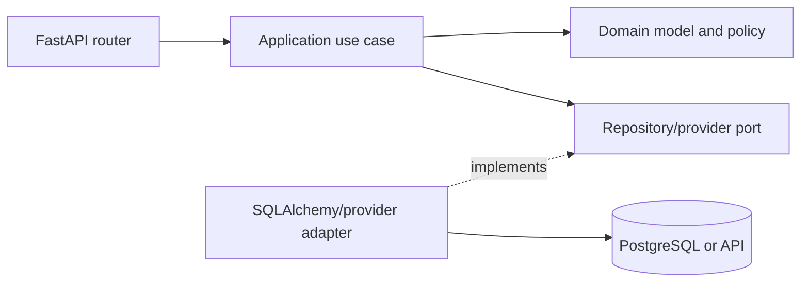
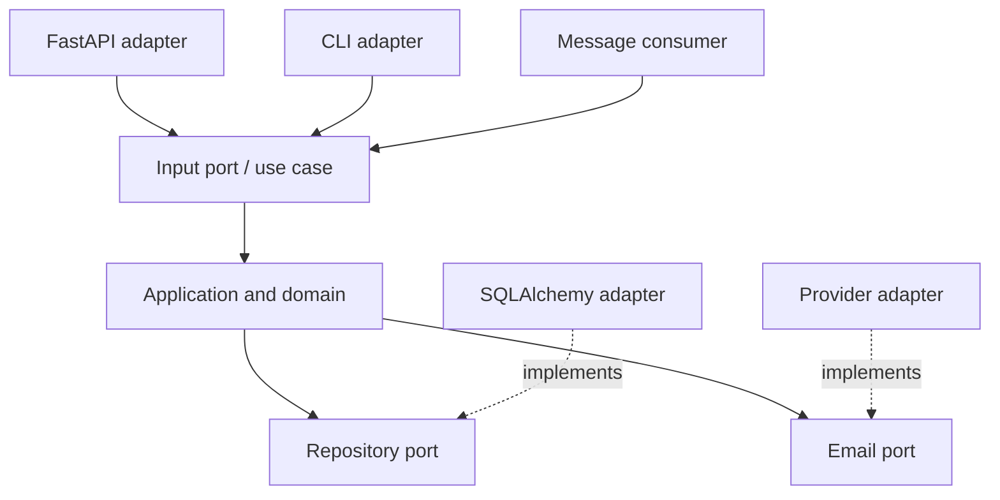
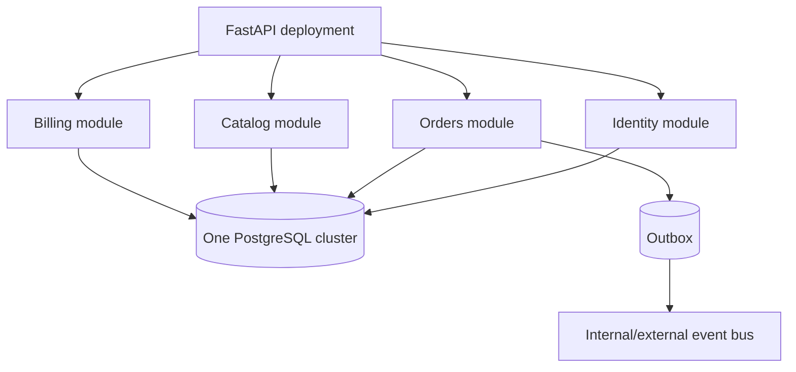

# Architecture Patterns for FastAPI Systems

Architecture is the set of boundaries that makes change, testing, ownership, and failure manageable. It is not a folder template. Two projects can have identical directories while one enforces clear dependencies and the other lets HTTP, SQL, and business rules reach everywhere.

Start with the simplest structure that keeps business decisions visible. Add boundaries when they isolate volatility, protect an invariant, enable focused tests, or assign ownership. Every abstraction introduces names, indirection, and coordination cost; it should solve a concrete problem.

## The dependency direction matters more than the diagram

A common production flow is:



The HTTP and infrastructure edges depend inward on application and domain concepts. The domain does not import FastAPI, SQLAlchemy, Celery, or a vendor SDK. This makes business behavior runnable without starting a server or database.

Not every CRUD endpoint needs all these boxes. A read-only administrative lookup can reasonably use a query function directly from a route dependency. Complexity should follow domain risk, not endpoint count.

## A vocabulary for layers

Use consistent terms:

- **API layer**: HTTP transport, authentication extraction, request validation, status codes, headers, response mapping.
- **Application layer**: orchestrates a use case, transaction, authorization policy, domain calls, and external ports.
- **Domain layer**: business concepts, invariants, value objects, entities, aggregates, policies, and domain events.
- **Infrastructure layer**: SQLAlchemy, Redis, broker, files, email, third-party clients, framework setup.
- **Repository**: a collection-like interface for loading and persisting domain aggregates or a focused data-access abstraction.
- **Service**: an overloaded word. Qualify it as application service, domain service, or infrastructure service.

Calling every module a `service` obscures responsibility.

## Pattern 1: simple CRUD

For a small internal API with straightforward data rules:

```text
app/
  main.py
  api/
    users.py
  schemas/
    users.py
  database.py
  models.py
  queries.py
```

A route can validate input, call a focused query/command function, and map the result. Keep transactions explicit and avoid duplicating SQL.

```python
@router.post("/users", response_model=UserResponse, status_code=201)
async def create_user(
    command: UserCreate,
    session: SessionDep,
) -> UserResponse:
    user = await user_queries.create(session, command)
    return UserResponse.model_validate(user)
```

This is acceptable when `create` means insert a validated row and handle one known uniqueness error. Extract an application service when creation coordinates several policies, resources, side effects, or reusable entry points.

### Failure mode: fat routers

A router has become an application service when it:

- starts several transactions;
- applies pricing or permission rules;
- calls multiple providers;
- publishes events;
- contains retry logic;
- is invoked indirectly from tasks or scripts;
- has branches that require extensive unit tests.

Route functions should remain transport adapters. Workers and CLI commands should call the same application use case, not call route functions.

## Pattern 2: classic layered architecture

```text
app/
  api/
    routers/
    dependencies.py
    errors.py
  services/
  repositories/
  schemas/
  models/
  infrastructure/
  core/
```

The API calls services, services call repositories, and repositories call the database. This structure is easy to teach and works well for moderate CRUD systems.

### Strengths

- familiar request flow;
- centralized persistence and business orchestration;
- easy to introduce dependency injection and test doubles;
- transport logic stays separate from database code.

### Weaknesses

- technical folders scatter one feature across the repository;
- `services/users.py` can become a god module;
- horizontal rules are often weak, allowing routers to call repositories directly;
- a generic repository can hide SQL capabilities and produce leaky abstractions;
- large teams contend on the same layers.

Use dependency checks, code review rules, and module APIs to enforce direction. A directory name alone does not prevent imports.

## Pattern 3: modular architecture

Organize first by business capability, then by layer within each module:

```text
app/
  modules/
    identity/
      api.py
      application.py
      domain.py
      repository.py
      infrastructure.py
    orders/
      api.py
      application.py
      domain/
      ports.py
      adapters/
    catalog/
      api.py
      queries.py
      models.py
  platform/
    database.py
    messaging.py
    observability.py
  main.py
```

The module is a cohesive unit with a public API. Other modules do not import its SQLAlchemy models or reach into its internal tables. Cross-module interaction goes through an application interface, domain event, or explicit query contract.

### Benefits

- feature changes stay localized;
- teams can own business capabilities;
- modules can choose appropriate internal complexity;
- extraction into a service remains possible without pretending it is free;
- test structure can mirror ownership and public contracts.

### Boundary rules

For each module, define:

- public commands, queries, and events;
- data ownership;
- invariants that must be transactional;
- allowed imports;
- synchronous versus asynchronous collaboration;
- compatibility policy for consumers.

Use a shared `platform` package only for genuine technical primitives. A global `common` folder tends to collect unrelated domain concepts and recreates coupling.

## Pattern 4: Clean Architecture

Clean Architecture places enterprise/business rules at the center and details at the outside. Source dependencies point inward:

```text
frameworks and drivers
  -> interface adapters
      -> application use cases
          -> entities and domain policy
```

FastAPI, SQLAlchemy, Redis, and Celery are details behind boundaries. This protects a complex domain from framework churn and gives fast use-case tests.

### A small use case

```python
from dataclasses import dataclass
from typing import Protocol


class OrderRepository(Protocol):
    async def get(self, order_id: str) -> "Order | None": ...
    async def save(self, order: "Order") -> None: ...


class UnitOfWork(Protocol):
    orders: OrderRepository

    async def __aenter__(self) -> "UnitOfWork": ...
    async def __aexit__(self, *args: object) -> None: ...
    async def commit(self) -> None: ...


@dataclass(frozen=True)
class CancelOrder:
    order_id: str
    actor_id: str


class CancelOrderHandler:
    def __init__(self, uow: UnitOfWork, policy: "OrderAuthorization") -> None:
        self.uow = uow
        self.policy = policy

    async def __call__(self, command: CancelOrder) -> None:
        async with self.uow:
            order = await self.uow.orders.get(command.order_id)
            if order is None:
                raise OrderNotFound(command.order_id)
            self.policy.require_cancel(command.actor_id, order)
            order.cancel()
            await self.uow.orders.save(order)
            await self.uow.commit()
```

The route maps HTTP to `CancelOrder`; the SQLAlchemy unit of work implements the protocol; a worker could call the same handler.

### When it earns its cost

- domain rules are complex and long-lived;
- several transports execute the same use cases;
- infrastructure changes often or needs isolated tests;
- team size benefits from explicit dependency direction;
- correctness matters more than minimizing files.

### When it is excessive

- application is mostly direct CRUD;
- interfaces merely duplicate every ORM method;
- each endpoint creates request DTO, command, entity, result DTO, and response with no semantic change;
- engineers cannot find behavior because it is split among trivial pass-through classes.

Clean Architecture does not require a class per operation or a framework-independent copy of every data shape. Apply the dependency rule with the smallest useful set of boundaries.

## Pattern 5: Hexagonal Architecture

Hexagonal Architecture, or ports and adapters, describes the application as a core with ports that adapters drive or implement.

- **Driving adapters** call the application: FastAPI routes, CLI, message consumers, scheduled jobs.
- **Driven adapters** are called by the application: PostgreSQL repository, email provider, object store, event publisher.



This is closely related to Clean Architecture but emphasizes interaction boundaries. It is particularly useful for FastAPI because dependency injection can bind ports to adapters without making the domain depend on the framework.

Python structural protocols are often enough; abstract base classes are useful when shared implementation or runtime registration is required.

### Composition root

Construct concrete dependencies at the application edge:

```python
def build_cancel_order_handler(session: SessionDep) -> CancelOrderHandler:
    uow = SqlAlchemyUnitOfWork(session)
    return CancelOrderHandler(uow=uow, policy=DefaultOrderAuthorization())


CancelOrderDep = Annotated[
    CancelOrderHandler,
    Depends(build_cancel_order_handler),
]
```

Do not make the dependency container globally accessible from domain code. Dependencies should be visible in constructors and function signatures.

## Domain-Driven Design concepts

DDD is useful when the difficulty is the business domain rather than HTTP or database plumbing. It is a modeling discipline, not a requirement to create microservices.

### Ubiquitous language

Use terms shared with domain experts. If the business distinguishes quote, order, authorization, capture, shipment, and return, a generic `TransactionService.process()` discards important meaning.

Names in APIs, code, events, and tests should reflect the same concepts, while public compatibility may require explicit mappings.

### Bounded context

A bounded context is a boundary within which a model and vocabulary are consistent. `Customer` in identity may mean credentials and account status; in shipping it may mean destination and contact details. Do not force one enterprise-wide class with every field.

Bounded contexts are candidates for modules and team ownership. They do not have to be network services.

### Entity and value object

An entity has identity across changes. A value object is defined by its values and should usually be immutable.

```python
from dataclasses import dataclass
from decimal import Decimal


@dataclass(frozen=True)
class Money:
    amount: Decimal
    currency: str

    def __post_init__(self) -> None:
        if self.amount < 0:
            raise ValueError("Money cannot be negative")
        if len(self.currency) != 3:
            raise ValueError("Currency must be an ISO-style three-letter code")

    def add(self, other: "Money") -> "Money":
        if self.currency != other.currency:
            raise CurrencyMismatch
        return Money(self.amount + other.amount, self.currency)
```

The domain type prevents adding incompatible currencies everywhere it is used.

### Aggregate and invariant

An aggregate is a consistency boundary. External code changes its state through the aggregate root. One transaction normally changes one aggregate; cross-aggregate workflows use application orchestration or events.

Do not choose aggregates by database relationship alone. A customer with millions of orders cannot be one in-memory collection and locking boundary.

Use database constraints as a second line of defense for invariants the database can express. Domain validation alone loses races.

### Domain service and application service

- A **domain service** implements domain policy that does not naturally belong to one entity or value object, and depends only on domain concepts.
- An **application service** coordinates identity, transaction, repositories, domain methods, providers, and event publication for a use case.

Do not put persistence calls into a domain service merely because it is named service.

### Domain events

An aggregate can record that something meaningful happened:

```python
@dataclass(frozen=True)
class OrderCancelled:
    order_id: str
    occurred_at: datetime


class Order:
    def cancel(self) -> None:
        if self.status is OrderStatus.SHIPPED:
            raise ShippedOrderCannotBeCancelled
        self.status = OrderStatus.CANCELLED
        self.events.append(OrderCancelled(self.id, self.clock.now()))
```

An application service persists the aggregate and publishes events through an outbox. Domain code should not call a broker directly.

Events are facts in past tense. Commands request an action and may be rejected.

## Repository pattern

A repository presents a persistence boundary in application/domain terms.

Good repository methods are intention-revealing:

```python
class OrderRepository(Protocol):
    async def get_for_update(self, order_id: str) -> Order | None: ...
    async def add(self, order: Order) -> None: ...
    async def find_expired_pending(self, before: datetime, limit: int) -> list[Order]: ...
```

A generic `Repository[T]` with `get_all`, `filter_by`, and `update(**kwargs)` often leaks persistence semantics while hiding query performance. It cannot express locking, eager loading, cursor pagination, projections, or aggregate intent cleanly.

### Use a repository when

- persistence must be replaced or isolated from the domain;
- aggregate loading and saving needs a stable semantic boundary;
- use cases benefit from a small fake;
- queries are reused and need centralized performance decisions;
- a module must prevent other modules from accessing its tables.

### Skip or narrow it when

- the application is simple CRUD with SQLAlchemy already serving as a suitable data abstraction;
- a repository would only forward every ORM method;
- read models require specialized SQL projections;
- hiding SQL makes plans and loading behavior harder to reason about.

Command-side aggregate repositories and direct query services can coexist. CQRS does not require separate databases.

## Service layer

An application service owns a use-case transaction and orchestration. It should not become a grab bag of unrelated methods.

Prefer one cohesive handler or small service per capability over a `UserService` with fifty methods. Inputs should be explicit commands; outputs should be domain values or application results, not FastAPI responses.

```python
class RegisterUserHandler:
    async def __call__(self, command: RegisterUser) -> RegisteredUser:
        async with self.uow:
            if await self.users.email_exists(command.normalized_email):
                raise EmailAlreadyRegistered
            user = User.register(command.normalized_email, self.passwords, self.clock)
            await self.users.add(user)
            await self.uow.commit()
            return RegisteredUser(id=user.id, email=user.email)
```

The database still needs a unique constraint on normalized email because two calls can race.

## Unit of Work

A unit of work defines a transaction boundary and coordinates repositories sharing it. SQLAlchemy `Session` already implements many unit-of-work behaviors; wrap it only when the application benefits from an infrastructure-independent transaction port or centralized event collection.

Common mistakes:

- one session/repository commits inside another service, splitting an intended transaction;
- repositories call `commit()` themselves, preventing orchestration;
- a transaction remains open while awaiting email or another HTTP service;
- nested application services each create independent units of work;
- rollback errors hide the original exception.

Usually the application service begins and commits; repositories flush or add but do not commit.

## CQRS

Command Query Responsibility Segregation separates models that change state from models that read it.

At a modest scale, this can mean:

- commands load domain aggregates and enforce invariants;
- queries issue optimized SQL projections directly into response DTOs;
- both use the same PostgreSQL database.

At higher scale, events can update separate read stores. That introduces eventual consistency, projection rebuilds, duplicate handling, lag, schema versioning, and operational ownership.

Use CQRS when read and write models genuinely differ. Do not duplicate every model and database because the acronym appears in an architecture catalog.

## Modular monolith

A modular monolith deploys one application artifact/process topology while enforcing internal business boundaries.



It retains:

- in-process calls and simple tracing;
- atomic transactions where intentionally allowed;
- one deployment pipeline and local development environment;
- lower operational overhead than microservices.

It requires discipline:

- each table has a clear owning module;
- cross-module imports use public interfaces;
- no shared god model or unrestricted session queries;
- module dependencies are acyclic or explicitly mediated;
- modules have independent tests and ownership;
- events and contracts are versioned where externalized.

A modular monolith is often the best default for a new product with a small or medium team. It preserves extraction options while avoiding premature network boundaries.

## Microservices

Microservices deploy and scale bounded capabilities independently. They can provide failure isolation, independent release cadence, technology specialization, and team autonomy. They also introduce:

- network latency and partial failure;
- duplicated deployment and observability machinery;
- eventual consistency and workflow compensation;
- API/event compatibility management;
- service discovery, authentication, authorization, and secret distribution;
- harder local development, testing, debugging, and incident response;
- distributed data ownership and reporting challenges.

### Extract a service when evidence exists

Useful signals include:

- a capability needs a substantially different scale or hardware profile;
- independent availability or blast-radius isolation is required;
- a stable team owns a clear bounded context and needs independent releases;
- regulatory or data-residency isolation requires it;
- the module has stable contracts and limited synchronous coupling;
- monolith deployment contention is measured and cannot be solved more simply.

Avoid extraction when the proposed services share tables, deploy together, call each other for most requests, or are owned by the same few engineers. That creates a distributed monolith.

### Data ownership

A service should own its data and expose it through contracts. Direct cross-service table access prevents independent change. Cross-service views use APIs, events, replicated read models, or analytical pipelines.

Distributed transactions across service databases are rarely the default. Model workflows with durable state, idempotent steps, outbox/inbox, and compensation.

## Event-driven architecture

Event-driven systems publish facts that consumers react to. They reduce direct temporal coupling and support multiple projections, but introduce temporal uncertainty.

### Choreography

Services react to events without one central workflow controller.

```text
OrderPlaced -> Inventory reserves -> InventoryReserved
InventoryReserved -> Payment authorizes -> PaymentAuthorized
PaymentAuthorized -> Fulfillment starts
```

Choreography works for short, understandable flows but can hide the overall process across consumers.

### Orchestration

A workflow component records state and commands each participant. It improves visibility and timeout handling for long or compensating workflows, at the cost of a central coordinator.

Choose based on workflow complexity, not ideology. Both require idempotency, durable messages, correlation, versioning, dead-letter handling, and reconciliation.

### Event design

- Use a stable event ID, type, producer, occurrence time, and schema version.
- Publish business facts, not database row dumps.
- Include enough data for intended consumers without exposing unnecessary personal data.
- Define ordering boundary and partition key.
- Make consumers tolerant of duplicate and unknown fields.
- Maintain compatibility and replay tests.
- Distinguish event time from processing time.

Event sourcing is a separate decision: events become the authoritative state history and aggregates rebuild from them. It offers audit and temporal modeling benefits but adds event evolution, projection, snapshot, replay, and operational complexity. Do not confuse publishing domain events with event sourcing.

## SOLID principles in Python services

### Single Responsibility

A class or module should have one reason to change. Separate payment policy from HTTP mapping and vendor protocol. Do not interpret this as one method per file.

### Open/Closed

Stable ports allow adding a provider adapter without editing domain policy. Avoid speculative plugin systems before a real variation point exists.

### Liskov Substitution

Every adapter for a port must preserve semantics, including errors, ordering, transaction, and idempotency. An in-memory repository that returns shared mutable objects or ignores uniqueness is not a valid substitute.

### Interface Segregation

Prefer small capability protocols such as `PaymentAuthorizer` over one `PaymentProvider` with twenty unrelated methods. Consumers should depend only on operations they use.

### Dependency Inversion

High-level use cases depend on domain-facing ports; infrastructure implements them. FastAPI dependency injection is one wiring mechanism, not the principle itself.

## Dependency injection choices

FastAPI's dependency system works well for request-scoped resources, authentication, settings, and composition at the API boundary. Constructor injection works well inside application and domain layers.

Avoid:

- calling `Depends()` inside ordinary service methods;
- service locator globals;
- injecting dozens of dependencies into a god service;
- hiding transaction boundaries inside a dependency chain;
- making every pure function a dependency.

Keep a composition root where concrete settings, pools, adapters, and handlers are assembled.

## Prevent circular imports

Circular imports usually reveal unclear ownership or modules that depend both ways.

- Move shared domain primitives to a lower-level module only if truly shared.
- Depend on protocols defined by the consumer or an explicit contracts module.
- Keep framework registration in a composition module, not inside domain packages.
- Import module APIs rather than their internal models.
- Use `TYPE_CHECKING` for type-only cycles only after fixing runtime ownership.
- Prefer domain events or application interfaces for cross-module notification.

Do not solve architectural cycles solely with imports inside functions. That hides the symptom.

## Architecture fitness functions

Automate rules that matter:

- domain packages cannot import FastAPI, SQLAlchemy, Redis, Celery, or provider SDKs;
- module A can import only the public API of module B;
- dependency graph is acyclic at chosen boundaries;
- public API/event schemas pass compatibility checks;
- integration tests enforce table ownership and tenant filters;
- ADRs exist for major dependencies and service extraction.

Tools can inspect imports, but code review and ownership remain necessary for semantic coupling.

## Evolution path

A pragmatic sequence is:

```text
simple FastAPI CRUD
  -> focused query and command functions
  -> application services around complex workflows
  -> modules aligned with business capabilities
  -> ports around volatile or costly infrastructure
  -> outbox and asynchronous integration where needed
  -> selective service extraction backed by operational evidence
```

This is not a maturity ladder. A well-designed modular monolith may remain the correct end state.

Record consequential choices in Architecture Decision Records:

```text
Context
Decision
Alternatives considered
Consequences and risks
Operational implications
Revisit trigger
```

The revisit trigger prevents a temporary decision from becoming permanent by accident.

## Selection guide

| Situation | Likely starting point |
|---|---|
| Small internal CRUD, one team | Simple or classic layered architecture |
| Growing product with several capabilities | Modular monolith |
| Complex invariant-rich domain | DDD concepts plus ports/use cases inside modules |
| Multiple transports and volatile integrations | Hexagonal/Clean boundaries at those edges |
| Read model differs materially from writes | CQRS, initially in one database |
| Long workflows across owned capabilities | Durable orchestration or event choreography |
| Independent team, scale, isolation, and stable boundary | Selective microservice extraction |
| Audit requires events as source of truth | Evaluate event sourcing with specialist experience |

## Common mistakes

- Selecting architecture by company size aspirations rather than current forces.
- A generic repository that merely renames SQLAlchemy methods.
- Business rules in routers, ORM callbacks, or Celery task wrappers.
- Domain objects importing FastAPI exceptions.
- One shared model and database session across every module.
- Splitting into services while retaining cross-service table access.
- Treating asynchronous events as ordered and exactly once.
- Creating a god application service with dozens of dependencies.
- Copying Clean Architecture diagrams into every trivial endpoint.
- Calling a codebase modular without enforcing imports and data ownership.

## Review questions

1. Where is each business invariant enforced, including concurrent requests?
2. Which layer owns transaction start and commit?
3. Can the core use case run without FastAPI?
4. Which tables and events does each module own?
5. Are repository methods domain-oriented or generic pass-throughs?
6. What failure or change does each port isolate?
7. Would a network boundary improve independent scale or ownership enough to pay for partial failure?
8. How are asynchronous duplicates, ordering, schemas, and reconciliation handled?
9. Which architecture rule is automated?
10. What evidence would trigger revisiting the design?

## Further reading

- [FastAPI: Bigger Applications](https://fastapi.tiangolo.com/tutorial/bigger-applications/)
- [Martin Fowler: Service Layer](https://martinfowler.com/eaaCatalog/serviceLayer.html)
- [Martin Fowler: Repository](https://martinfowler.com/eaaCatalog/repository.html)
- [Alistair Cockburn: Hexagonal Architecture](https://alistair.cockburn.us/hexagonal-architecture/)
- [Domain Language: Domain-Driven Design Reference](https://www.domainlanguage.com/ddd/reference/)
- [AWS Prescriptive Guidance: Transactional Outbox](https://docs.aws.amazon.com/prescriptive-guidance/latest/cloud-design-patterns/transactional-outbox.html)

## Related topics

- [Production Architecture](./production-architecture.md)
- [Distributed Systems](./distributed-systems.md)
- [System Design Case Studies](./system-design-case-studies.md)
