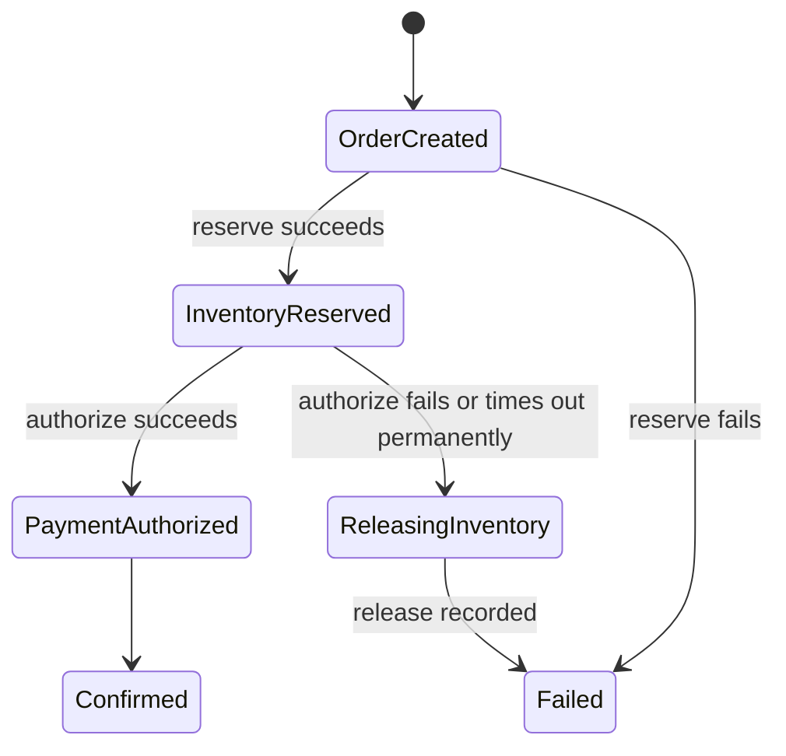

# Distributed Systems for Backend Engineers

A system becomes distributed when one operation depends on components that communicate over a network or fail independently. A FastAPI service with PostgreSQL, Redis, a queue, and a payment provider is already distributed, even if the application code lives in one repository.

The defining condition is uncertainty. A caller can know that it sent bytes but not whether the receiver committed a side effect before the response disappeared. A process can pause while its lease expires. Two replicas can observe state in different orders. Design must account for these states rather than treating them as rare exceptions.

## Failure is partial

In one process, a function usually returns or raises. Across a network:

- DNS can fail while existing connections work;
- connection establishment can time out;
- request bytes can arrive while response bytes are lost;
- one availability zone can be isolated from another;
- a process can be alive but paused or unable to reach a dependency;
- a replica can serve stale state;
- a message can be accepted but its acknowledgement lost;
- clocks can disagree;
- overload can look like failure because queues exceed deadlines.

A timeout is a local observation, not proof that remote work did not happen.

### The outcome matrix

For every remote mutation, consider:

| Local observation | Possible remote outcome | Required response |
|---|---|---|
| Success response | committed | persist reference and continue |
| Explicit rejection | not committed, according to contract | surface domain failure |
| Timeout/disconnect | not started, in progress, committed, or rolled back | query/reconcile using operation ID |
| Retry accepted | first or retry may have committed | deduplicate by stable logical key |

This is why a payment integration needs a durable operation ID and status lookup, not only `try/except TimeoutError`.

## Timeouts, deadlines, and cancellation

A **timeout** bounds one wait. A **deadline** bounds an entire operation across calls, queues, and retries. Propagate the remaining deadline rather than giving every hop the full original timeout.

```text
Client deadline: 2.0 s
  edge:                 0.05 s
  API work:             0.10 s
  dependency attempt 1: 0.50 s
  jitter/backoff:        0.10 s
  dependency attempt 2: 0.50 s
  response reserve:      0.20 s
  contingency:           0.55 s
```

When a caller times out, downstream work may continue. Cancellation should propagate where protocols and libraries support it, but correctness cannot depend on immediate cancellation. A database statement, thread-pool call, or provider mutation may outlive its coroutine.

For asynchronous jobs, store `expires_at` or a business deadline. A worker should not process obsolete work simply because the message remains deliverable.

## Retry safety

Retry only if the failure is transient and the operation is safe to repeat. Use exponential backoff, full jitter, attempt and elapsed-time caps, and a system-wide retry budget.

Retries consume capacity. If each of four layers retries three times, one request can cause up to 81 deepest calls. Put retry ownership at one appropriate layer and disable or tightly limit hidden client retries.

Avoid retrying:

- validation and authorization failures;
- business declines;
- schema incompatibility;
- non-idempotent mutation without a stable operation key;
- work whose deadline has expired;
- an overloaded dependency after the retry budget is exhausted.

Hedged requests issue a second copy after a percentile threshold to reduce tail latency. They increase load and require idempotent reads, cancellation, and strict budgets. They are an advanced optimization, not a default.

## Idempotency and deduplication

An operation is idempotent when applying it more than once has the same intended effect as applying it once. Duplicate suppression is one implementation technique; it must be durable for at least the replay horizon.

### API idempotency record

```text
idempotency_records
  scope              tenant/user and operation
  key
  request_fingerprint
  status             in_progress | completed | failed_retryable
  response_status
  response_body_ref
  created_at
  expires_at
  UNIQUE(scope, key)
```

On the first request, atomically claim the key. A replay with the same fingerprint returns or waits for the recorded outcome. The same key with different input returns a conflict. Concurrent requests rely on a uniqueness constraint or row lock, not a check-then-insert race.

Do not use an idempotency record to cache authentication or authorization indefinitely. Re-evaluate the policy appropriate to the replay contract. Do not store unbounded response bodies in a hot table.

### Consumer inbox

A message consumer writes `(consumer, message_id)` in the same local transaction as its business state. A unique constraint rejects duplicate application. The broker acknowledgement occurs after commit.

If the side effect is outside the database, pass the message/operation ID to a provider idempotency feature or record a state machine and reconcile. No local inbox can atomically control an arbitrary email server.

### Idempotency is scoped

"Exactly once" must name the boundary:

- one row inserted once in PostgreSQL;
- one output record per input in a Kafka transaction;
- one provider charge per provider idempotency key;
- one user-visible order despite repeated HTTP attempts.

Connecting boundaries still requires coordination and reconciliation.

## Consistency models

Consistency describes what values concurrent clients may observe. Terms are often used loosely; define the actual guarantee.

### Strong/linearizable register semantics

An operation appears to take effect atomically between invocation and response, respecting real-time order. After a completed write, a later read sees it or something newer. This is useful for locks, leader election, and some metadata, but costs latency and availability across distance or partition.

### Sequential consistency

All operations appear in one order consistent with each process's program order, but not necessarily real-time order.

### Causal consistency

Causally related operations are observed in order; concurrent unrelated operations may be observed differently. Useful in collaborative and social systems where reply-after-post ordering matters.

### Eventual consistency

If writes stop and communication continues, replicas converge. This says little about convergence time, conflict resolution, monotonic reads, or read-your-writes. Those properties need separate definition.

### Session guarantees

- read your writes;
- monotonic reads;
- monotonic writes;
- writes follow reads.

Session routing or consistency tokens can provide a better user experience without global linearizability.

### Database isolation is a different axis

Serializability concerns concurrent transactions producing an outcome equivalent to some serial order. Linearizability concerns real-time visibility of individual operations. A system can provide one without the other depending on design. Name the transaction isolation level and retry behavior for serialization failures.

## CAP without slogans

The CAP result concerns executions in which network communication between groups of nodes is lost. During a partition, a replicated system cannot guarantee both:

- **consistency** in the CAP sense, commonly a linearizable register;
- **availability** where every request to a non-failing node eventually receives a non-error response.

Partition tolerance is not an optional setting for systems that can experience communication failure. The engineering choice is often per operation: reject writes that cannot reach a quorum, or accept operations that may conflict and reconcile later.

Outside partitions, latency versus consistency still matters. Replication mode, quorum, geography, and durability define a more useful operational discussion than labeling an entire product "CP" or "AP."

### Quorum intuition

With `N` replicas, write quorum `W`, and read quorum `R`, overlap is possible when `W + R > N`. But strong consistency also depends on versioning, conflict resolution, sloppy quorums, failure detection, and implementation. The equation alone is not proof of linearizability.

## Replication

### Leader-follower

Writes go to a leader and replicate to followers. It is common and understandable, but requires:

- leader election and split-brain prevention;
- a policy for acknowledged writes before replication;
- follower lag monitoring;
- client reconnection and endpoint discovery;
- read routing and read-after-write behavior;
- failover data-loss analysis.

Synchronous replication lowers acknowledged-write loss but adds latency and can reduce write availability. Asynchronous replication improves latency/availability but may lose acknowledged recent writes on failover.

### Multi-leader

Several leaders accept writes and replicate between them. It helps disconnected or regional writing but creates conflicts, ordering, and unique-constraint challenges. Last-write-wins can discard valid updates and depends on clocks. Domain-specific merge or ownership is often safer.

### Leaderless

Clients or coordinators write/read several replicas. Quorums, read repair, hinted handoff, and conflict versions can provide different tradeoffs. Operational semantics are store-specific; do not infer them from a category name.

### Read replicas are not transparent

An API that writes to a primary then reads from a lagging replica can return 404 for the resource it just created. Route consistency-sensitive reads to primary, provide session stickiness/tokens, or design the UI/API for pending convergence.

## Partitioning and sharding

Partitioning distributes data and load by a key.

Choose a key based on:

- query and transaction locality;
- distribution and hot-key risk;
- tenant isolation;
- growth and rebalancing;
- ordering requirements;
- ability to route every request.

### Hash partitioning

Spreads keys relatively evenly but makes range queries and locality harder. Consistent hashing reduces key movement when membership changes, though production schemes still need virtual nodes, replication, and rebalancing controls.

### Range partitioning

Supports range scans and locality but can create a hot latest range for time-ordered IDs.

### Tenant partitioning

Keeps tenant data together and supports residency/isolation, but tenant sizes are skewed. Large tenants may need their own shard while small tenants share shards.

Cross-shard transactions, joins, unique constraints, pagination, and rebalancing are expensive. Introduce sharding after measuring alternatives such as indexes, query changes, vertical scale, archival, and read separation.

## Ordering and clocks

### Physical clocks

NTP keeps clocks reasonably aligned but not identical. Clocks can jump or drift. Use a monotonic clock for durations and timeouts, and a wall clock for timestamps shown or exchanged externally.

Do not use application timestamps alone to decide the winner of concurrent financial or authorization updates.

### Logical clocks

Lamport clocks assign numbers that preserve happened-before ordering but cannot identify all concurrency. Vector clocks can represent causality across participants at greater metadata cost. Hybrid logical clocks combine physical time with logical ordering in some systems.

Most FastAPI applications use database sequence/version columns, broker offsets, or aggregate versions rather than implementing clocks. Understand what those values order and what they do not.

### IDs

Auto-increment IDs are compact and ordered inside one database sequence but reveal volume and complicate independent generation. UUIDs are decentralized; time-oriented UUID variants improve locality but still require careful privacy and ordering assumptions. A unique ID is not automatically an ordering guarantee.

Use a separate version/sequence when ordering is a correctness requirement.

## Locks, leases, and fencing

A lock in one process protects only that process. A distributed lease grants temporary ownership, but the holder can pause beyond expiry:

```text
Worker A acquires lease token 41
Worker A pauses for 60 seconds
Lease expires
Worker B acquires lease token 42 and writes
Worker A resumes and writes stale data
```

A **fencing token** is a monotonically increasing number supplied with every operation. The protected resource records the latest token and rejects token 41 after accepting 42.

Use database constraints, row locks, or compare-and-swap versions when the database owns the invariant. Use a consensus-backed coordinator for leader election when its semantics match. Never assume `SET NX` plus a TTL makes an arbitrary external side effect safe.

Locks need bounded acquisition, lease expiry, ownership-safe release, cancellation cleanup, contention metrics, and a crash analysis for every critical step.

## Consensus and leader election

Consensus algorithms such as Raft let a group agree on an ordered log despite some failures. Databases, brokers, and coordinators use consensus internally for metadata, replication, and leader election.

Application teams usually should not implement consensus. Use a tested system, then understand:

- required quorum and fault tolerance;
- what happens in a minority partition;
- election and recovery latency;
- persistence and membership changes;
- client session and stale-leader behavior.

Running three nodes on one host does not tolerate a host failure. Quorum placement must span actual failure domains.

## Distributed transactions

### Two-phase commit

Two-phase commit coordinates participants to prepare, then commit or abort. It can provide atomicity but adds coordinator availability, participant lock duration, recovery, and operational coupling. Support varies across databases and external services.

It is rarely available across a payment provider, email service, broker, and application database.

### Saga

A saga is a sequence of local transactions with durable workflow state. On failure, it executes compensating business actions where possible.



Each step and compensation must be idempotent. The workflow needs timeouts, retries, stuck-state detection, operator intervention, and reconciliation. Compensation is not equivalent to rollback: an email cannot be unsent and a refund may have fees or delay.

### Transactional outbox

Persist business state and an outbox message in one local transaction. A relay publishes later. This prevents the lost-message gap but allows duplicate publication, so consumers deduplicate.

The inverse inbox pattern atomically records message receipt with local effects.

## Messaging semantics

### At-most-once

Acknowledge before processing or do not redeliver. Work can be lost.

### At-least-once

Acknowledge after durable processing. Failure between effect and acknowledgement creates duplicates. This is a practical, common target.

### Exactly-once within systems

Some brokers/stream processors support transactional processing within defined boundaries. External effects remain outside unless they participate in the protocol. State the boundary every time exactly-once is claimed.

### Ordering

Global ordering limits parallelism and is rarely required. Define order per aggregate or partition. Multiple consumers can finish out of order even if delivery begins in order. Use aggregate versions, single-key partitioning, or commutative operations.

### Poison messages

A permanently invalid message can block a partition or retry forever. Validate envelopes, classify permanent failures, quarantine/dead-letter with context, alert, and provide controlled replay after repair.

## Event schemas and compatibility

Events may outlive a deployment and have consumers unknown to the producer. Include:

- stable event ID and type;
- producer and schema version;
- occurrence time;
- aggregate ID and version when relevant;
- correlation/causation IDs;
- data required by the contract, minimizing sensitive fields.

Compatibility practices:

- add optional fields with safe defaults;
- do not change field meaning under the same name;
- tolerate unknown fields;
- keep old consumers in the rollout model;
- use a schema registry or compatibility checks where scale justifies it;
- test replay of retained historical events;
- migrate or upcast old events deliberately.

An event is not a shared database row dump. It represents a domain fact owned by the producer.

## Service discovery and load balancing

Clients need a way to find healthy instances. DNS, orchestrator service names, load balancers, and service meshes provide different discovery and balancing behaviors.

Review:

- DNS caching and stale addresses;
- readiness versus mere process existence;
- connection pooling that pins traffic to old instances;
- retry of connection establishment during rollout;
- load-balancing algorithm under long-lived requests;
- zone-aware routing and cross-zone cost;
- authentication and TLS identity.

Client-side retries can defeat load balancing if they reuse the same failed connection or endpoint. Connection pools must recycle according to discovery behavior.

## Cascading failure and overload

One slow dependency increases request concurrency, consumes pools, triggers timeouts and retries, and can spread failure across services.

Defenses:

- deadlines and short bounded pool waits;
- concurrency limits and bulkheads per dependency;
- circuit breakers based on relevant health outcomes;
- retry budgets and jitter;
- bounded queues with admission control;
- load shedding and priority/reserved capacity;
- cache stampede protection;
- autoscaling bounded by downstream capacity;
- graceful degradation and stale data only where correct.

Every queue hides overload temporarily. Monitor its oldest age and drain rate, and reject work before promises become impossible.

## Multi-region tradeoffs

Network distance adds latency and partitions. Common strategies:

- single writer region with remote reads and disaster failover;
- tenant/key home region with explicit routing;
- globally consistent database accepting coordination latency;
- conflict-tolerant data types and application merges;
- asynchronous replication with documented RPO and stale reads.

Idempotency keys must have the same scope as possible retries. If two regions can accept the same payment request but deduplicate only locally, failover can duplicate it.

Global secondary indexes, unique email addresses, inventory, and balances are hard under independent regional writes. Selective central coordination may be appropriate even when other data is local.

## Observing a distributed operation

Propagate:

- trace context for causal investigation;
- request ID for caller support;
- stable operation/message ID for business identity and deduplication;
- correlation and causation IDs for workflows;
- deadline and schema version where contracts support them.

These values have different purposes. A sampled trace ID is not a durable payment ID.

Measure:

- end-to-end outcome and latency;
- dependency time, pool wait, timeout, retry, and circuit state;
- queue schedule and oldest age;
- replication lag and conflict/reconciliation counts;
- duplicate detections and idempotency conflicts;
- stuck workflow age;
- region/zone and deployment version.

Use span links for messages and fan-in. Avoid an unbounded trace spanning days of workflow history; durable workflow records are the long-term source.

## Testing distributed behavior

Unit tests cannot prove network semantics. Add targeted integration and resilience tests:

- drop the response after applying a provider mutation;
- deliver the same message concurrently;
- kill a worker after database commit before acknowledgement;
- reorder versioned events;
- pause a lease holder past expiry and verify fencing;
- exhaust connection pools and observe bounded rejection;
- fail Redis and verify cache/rate failure policy;
- introduce replica lag and test read-after-write routing;
- disconnect one broker/database node and observe client recovery;
- restore from backup and reconcile external operations.

Fault injection should have a hypothesis, safety limit, abort condition, and measured user impact. A dramatic chaos experiment without recovery evidence is not useful.

## Decision checklist

For each distributed interaction, document:

1. Is it a command, query, or event?
2. What is the operation identity and deduplication scope?
3. Which consistency and ordering guarantees are required?
4. What is the timeout/deadline and who may retry?
5. Can the result be ambiguous, and how is it reconciled?
6. What is durable before success is reported?
7. What happens during partition, overload, and dependency failover?
8. How are schemas versioned and historical messages replayed?
9. What is the maximum queue/backlog and rejection policy?
10. Which metrics and tools reveal stuck or conflicting state?

## Common mistakes

- Treating timeout as proof of failure.
- Retrying a mutation with a new idempotency key.
- Calling an entire database "eventually consistent" without defining session behavior.
- Using CAP as a permanent two-letter label rather than analyzing partition behavior.
- Assuming a broker acknowledgement means the consumer applied the side effect.
- Depending on global message order while scaling consumers.
- Using timestamps as conflict resolution without clock and domain analysis.
- Relying on a lease without fencing for correctness-critical writes.
- Allowing every layer to retry independently.
- Scaling producers without bounding consumer and database capacity.
- Claiming exactly-once across an external provider without reconciliation.

## Interview prompts

1. A payment request times out. What states are possible, and what should the API do?
2. Explain CAP without saying that partition tolerance is simply chosen.
3. Compare linearizability, serializability, and eventual consistency.
4. Why can a distributed lock holder write after its lease expires, and how do fencing tokens help?
5. What problem does the transactional outbox solve, and what does it not solve?
6. Explain at-least-once delivery from broker publish through consumer commit.
7. How can retries create a cascading failure?
8. What makes a good partition key?
9. Why does read-replica lag break read after write?
10. How would you test an effectively-once outcome?

## Further reading

- [Gilbert and Lynch: Brewer's Conjecture and the Feasibility of Consistent, Available, Partition-Tolerant Web Services](https://groups.csail.mit.edu/tds/papers/Gilbert/Brewer2.pdf)
- [Lamport: Time, Clocks, and the Ordering of Events in a Distributed System](https://lamport.azurewebsites.net/pubs/time-clocks.pdf)
- [Raft Consensus Algorithm](https://raft.github.io/)
- [Jepsen: Consistency Models](https://jepsen.io/consistency)
- [RFC 9110: HTTP Semantics and Idempotent Methods](https://www.rfc-editor.org/rfc/rfc9110)
- [RabbitMQ Reliability Guide](https://www.rabbitmq.com/docs/reliability)
- [Apache Kafka Design](https://kafka.apache.org/documentation/#design)
- [AWS Prescriptive Guidance: Saga Pattern](https://docs.aws.amazon.com/prescriptive-guidance/latest/cloud-design-patterns/saga.html)
- [AWS Prescriptive Guidance: Transactional Outbox Pattern](https://docs.aws.amazon.com/prescriptive-guidance/latest/cloud-design-patterns/transactional-outbox.html)

## Related topics

- [Architecture Patterns](./architecture-patterns.md)
- [Production Architecture](./production-architecture.md)
- [System Design Case Studies](./system-design-case-studies.md)
