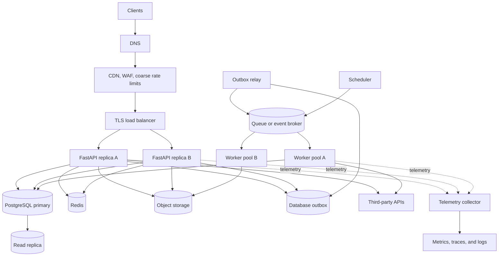
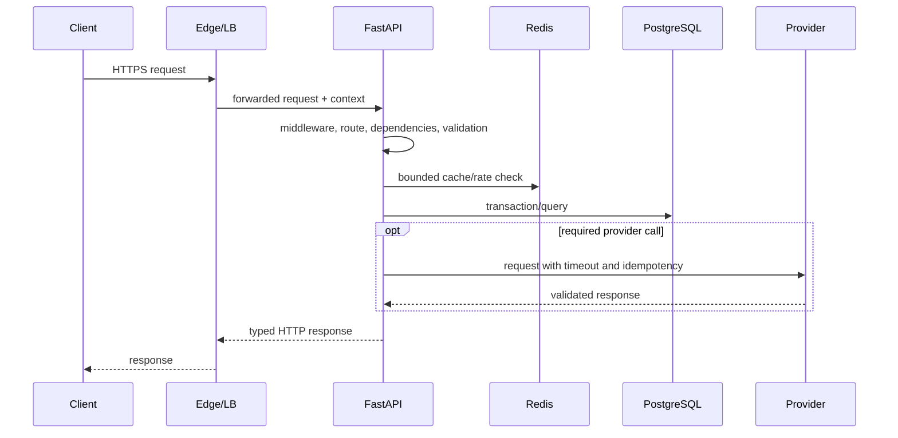
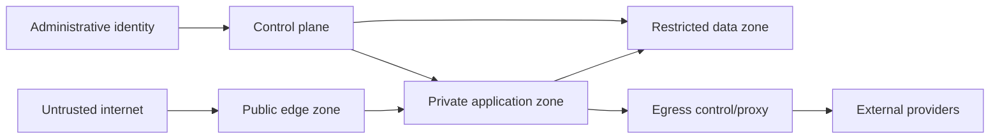
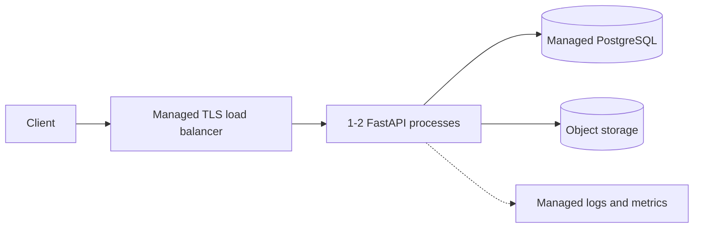

# Production Architecture

A production FastAPI deployment is a system, not a server command. The API process sits between untrusted clients, stateful data systems, background workers, third-party dependencies, and an operational control plane. The architecture should make request deadlines, data ownership, failure behavior, and deployment boundaries explicit.

This chapter presents a reference topology, then shows how to remove or add components according to scale and risk. It is not a required shopping list.

## Reference topology



Every arrow is a latency, authentication, capacity, and failure boundary. Document who owns its timeout, retry, encryption, schema, and telemetry.

## Request path

### DNS and edge

DNS maps the public name to an edge service or load balancer. Time-to-live affects failover speed and query volume. A CDN can serve cacheable public representations near clients, terminate TLS, absorb traffic spikes, and provide denial-of-service defenses. A web application firewall can block known malicious patterns, but it does not replace input validation or authorization.

Edge controls should include:

- maximum body, header, and URL sizes;
- coarse IP/network rate limits;
- TLS policy and certificate automation;
- bot and abuse controls according to the product;
- cache keys and `Vary` behavior that cannot mix users or tenants;
- origin authentication so attackers cannot bypass the edge by calling it directly.

### Load balancer and reverse proxy

The load balancer routes only to ready targets, drains them during deploys, and supplies forwarding context. Align idle, request, streaming, and connection timeouts with API behavior. Trust forwarding headers only from known proxies that sanitize incoming copies.

Use request IDs for client support and W3C trace context for distributed tracing. Neither is proof of identity.

### FastAPI replicas

API replicas should be disposable and hold no unique durable state. Each process owns:

- an event loop;
- database, Redis, and outbound HTTP pools;
- in-process caches and configuration snapshot;
- telemetry batching;
- memory for code, data, and active requests.

Process-local state is acceptable for optimization or observation, not cross-request correctness. A local rate counter, job registry, upload directory, or scheduler becomes inconsistent when replicas scale or restart.

Keep the request path bounded:



Long or retryable work moves to a durable job after the application records acceptance.

## Synchronous and asynchronous boundaries

Use synchronous request/reply when the caller needs an immediate outcome and work fits the latency budget. Use asynchronous processing when work is long, bursty, retriable, independently scalable, or not required before response.

Examples:

- Authenticate and reserve inventory synchronously when checkout needs a decision.
- Generate an invoice PDF asynchronously after the order commits.
- Record a durable notification intent in the transaction, then send email in a worker.
- Upload large content directly to object storage, then enqueue scanning and processing.

Returning 202 is a contract. Provide a job/status resource, completion webhook, SSE/WebSocket notification, or polling semantics. Persist the job before returning.

## Data tier

### PostgreSQL as source of truth

PostgreSQL commonly owns transactional business state, constraints, idempotency records, outbox events, and job metadata. Protect it with:

- private network access and TLS where required;
- least-privilege roles separated by service and migration capability;
- high availability across failure domains;
- automated backups plus tested point-in-time recovery;
- schema migrations using expand-and-contract;
- connection budgets across API, workers, migrations, and operators;
- statement and lock timeouts;
- slow-query, lock, replication, storage, and transaction monitoring.

The database constraint is the final arbiter for uniqueness and referential integrity under concurrency. Domain validation improves messages but cannot replace it.

### Read replicas

Read replicas can isolate analytics or scale stale-tolerant reads. They introduce replication lag and read-after-write anomalies. Route deliberately:

- critical read after write stays on primary;
- a cursor or session can carry a consistency token where infrastructure supports it;
- eventual views communicate their freshness;
- lag above a threshold removes a replica from eligible reads.

Do not send all reads to replicas automatically. Authentication state, permissions, balances, and newly created resources may require primary consistency.

### Redis

Redis can serve cache, rate-limit, ephemeral coordination, or stream roles. Separate correctness-critical state from disposable cache memory where eviction or failure policy differs.

For cache use, a complete Redis loss should degrade according to a capacity plan. If all requests fall through to PostgreSQL, admission control and cache warm-up must prevent a database stampede.

For rate limiting or locks, specify fail-open/closed behavior and understand replication/failover guarantees. A Redis lease does not create exactly-once execution.

### Object storage

Store uploads, exports, media, large AI artifacts, and backups in object storage rather than application filesystems or broker messages. Use:

- short-lived signed upload/download URLs;
- content length/type constraints and checksums;
- tenant-scoped object keys and authorization before signing;
- server-side encryption and lifecycle/retention policies;
- malware/content scanning before publication;
- immutable or versioned objects where audit requires it;
- event delivery with idempotent processing.

A signed URL is a bearer credential. Keep it short-lived and out of logs.

## Messaging and workers

The queue absorbs bursts and decouples execution capacity, but it is not infinite. Each workload needs:

- bounded payload and retention;
- message schema and version;
- stable ID and idempotent consumer;
- acknowledgement after durable effect;
- retry classification with backoff and jitter;
- dead-letter investigation and controlled replay;
- queue age objective and admission control;
- independent concurrency and downstream pool budget.

Separate queues and worker pools for workloads with materially different duration, priority, resource type, or downstream dependency. Password reset emails should not wait behind a million marketing messages. GPU inference should not share a concurrency knob with PDF generation.

### Outbox and inbox

Write an outbox row in the same transaction as business state. A relay publishes it. Consumers record an inbox event ID atomically with local changes. This produces at-least-once delivery with effectively-once local effects when constraints and handlers are correct.

Outbox backlog is part of user-visible latency even when the API returned 201. Monitor oldest unpublished age.

## Third-party dependencies

Use one adapter and bounded client pool per dependency or criticality class. Configure:

- fixed allowlisted base destination;
- authentication and secret rotation;
- connect/read/write/pool timeouts within an operation deadline;
- retry only for transient and idempotent operations;
- exponential backoff, jitter, cap, and retry budget;
- bulkhead/concurrency limit;
- circuit breaker and correctness-preserving fallback;
- schema validation and provider error mapping;
- reconciliation for ambiguous operations.

Avoid chaining many synchronous service/provider calls on one request. Availability multiplies and latency accumulates. Consider a local read model or asynchronous workflow when a page otherwise requires a distributed join.

## Security architecture

### Trust zones



Default-deny network paths. The API should reach only required database, cache, broker, object store, telemetry, and egress destinations. Data systems should not accept public traffic.

### Identity and authorization

- Authenticate at a well-defined boundary, but enforce resource authorization in the application where resource context exists.
- Validate token issuer, audience, signature, expiry, and intended token type.
- Scope service identities and database roles per workload.
- Use workload identity and short-lived credentials where possible.
- Protect administrative paths with stronger identity, network, audit, and rate controls.
- Include tenant constraints in queries and database designs; do not trust a tenant ID from the request body.

An API gateway can reject invalid external tokens, but internal services still need caller identity and authorization policy. Network location is not identity.

### Secrets and keys

Secrets enter at runtime from a managed store or mounted mechanism. Applications receive only what they need. Rotation must account for pools and verification overlap. Signing and encryption keys need key IDs, versioning, audit, and emergency revocation.

### Data protection

Classify data, minimize collection, encrypt transport, use storage encryption, and limit telemetry. Separate audit from ordinary logs. Define retention, deletion, backup, and restore behavior. A deleted primary row may remain in caches, search indexes, object versions, logs, and backups according to separate policies.

## High availability

Availability comes from eliminating single failure domains and designing recovery, not simply running two API replicas.

### Failure domains

Spread stateless replicas across hosts and availability zones. Ensure load balancers, NAT/egress, brokers, database, Redis, DNS, and secret systems also have appropriate redundancy. A multi-zone API behind a single-zone database is not a multi-zone service.

### Stateful failover

Understand for each store:

- detection and leader-election time;
- acknowledged-write durability during failure;
- client DNS/endpoint behavior and connection recycling;
- read consistency after failover;
- recovery point and recovery time objective;
- backup independence from the primary account/region;
- operator and automated failover authority.

High availability does not replace backup. Replication can faithfully copy accidental deletion or corruption.

### Graceful degradation

Create a dependency policy table:

| Dependency | Required for | Outage behavior | Protection |
|---|---|---|---|
| Primary PostgreSQL | durable mutations, critical reads | reject/read-only mode by endpoint | short timeouts, admission control |
| Redis cache | catalog acceleration | bypass, reduce optional traffic | local limit, stale cache where safe |
| Redis rate limiter | login protection | fail closed or edge fallback | gateway limit, security alert |
| Email provider | notification delivery | queue and retry | separate queue, alternate provider if justified |
| Analytics | optional event export | outbox backlog | retention and backpressure |
| Payment provider | checkout authorization | fail explicitly or pending workflow | circuit, idempotency, reconciliation |

The policy varies by capability. A single global readiness result may be too coarse for partial operation, but complexity must be justified.

## Disaster recovery

Define:

- **RPO**: maximum acceptable data loss measured in time or transactions;
- **RTO**: maximum acceptable time to restore service;
- regional/account failure assumptions;
- backup frequency, retention, encryption, and immutable copies;
- restore sequence for database, object data, secrets, DNS, queues, and configuration;
- how external operations are reconciled after restoring older state.

Test full restore into an isolated environment. A green backup job proves only that a file was written, not that it can restore within RTO.

Queues and caches complicate restore. Replaying retained events may rebuild projections, but events and consumers must remain compatible. Restoring an idempotency table to an earlier point can allow old external mutations to run again; reconciliation and provider records are necessary.

## Multi-region choices

Multi-region architecture is expensive in data semantics and operations. Choose a model explicitly:

### Active-passive

One region serves traffic; another receives backups/replication and is promoted during disaster. It is simpler but has failover delay and requires regular exercises.

### Active-active with regional ownership

Both regions serve, but each tenant or key has one write home. This reduces conflict and supports locality, while failover requires reassignment and consistency policy.

### Globally writable

Multiple regions accept writes to the same logical data. This demands conflict resolution, globally consistent storage, or carefully designed commutative operations. Latency, availability, and consistency tradeoffs are unavoidable during partitions.

Do not claim active-active because two read replicas serve GET traffic. Define write routing, session consistency, queue locality, idempotency scope, and failover behavior.

## Configuration and feature control

Use typed settings for process configuration and a controlled dynamic system for runtime flags. Every deployed instance should report sanitized effective version/config metadata.

Feature flags can support canary behavior and emergency disablement, but:

- default behavior must be safe when the flag service is unavailable;
- evaluation latency should not add a remote call per request;
- tenant/user targeting creates sensitive telemetry and cache keys;
- important combinations need tests;
- flags need owners and expiration dates.

## Deployment and migration topology

Build one immutable image and deploy it by digest. A typical rollout is:

1. validate backward-compatible schema expansion;
2. run one migration job;
3. deploy a small canary with new code;
4. compare technical SLOs and business outcomes;
5. roll replicas gradually while old and new coexist;
6. run resumable data backfills out of band;
7. switch behavior with a flag if used;
8. contract old schema in a later release.

Workers and event consumers may need independent rollout order. An old consumer must tolerate new optional fields; a new consumer may need to handle old messages retained in the broker.

Readiness prevents traffic before initialization. Termination removes readiness, drains load-balancer targets, completes or requeues work, flushes telemetry, and exits within the platform grace period.

## Observability topology

Instrument each boundary with consistent service/resource identity. Critical signals include:

- API request rate, errors, duration, active requests, event-loop lag;
- database query latency, locks, transactions, pool waits, connections, replica lag;
- Redis hit/miss, command latency, errors, memory, eviction;
- queue publish, backlog age, processing, retry, dead letter, worker saturation;
- outbound dependency latency, errors, retries, circuit, pool waits;
- deployment version and feature state;
- business outcomes and stuck workflows;
- telemetry exporter drops and collector saturation.

Trace context crosses trusted HTTP calls and message headers. Use span links for delayed background work. Do not put personal or unbounded identifiers in metric labels.

## Capacity model

Capacity planning starts with a workload model:

```text
peak requests/second by operation
* calls/queries per request
* average and tail duration
* payload and response sizes
* cache hit/miss distribution
* tenant/key skew
* scheduled and background overlap
```

Then budget each tier:

- API CPU and memory per request/process;
- load balancer connections and timeouts;
- database connections, queries/sec, rows, locks, IOPS, storage;
- Redis commands/sec, hot keys, connections, memory;
- broker publish rate, retention, partitions/queues, worker drain rate;
- provider quotas and cost;
- telemetry volume and cardinality.

Autoscaling one tier can overload the next. Put hard concurrency and admission bounds around scarce dependencies.

## Architecture by stage

### Small production service



Use this until requirements justify Redis or a broker. A durable database jobs table plus one worker may be enough.

### Growing service

Add:

- at least two API replicas across failure domains;
- Redis for a measured cache/rate need;
- broker and independent worker pools;
- outbox for durable publication;
- automated canary/rolling deployment;
- OpenTelemetry collector and SLO alerting;
- explicit backup restore and incident processes.

### High-scale or high-criticality service

Potential additions, only with evidence:

- multi-zone stateful topology and tested failover;
- database replicas, partitioning, or service-specific stores;
- edge caching and global traffic management;
- workload-specific clusters and strict bulkheads;
- multi-region passive or active model;
- formal capacity, chaos, security, and recovery exercises;
- independent service boundaries aligned with teams and data ownership.

## Failure matrix

Review failures before launch:

| Failure | Expected behavior | Evidence |
|---|---|---|
| One API process dies | load balancer routes around it | readiness and request SLO |
| Entire cache unavailable | safe fallback or explicit rejection, DB protected | cache bypass and DB saturation metrics |
| Database pool exhausted | bounded wait, load shedding, no event-loop collapse | pool wait and 503/error rate |
| Broker publish fails | outbox retains event | outbox age alert |
| Worker dies after side effect | message redelivers, effect deduplicated | redelivery integration test |
| Provider times out after mutation | reconcile with stable operation key | pending-operation age |
| Zone fails | capacity and state fail over according to objective | game-day result |
| Bad release | canary halts and rollback/roll-forward works | deployment markers and SLO |
| Secret rotates | new connections use it, overlap handles transition | rotation audit/test |
| Telemetry backend fails | service continues, drops are visible | exporter/collector drop metric |

## Operational readiness review

Before accepting production traffic, verify:

- owners, objectives, escalation, dashboards, alerts, and runbooks exist;
- data classification, threat model, authorization, and abuse controls are reviewed;
- all network calls have timeouts and all retries have safety and budgets;
- connection pools are budgeted across maximum replicas;
- database constraints, migrations, backups, and restore are tested;
- queues are idempotent, bounded, observable, and replayable with control;
- load, soak, failure, and graceful-shutdown tests meet targets;
- secrets and signing keys can rotate;
- deployment is immutable, auditable, and reversible where possible;
- dependency outage policies and manual reconciliation tools are documented.

## Interview prompts

1. Walk through a request from TLS termination to PostgreSQL and back, including timeouts and telemetry.
2. Which state may safely live inside a FastAPI worker process?
3. How do you choose between synchronous response and a 202 job contract?
4. Why does adding API replicas require revisiting every connection pool?
5. What is the difference between high availability and disaster recovery?
6. How would you design degraded behavior for Redis versus PostgreSQL failure?
7. What does a rolling deployment require from schemas and messages?
8. Compare active-passive, regional ownership, and globally writable multi-region designs.
9. What would you verify in an operational readiness review?

## Further reading

- [FastAPI Deployment Concepts](https://fastapi.tiangolo.com/deployment/concepts/)
- [AWS Well-Architected Framework](https://docs.aws.amazon.com/wellarchitected/latest/framework/welcome.html)
- [Google SRE Book: Addressing Cascading Failures](https://sre.google/sre-book/addressing-cascading-failures/)
- [OpenTelemetry Concepts](https://opentelemetry.io/docs/concepts/)
- [OWASP Application Security Verification Standard](https://owasp.org/www-project-application-security-verification-standard/)
- [PostgreSQL High Availability, Load Balancing, and Replication](https://www.postgresql.org/docs/current/high-availability.html)

## Related topics

- [Architecture Patterns](./architecture-patterns.md)
- [Distributed Systems](./distributed-systems.md)
- [System Design Case Studies](./system-design-case-studies.md)
