# System Design Case Studies

System design is the process of turning product behavior into explicit data, API, consistency, capacity, failure, and operational decisions. FastAPI is one implementation component. A complete design also explains the stateful systems, asynchronous work, security boundaries, and how the team will know the system is healthy.

The cases below use a consistent review frame. Numbers are intentionally derived from a hypothetical workload during an interview or design review rather than asserted as universal capacity limits.

## A repeatable design method

### 1. Clarify requirements

Separate functional behavior from non-functional objectives:

```text
Functional: create, read, update, workflow, search, notification
Quality: latency, availability, durability, consistency, privacy, cost
Scale: peak reads/writes, concurrency, payload, storage growth, key skew
Scope: clients, regions, tenants, integrations, retention, compliance
```

Ask which failures may produce stale data, which must reject work, and which operations need effectively-once outcomes.

### 2. Estimate the dominant resources

Use simple calculations and state assumptions:

```text
peak requests/s = daily operations * peak factor / active seconds
in-flight work = requests/s * average latency seconds
daily storage = objects/day * average bytes * replication/overhead
worker rate needed = peak jobs/s * average job seconds / target utilization
connection budget = replicas * processes * pool size
```

Skew matters. Average traffic per user does not predict a celebrity feed, popular short URL, or one tenant's import.

### 3. Define contracts and state transitions

List APIs, idempotency rules, authorization, response consistency, and state machines. Draw the critical write path. Name the source of truth.

### 4. Add derived systems only for a reason

Caches, search indexes, queues, vector stores, and read models are projections. Define their freshness, rebuild path, and behavior when they disagree with the source of truth.

### 5. Design failure and operations

For every network hop: timeout, retry owner, idempotency, circuit/bulkhead, and ambiguous-outcome reconciliation. Finish with security, telemetry, deployment, backup/restore, and major tradeoffs.

---

## Case 1: Authentication and Session Service

### Requirements

Support account registration, login, logout, access-token validation, refresh-token rotation, password reset, email verification, MFA, role/permission lookup, and administrative session revocation. External identity providers may use OpenID Connect.

Targets might include low-latency token validation, strong protection against credential stuffing, durable revocation of refresh sessions, and an audit trail for security-sensitive changes. Decide whether this is one product's identity module or an organization-wide service before designing a network boundary.

### API

```http
POST /v1/accounts
POST /v1/sessions
POST /v1/sessions/{session_id}/refresh
DELETE /v1/sessions/{session_id}
DELETE /v1/accounts/{account_id}/sessions
POST /v1/password-reset-requests
POST /v1/password-resets
POST /v1/mfa/challenges
POST /v1/mfa/challenges/{challenge_id}/verify
GET  /v1/me
GET  /.well-known/jwks.json
```

Login uses a generic failure response so account existence is not disclosed. Refresh is an idempotent or carefully stateful operation: concurrent use of one refresh token should produce one valid successor or revoke the token family according to policy.

For OAuth/OIDC clients, prefer authorization code with PKCE and follow the current OAuth security BCP. Do not introduce the resource owner password credentials grant as a new design.

### Data model

```text
accounts(id, tenant_id, email_normalized, status, verified_at, created_at)
credentials(account_id, password_hash, password_changed_at)
sessions(id, account_id, token_family_id, created_at, last_seen_at,
         expires_at, revoked_at, client_metadata)
refresh_tokens(id_hash, session_id, parent_id_hash, used_at, expires_at)
mfa_methods(id, account_id, type, encrypted_secret_or_public_key, status)
one_time_challenges(id_hash, account_id, purpose, expires_at, consumed_at)
role_assignments(account_id, tenant_id, role_id)
security_events(id, account_id, action, actor, safe_context, occurred_at)
```

Unique normalized email may be scoped globally or by tenant. Password hashes use an adaptive password hashing algorithm with calibrated cost. Store refresh and one-time token hashes, not bearer values. Encryption keys for MFA secrets live in a managed key system and rotate.

### Architecture, cache, and scaling

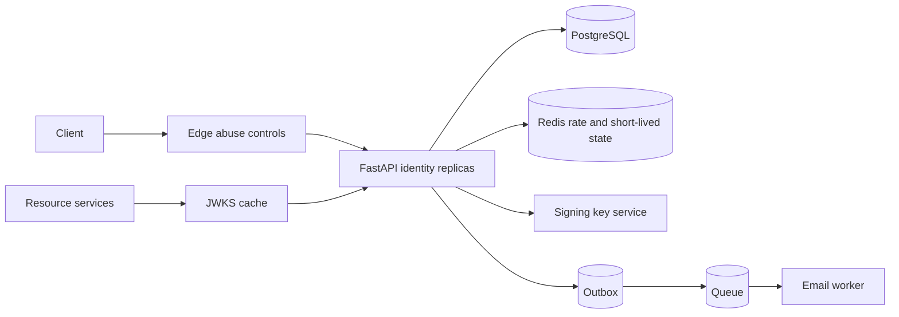

Self-contained signed access tokens allow local verification and reduce central latency, but claims remain valid until expiry and revocation is harder. Keep access tokens short-lived and refresh sessions revocable. Opaque access tokens allow immediate centralized control but make introspection availability and latency part of every request unless cached.

Cache public verification keys by key ID with overlap during rotation. Cache permissions only for a bounded time or include a policy/version claim and verify critical changes. Redis can hold rate-limit counters and short challenge state, but durable session revocation remains in PostgreSQL.

### Queues and asynchronous work

Commit account/session changes and an outbox event together. Workers send verification/reset emails, security notifications, and audit exports. Give transactional messages reserved capacity separate from bulk mail. A password reset response can be uniform whether or not the account exists; queue behavior and timing should not reveal it.

### Failure handling

- Database unavailable: reject login/refresh; locally validated short-lived access tokens may continue at resource services according to risk.
- Redis unavailable: login limiting should fail closed or fall back to strict edge/local controls, while ordinary key caching can degrade.
- Email unavailable: retain notification intent and retry, without blocking account registration if product policy allows.
- Signing key issue: stop minting tokens; continue verification with already published valid keys if safe.
- Refresh response lost: replay with the same token must follow a defined rotation/reuse policy and not create unlimited valid descendants.

### Security

Use TLS, secure and HttpOnly cookies for browser sessions, CSRF protection when cookies carry credentials, exact issuer/audience validation, algorithm allowlists, key IDs, refresh rotation, session binding signals, MFA recovery controls, and strict administrative authorization. Rate-limit by account and network signals without making IP the sole identity. Never log passwords, tokens, codes, cookies, or raw MFA secrets.

Prevent user enumeration across login, registration, and reset flows. Audit password, MFA, role, email, and session changes. Provide revocation and incident tooling.

### Observability

Measure login outcome by bounded reason, latency, hash-computation saturation, refresh reuse detection, active/revoked sessions, key rotation state, reset email delay, MFA challenge outcome, and abuse-limit decisions. Alert on sharp failure changes, unusual geography/device patterns where permitted, signing-key errors, and refresh-token family reuse. Do not label metrics by account or IP.

### Tradeoffs

- JWT validation improves availability but delays claim/revocation changes.
- Opaque tokens centralize control but create a synchronous dependency.
- A dedicated identity service standardizes policy but raises blast radius and operational requirements.
- Password authentication gives local control but creates credential security obligations; managed OIDC reduces some burden but adds provider dependency.

---

## Case 2: E-commerce API

### Requirements

Support catalog browse/search, prices, carts, checkout, inventory reservation, orders, payment authorization/capture, shipment status, cancellation, and returns. Reads dominate browse traffic; checkout demands correctness under retries and concurrency.

Define whether price and inventory shown on product pages are advisory or guaranteed. The checkout contract should state when an order becomes accepted, how long inventory is reserved, and how pending payment is resolved.

### API

```http
GET  /v1/products?category=&cursor=&limit=
GET  /v1/products/{product_id}
PUT  /v1/carts/{cart_id}/items/{sku}
GET  /v1/carts/{cart_id}
POST /v1/checkouts                  Idempotency-Key required
GET  /v1/orders/{order_id}
POST /v1/orders/{order_id}/cancel  Idempotency-Key required
POST /v1/returns                   Idempotency-Key required
```

The server recalculates authoritative prices, discounts, tax, shipping, and inventory at checkout. Never trust totals sent by the client. A checkout replay with the same key and payload returns the same order; a different payload conflicts.

### Data model

Separate bounded concepts even if they share one database:

```text
catalog_products, product_variants, price_versions
carts, cart_items
inventory_items(sku, on_hand, reserved, version)
inventory_reservations(id, order_id, sku, quantity, expires_at, state)
orders, order_lines, order_state_history
payment_operations, refunds
shipments, returns
idempotency_records, outbox_events, inbox_events
```

Store the accepted unit price, tax, discount, product description, and currency on order lines. Catalog changes must not rewrite historical orders. Inventory uses atomic conditional updates or row locks, backed by non-negative constraints.

### Architecture, cache, and scaling

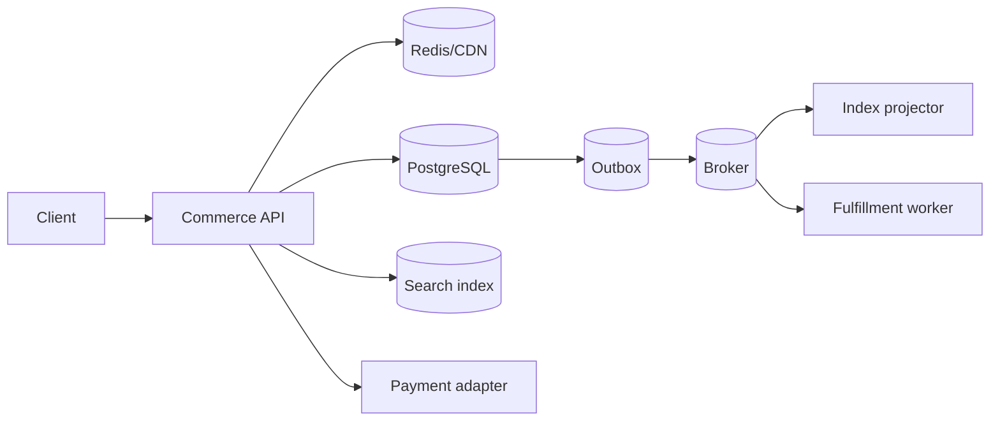

Cache catalog representations and category pages with versioned keys and event-driven invalidation plus TTL. Search is a derived index and can lag; product detail and checkout read authoritative state. Cart storage can be PostgreSQL for durability, Redis for low latency with durable recovery, or a hybrid. State the abandonment and recovery requirements.

Partitioning by tenant/merchant or order ID may eventually help, but inventory and checkout locality govern the choice. Start with indexed PostgreSQL and read models.

### Queues and workflows

A checkout saga might:

1. create an order in `pending` using the idempotency key;
2. reserve inventory atomically with expiry;
3. authorize payment with the order operation ID;
4. confirm the order and publish `OrderConfirmed`;
5. start fulfillment and notification asynchronously.

On permanent payment failure, release inventory. On ambiguous timeout, keep the order pending and reconcile provider status. Do not issue a second charge with a new key.

Use outbox events for search projection, reservation expiry, email, analytics, and fulfillment. Separate workloads so a reindex does not delay checkout events.

### Failure handling

- Catalog cache fails: bypass with database protection and possibly serve stale public catalog.
- Search lags: show explicit freshness and use authoritative product read for checkout.
- Two buyers claim final stock: database conditional reservation lets one succeed.
- Payment times out: order stays pending; reconciliation queries by stable operation ID.
- Worker duplicates `OrderConfirmed`: inbox constraint makes fulfillment idempotent.
- Reservation expiry races with authorization: state/version transitions decide one winner and reconciliation compensates.

### Security

Authorize every cart/order by subject and tenant. Prices and roles are server-derived. Tokenize payment methods through a compliant provider and keep raw card data out of application systems. Validate addresses and promotion inputs, rate-limit checkout, detect enumeration, protect administrative refunds, sign provider webhooks, and audit all money/status changes.

### Observability

Track browse latency/cache behavior, cart-to-checkout conversion, checkout outcome by bounded reason, inventory conflict rate, pending order age, reservation expiry, payment latency/ambiguity, outbox lag, fulfillment queue age, and reconciliation mismatches. Trace one checkout across reservation, payment, and event publication using operation IDs.

### Tradeoffs

- Synchronous checkout gives immediate answers but couples availability to inventory and payment.
- A pending-order workflow tolerates ambiguity but complicates client UX.
- Reserving inventory before payment reduces oversell but can hoard stock; payment first can require void/refund.
- One modular monolith enables atomic local transitions; services allow independent scale but introduce sagas and replicated views.

---

## Case 3: Social Media Backend and Feed

### Requirements

Support profiles, follow/unfollow, post creation, media references, home feed, profile feed, likes, comments, deletion, privacy/blocking, moderation, and notifications. The design must handle skew: a small number of accounts may have enormous follower counts.

Define feed ordering (chronological, ranked, or hybrid), freshness target, edit/delete propagation, and whether counters may be approximate.

### API

```http
POST /v1/posts
GET  /v1/posts/{post_id}
DELETE /v1/posts/{post_id}
PUT  /v1/users/{user_id}/following/{target_id}
DELETE /v1/users/{user_id}/following/{target_id}
GET  /v1/users/{user_id}/posts?cursor=
GET  /v1/feed?cursor=
PUT  /v1/posts/{post_id}/likes/me
DELETE /v1/posts/{post_id}/likes/me
POST /v1/posts/{post_id}/comments
```

Use cursor pagination with a stable ranking/time plus ID tie-breaker. PUT/DELETE make follow and like operations naturally idempotent.

### Data model

```text
users(id, privacy_state, profile_version)
follows(follower_id, followed_id, state, created_at)
blocks(blocker_id, blocked_id)
posts(id, author_id, body_ref, visibility, created_at, deleted_at, version)
post_media(post_id, object_id, position)
likes(post_id, user_id, created_at)
comments(id, post_id, author_id, body, created_at, deleted_at)
feed_entries(user_id, rank_or_time, post_id, source_author_id)
counter_projections(subject_type, subject_id, kind, value, updated_at)
outbox_events, moderation_cases
```

Unique constraints make follow and like idempotent. Treat counters as projections unless exactness is required. Tombstones or deletion events let caches, feeds, search, and moderation replicas remove content.

### Architecture, cache, and scaling

Use a hybrid feed:

- fan out ordinary authors' post IDs to follower feed inboxes on write;
- do not fan out celebrity accounts to millions of rows immediately;
- merge celebrity/profile streams at read time;
- rank/filter after applying blocks, privacy, deletion, and moderation.

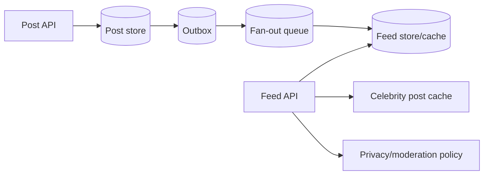

Cache post bodies, profile summaries, and initial feed pages for short periods with viewer-sensitive keys or post-filtering. Never cache a personalized feed as public. Partition large edge/feed tables by user ID, while recognizing celebrity fan-out hotspots.

### Queues and derived views

Queues handle feed fan-out, notification candidates, counter aggregation, search indexing, media processing, moderation, and deletion propagation. Event IDs and post versions make consumers idempotent and prevent an older edit from overwriting a newer projection.

Fan-out workers need per-author and per-follower rate controls. Backfill a new follower's feed separately from real-time fan-out so it cannot starve fresh events.

### Failure handling

- Fan-out delayed: profile feed remains authoritative; home feed is stale but available.
- Duplicate like/follow: uniqueness yields the same state.
- Delete races with fan-out: read-time tombstone/policy filters prevent display; async cleanup follows.
- Celebrity spike: switch to read-time merge and hot cache, protect storage with admission limits.
- Counter lag: display approximate count or hide it; never use projection count for authorization.
- Moderation unavailable: quarantine new high-risk content or degrade according to policy.

### Security

Enforce privacy, blocks, audience, and tenant/community rules at read and write. Object IDs must not grant access. Sanitize rendered content, constrain URLs and uploads, detect spam/automation, rate-limit interactions, protect account recovery, and maintain moderation/audit workflows. Deletion must propagate to caches, feeds, search, media, and legal retention paths.

### Observability

Measure post creation, feed generation latency, empty/error responses, feed entry age, fan-out queue age, fan-out amplification, cache hits, celebrity/hot-key skew, policy-filter counts, deletion propagation lag, moderation backlog, and counter projection drift. Sample traces by feed strategy and record algorithm version.

### Tradeoffs

- Fan-out on write gives fast reads but amplifies celebrity writes and storage.
- Fan-out on read keeps writes cheap but increases read latency and computation.
- Ranked feeds improve relevance but require feature freshness, experimentation, and explainability.
- Exact counters and immediate global deletion are expensive; define which paths require strictness.

---

## Case 4: File Upload and Processing Service

### Requirements

Accept small and large files, resume multipart uploads, validate checksum and ownership, quarantine and scan content, extract metadata/derivatives, expose processing status, and issue authorized downloads. Files must not pass through FastAPI memory when direct object-storage upload is available.

Define allowed types, maximum original and expanded size, retention, regional storage, versioning, public/private access, and processing deadline.

### API

```http
POST /v1/uploads
  -> {upload_id, object_key, part_urls or upload_url, expires_at}

POST /v1/uploads/{upload_id}/parts
POST /v1/uploads/{upload_id}/complete
GET  /v1/uploads/{upload_id}
DELETE /v1/uploads/{upload_id}
GET  /v1/files/{file_id}/download-url
```

Creation records expected size, allowed media category, checksum, tenant, and purpose. Completion verifies storage metadata and changes `initiated -> uploaded`; it does not mark the file safe. Download is permitted only after `available` and an authorization check.

### Data model

```text
uploads(id, tenant_id, owner_id, purpose, storage_key, expected_size,
        expected_checksum, claimed_type, detected_type, state,
        multipart_upload_id, expires_at, created_at)
upload_parts(upload_id, part_number, etag, size)
files(id, upload_id, storage_version, state, scan_result, metadata,
      available_at, retention_until, deleted_at)
derivatives(id, file_id, kind, storage_key, state)
processing_attempts(id, file_id, stage, status, error_code, started_at)
```

Generate opaque storage keys. Do not use the client filename as a path. Keep the original filename as bounded metadata only if needed.

### Architecture, cache, and scaling

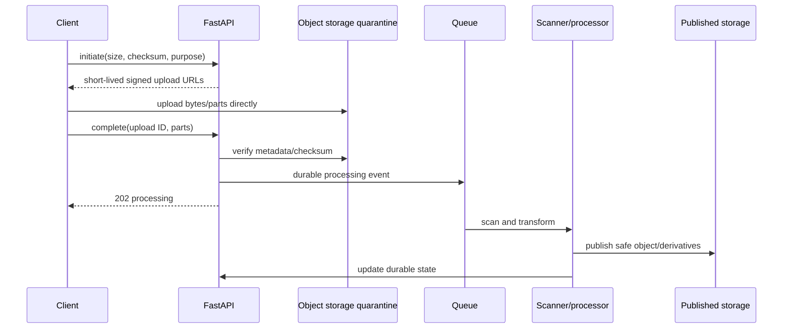

Object storage carries bandwidth and durability. FastAPI controls authorization and metadata. A CDN serves public or authorized-download content according to cache policy. Cache only safe metadata/status briefly; storage state and database state require reconciliation.

Multipart uploads support parallel/resumable transfer. Abort abandoned multipart sessions through a lifecycle job to stop storage cost growth.

### Queues and processing

Stages may include type detection, malware scan, archive inspection, media probing, OCR, thumbnail/transcode, content moderation, and publish. Separate untrusted parsers into sandboxed workers with minimal network and filesystem privileges. Each stage records state and is idempotent by file version plus processor version.

Limit decompressed bytes, file count, recursion, CPU, memory, and time. Never trust extension or `Content-Type` alone.

### Failure handling

- Signed URL expires mid-upload: issue new URLs only for the same authorized upload and remaining parts.
- Client says complete but parts/checksum differ: reject and keep quarantined.
- Completion request repeats: return the existing state.
- Scanner crashes: queue redelivery resumes an idempotent stage.
- Database commit succeeds but event publish fails: outbox retains work.
- Storage event duplicates or arrives before API completion: reconcile against upload state/version.
- Processing permanently fails: quarantine, expose safe error code, and apply retention cleanup.

### Security

Signed URLs are bearer credentials: scope them to exact object key/method, expected headers/size where supported, and short expiry. Use tenant authorization before initiation, completion, and download. Quarantine by default, use allowlisted formats, detect actual type, randomize names, scan before use, prevent path traversal/archive bombs/parser SSRF, encrypt, and keep storage private. Serve active content with safe content disposition and isolated domains where appropriate.

### Observability

Measure initiated/completed/abandoned uploads, bytes and part retry, checksum mismatch, state age, queue age by stage, scan outcomes, processing duration, expansion ratio, storage errors, derivative failures, download authorization failure, and cleanup backlog. Trace metadata operations, not every byte. Audit sensitive downloads separately.

### Tradeoffs

- Proxy upload through FastAPI simplifies clients but consumes API bandwidth and connections.
- Direct signed upload scales better but needs a two-phase state/reconciliation design.
- Synchronous scanning delays response and encourages retries; asynchronous quarantine needs status UX.
- Deduplicating by content hash saves storage but can leak file existence or cross-tenant information unless scoped carefully.

---

## Case 5: Notification Service

### Requirements

Accept transactional and bulk notification intents, resolve templates and locale, enforce user preferences and legal suppression, deliver email/SMS/push/in-app messages, schedule future delivery, track provider outcomes, and prevent duplicates. Transactional security messages need higher priority and stricter latency than campaigns.

### API

```http
POST /v1/notifications             Idempotency-Key required
POST /v1/notifications/batches
GET  /v1/notifications/{id}
POST /v1/notifications/{id}/cancel
PUT  /v1/users/{user_id}/preferences
POST /v1/providers/{provider}/webhooks
```

Internal producers can publish domain events rather than call HTTP for every notification. The service maps business events to notification intents; producers should not assemble vendor payloads.

### Data model

```text
notification_intents(id, tenant_id, recipient_ref, category, priority,
                     template_version, locale, data_ref, scheduled_at,
                     idempotency_key, state, expires_at)
delivery_attempts(id, intent_id, channel, provider, attempt_no, state,
                  provider_message_id, next_attempt_at, error_code)
templates(id, tenant_id, name, version, channel, subject, body, status)
preferences(user_id, category, channel, enabled, quiet_hours, timezone)
suppressions(destination_hash, channel, reason, effective_at)
provider_events(provider, event_id, provider_message_id, type, occurred_at)
```

Snapshot the template version and rendering inputs needed for audit/retry. Encrypt sensitive destinations; use a normalized hash for suppression lookup only if the threat model permits it.

### Architecture, cache, and scaling

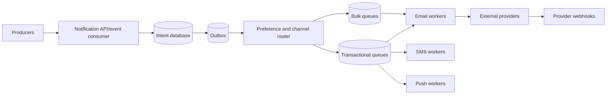

Cache templates and preferences briefly with versioning/invalidation, but recheck suppression near send time. Partition queues by channel, priority, and possibly provider. Apply tenant quotas and fair scheduling so one campaign cannot starve all users.

### Queues and scheduling

Persist intent before acceptance. A router evaluates current preferences, quiet hours, channel fallback, and expiry, then emits delivery tasks. Workers claim attempts, render or retrieve a rendered artifact, call providers with stable operation keys, and record results.

Scheduled messages should store the intended local time zone plus UTC execution instant and define daylight-saving behavior. Cancellation is best effort after a provider accepts a message.

### Failure handling

- Provider timeout after acceptance: reconcile by operation/provider message ID before sending again.
- 429 or 5xx: retry with `Retry-After`, jitter, expiry, and provider/tenant budgets.
- Invalid destination or unsubscribe: mark permanent and update suppression where appropriate.
- Provider outage: open circuit, queue within retention, route to secondary only when semantics and duplicate control are safe.
- Webhook duplicated/reordered: deduplicate provider event ID and apply monotonic delivery state rules.
- Template bug: stop affected version, retain intents, and replay after repair with an audited decision.

### Security

Authorize producers by notification category and tenant. Prevent template injection with constrained rendering, context-aware escaping, approved links/senders, and preview/testing. Protect destinations and message content in logs and queues. Enforce unsubscribe, consent, quiet-hours, and jurisdiction policy. Sign/verify internal events and provider webhooks. Restrict bulk APIs and audit administrator actions.

### Observability

Track accepted intents, scheduling delay, queue oldest age, send latency, outcome by channel/provider/bounded reason, provider quota, retry/exhaustion, duplicate suppression, preference suppression, bounce/complaint/unsubscribe, template version, and cost units. Separate "provider accepted" from "delivered" and from user engagement.

### Tradeoffs

- Central service gives consistent preferences and provider handling but becomes a shared critical dependency.
- Rendering at enqueue preserves historical content; rendering at send uses fixes and current locale/preferences.
- Multi-provider fallback improves availability but complicates sender identity, deliverability, cost, and duplicates.
- Exactly-once user delivery is not generally provable; design effectively-once intent and transparent attempt history.

---

## Case 6: Real-Time Chat Backend

### Requirements

Support one-to-one and group conversations, message send/history, real-time delivery, offline sync, edits/deletes, delivery/read receipts, typing and presence, attachments, moderation, and multi-device sessions. Define maximum group size, ordering scope, retention, encryption model, and acceptable presence staleness.

### API and protocol

REST handles durable setup and history; WebSocket handles low-latency bidirectional events:

```http
POST /v1/conversations
GET  /v1/conversations?cursor=
GET  /v1/conversations/{id}/messages?before=&limit=
POST /v1/conversations/{id}/messages   Idempotency-Key required
POST /v1/attachments/uploads
GET  /v1/realtime-token
WS   /v1/realtime
```

Example WebSocket envelopes:

```json
{"type":"message.send","request_id":"client-7","conversation_id":"c1","body":"hello"}
{"type":"message.created","event_id":"e9","conversation_id":"c1","sequence":418,"message":{}}
{"type":"receipt.read","conversation_id":"c1","through_sequence":418}
```

Version the envelope. Client request IDs make sends idempotent across reconnect. Server event IDs and conversation sequence support resume and deduplication.

### Data model

```text
conversations(id, type, created_at, latest_sequence)
conversation_members(conversation_id, user_id, role, joined_sequence,
                     left_sequence, last_read_sequence)
messages(id, conversation_id, sequence, sender_id, client_request_id,
         body_cipher_or_ref, created_at, edited_at, deleted_at)
message_versions(message_id, version, body_ref, edited_at)
attachments(id, message_id, file_id, state)
devices(id, user_id, push_token_ref, last_seen_at)
```

Unique `(conversation_id, sender_id, client_request_id)` prevents duplicate sends. Unique `(conversation_id, sequence)` provides ordering. Allocate sequences with a database row/sequence, partition leader, or another mechanism whose contention matches group scale.

### Architecture, cache, and scaling

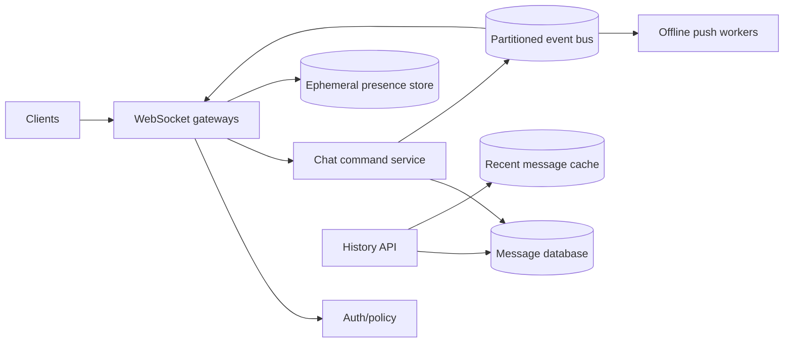

Partition messages/events by conversation ID to preserve per-conversation order and parallelize unrelated conversations. Gateways maintain connection maps locally and advertise user/device routing through ephemeral shared state or pub/sub. Presence uses heartbeats with TTL and is explicitly approximate.

Cache recent public-to-members history only after membership authorization. Do not use cached membership beyond the accepted revocation window.

### Queues and delivery

Commit the message and outbox event atomically. Fan-out consumers deliver to connected devices and enqueue offline push notifications. At-least-once event delivery means gateways and clients deduplicate by event ID/sequence. Store history first, so reconnect can repair any missed live events.

Large groups should not write one durable delivery row per member unless product receipts require it. Maintain per-user read watermark and derive aggregate counts where possible.

### Failure handling

- Gateway disconnect: client reconnects with last seen sequence and fetches gaps.
- Duplicate send after timeout: unique client request ID returns original message.
- Events arrive out of order: buffer briefly or fetch missing sequence; history is authority.
- Presence store fails: show unknown/offline rather than denying messages.
- Event bus lags: writes remain durable; live delivery degrades, queue-age alert fires.
- Member removed during send: authorization and membership version at commit decide; delivery filters current policy where required.
- Hot group: isolate partition, batch fan-out, enforce group/rate limits, or assign dedicated routing capacity.

### Security

Authenticate WebSocket establishment with a short-lived token and reauthorize conversation actions. Prevent origin abuse for browser connections, limit message/frame size and rate, sanitize rendered content, scan attachments, apply block/moderation policy, and avoid exposing membership through errors. TLS protects transport. End-to-end encryption changes search, moderation, multi-device key management, recovery, and notification previews; it must be a product-wide protocol decision, not a flag on storage encryption.

### Observability

Measure active connections, connect/auth failures, event-loop lag, messages accepted, commit latency, bus lag, end-to-end delivery latency, reconnect/gap rate, duplicate sends, outbound buffer depth, slow consumers, presence heartbeat delay, push fallback, and hot conversation skew. Trace send-to-commit and link fan-out spans rather than creating one enormous fan-out trace.

### Tradeoffs

- WebSockets provide bidirectional low latency but complicate load balancing, draining, backpressure, and mobile connectivity.
- SSE plus HTTP send is simpler for server-to-client streams but not bidirectional.
- Strict global order is unnecessary; per-conversation order gives better scale.
- Durable per-device receipts enable precision but amplify writes.
- End-to-end encryption improves confidentiality while limiting server features and recovery.

---

## Case 7: AI Inference API

### Requirements

Expose one or more language, vision, speech, or custom model capabilities through authenticated APIs. Support short synchronous requests, token/event streaming, long asynchronous jobs, cancellation, model version selection, quotas, safety policy, usage accounting, and either hosted providers or self-managed accelerators.

Define latency by workload class rather than one global target:

- time to first token/event for interactive streaming;
- total generation time and output limit;
- queue wait and completion deadline for batch jobs;
- availability and fallback by model tier;
- maximum tokens, image/audio bytes, context size, and concurrent work per tenant;
- whether outputs are deterministic enough to cache or reproduce.

### API

```http
POST /v1/inferences
  {model, input, parameters, stream: false}

POST /v1/inferences:stream
  Accept: text/event-stream

POST /v1/inference-jobs              Idempotency-Key required
GET  /v1/inference-jobs/{job_id}
POST /v1/inference-jobs/{job_id}/cancel
GET  /v1/models
```

For Server-Sent Events, define event types such as `started`, `delta`, `usage`, `completed`, and `error`. A 200 response followed by a stream error cannot change its HTTP status; the event protocol needs a terminal error shape. Send heartbeats through proxies when required and stop generation on disconnect when cancellation is supported and safe.

Asynchronous creation returns 202 plus a status URL. Store large inputs/outputs in object storage and pass references, not megabytes through a queue.

### Data model

```text
model_deployments(id, provider, model_name, version, capability, state,
                  region, max_context, policy_version)
inference_operations(id, tenant_id, actor_id, idempotency_key,
                     model_deployment_id, request_fingerprint, state,
                     input_ref, output_ref, prompt_version, created_at,
                     started_at, completed_at, deadline_at)
usage_records(operation_id, input_units, output_units, compute_ms,
              cost_amount, currency, measured_at)
inference_attempts(id, operation_id, deployment_id, attempt, state,
                   provider_request_id, error_code, latency_ms)
safety_decisions(operation_id, policy_version, category, decision)
```

Usage records should be append-only or ledger-like when they drive billing. Do not rely solely on metrics for customer invoices.

### Architecture, cache, and scaling

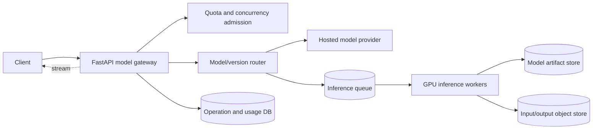

The gateway validates requests, enforces tenant policy, chooses a deployment, normalizes provider behavior, and records usage. Separate CPU preprocessing, GPU inference, and postprocessing capacity when their scaling differs.

For self-hosted models, route requests by model/version so workers keep weights warm. Dynamic batching improves accelerator utilization but adds queue delay; use separate interactive and batch queues or a maximum batching wait. Autoscale on queue delay, active tokens/compute units, and accelerator utilization, not only request count.

Exact response caching is safe only when every output-affecting input is in the key: model artifact/version, prompt template, parameters, tools, retrieved context, safety policy, and tenant isolation. Non-determinism and privacy often reduce value. Cache embeddings or deterministic preprocessing more readily, with versioned keys.

### Queues and long jobs

Persist operation state and enqueue through an outbox. Workers lease jobs, heartbeat, checkpoint where useful, respect deadlines/cancellation, and atomically publish terminal state. Idempotency prevents duplicate billed jobs when creation retries.

Priority and weighted fair queues stop one tenant or batch import from consuming all accelerators. Admission control should reject early when the promised deadline is impossible rather than accepting an unbounded backlog.

### Failure handling

- Hosted provider times out: the outcome/usage may be ambiguous; use provider request ID and documented idempotency/status behavior.
- Stream disconnects: cancel upstream generation where supported, record partial usage, and do not retry transparently into a second visible stream.
- GPU worker dies: lease expires and job retries from a safe checkpoint or start, with duplicate usage protection.
- Model deployment is unhealthy: circuit-break it and route only to a compatible fallback approved for the tenant and policy.
- Queue exceeds deadline: expire before expensive work and return a terminal capacity error.
- Usage event write fails: keep operation pending reconciliation; never silently omit billable usage.

### Security and safety

Authenticate and authorize model, tools, data region, and budget. Bound input, output, context, uploads, and concurrency. Treat prompts and model outputs as untrusted data. Prevent tool calls from becoming SSRF or arbitrary code execution through allowlisted typed tools, isolated credentials, and policy checks. Encrypt sensitive inputs, define retention/zero-retention provider settings, and redact telemetry.

Content safety is layered and policy-specific: input checks, model/tool constraints, output checks, abuse detection, and human escalation. A model instruction is not an authorization decision. Protect model artifacts and provider keys, and prevent one tenant's context from entering another's batch/cache.

### Observability

Measure admission/rejection, queue delay, time to first event, total latency, tokens or workload units, throughput per deployment, accelerator utilization/memory, batch size, cancellation, provider error/retry, safety decisions, output truncation, usage reconciliation lag, and cost per bounded product/model tier. Record model, prompt, tool, and policy versions in traces or durable operation metadata without recording sensitive prompt text by default.

Quality needs evaluation signals beyond uptime: task-specific offline evals, sampled human review, regression sets, safety false-positive/negative review, and version canaries. Do not use user feedback alone as an unbiased quality metric.

### Tradeoffs

- Hosted providers reduce model operations but add data, quota, cost, and availability dependencies.
- Self-hosting offers control and potential unit economics at scale, with accelerator scheduling and model-serving burden.
- Streaming improves perceived latency but complicates retries, status, moderation, and usage settlement.
- Dynamic batching raises throughput while increasing time to first token.
- Fallback models improve availability but may change quality, safety, context, latency, and price contracts.

---

## Case 8: Retrieval-Augmented Generation API

### Requirements

Ingest documents from uploads and connectors, extract and normalize text, split it into retrievable units, create embeddings, maintain tenant-scoped indexes, answer questions with cited source passages, stream responses, delete/reindex content, and evaluate retrieval and answer quality.

Define freshness from source change to searchable content, supported document sizes/types, access-control granularity, query latency, citation requirements, model/data residency, retention, and whether a user may retrieve only documents they can currently access.

### API

```http
POST /v1/collections
POST /v1/collections/{collection_id}/documents
POST /v1/collections/{collection_id}/connectors
GET  /v1/ingestion-jobs/{job_id}
DELETE /v1/documents/{document_id}
POST /v1/collections/{collection_id}/reindex
POST /v1/answers
POST /v1/answers:stream
GET  /v1/answers/{answer_id}
```

Document creation returns a durable ingestion job. Query input includes collection IDs, filters, conversation context reference, and response mode. The server derives tenant and access scope from identity, never solely from supplied filters.

### Data model

```text
collections(id, tenant_id, name, embedding_profile, access_policy_version)
documents(id, collection_id, source_uri, source_version, checksum,
          state, metadata, created_at, deleted_at)
document_acl(document_id, principal_or_group, permission, version)
ingestion_jobs(id, document_id, pipeline_version, state, stage,
               checkpoint, error_code, created_at, completed_at)
chunks(id, document_id, document_version, ordinal, text_ref,
       token_count, metadata, content_hash, pipeline_version)
embedding_records(chunk_id, embedding_model_version, vector_ref, state)
answers(id, tenant_id, actor_id, query_hash, retrieval_version,
        prompt_version, model_version, response_ref, usage, created_at)
citations(answer_id, chunk_id, document_version, quoted_range, rank)
```

Vector data may live in PostgreSQL with an extension, a search engine, or a vector database. PostgreSQL remains a good authority for metadata, ACLs, ingestion state, and versions. Store document/chunk version in every vector record so stale projections are filterable and rebuildable.

### Architecture, cache, and scaling

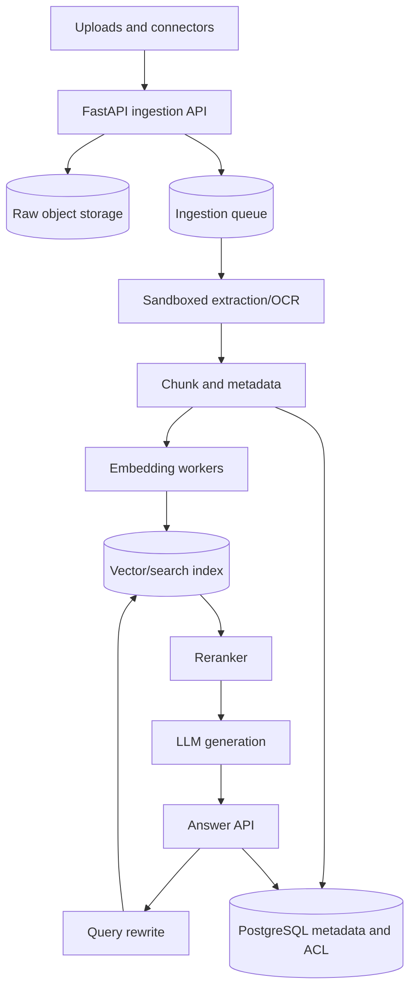

Version the complete ingestion profile: extractor, OCR, normalization, chunking, embedding model, dimensions, and metadata mapping. Build a new index/profile alongside the old, backfill, evaluate, then switch traffic. Do not overwrite all vectors in place without a rollback path.

Hybrid retrieval combines lexical and vector candidates, followed by reranking and diversity rules. Fetch source text and current ACL from authoritative storage before generation when access can change faster than the index.

Cache deterministic embeddings by content hash plus model version, connector cursors, and perhaps retrieval results for non-sensitive repeated queries. Answer caching is risky because ACL, source freshness, conversation, prompt, and model version all affect output. Scope every cache by tenant and policy version.

### Queues and ingestion

Use separate queues for fetch, scan, extraction/OCR, chunking, embedding, indexing, and cleanup when capacity profiles differ. Each stage consumes and emits versioned artifacts and can restart from a durable checkpoint. Deduplicate documents by tenant-scoped content hash only when product semantics permit.

Apply backpressure at connector and upload admission. A mass reindex must not starve incremental updates. Provide progress by stage, and garbage-collect partial artifacts after terminal failure.

### Failure handling

- Connector rate-limited: checkpoint cursor, honor retry guidance, and resume without duplicate versions.
- Parser fails on malicious/corrupt file: quarantine and mark permanent without blocking the collection.
- Embedding provider changes dimensions: write a new versioned index, never mix vectors.
- Index write succeeds but state update fails: idempotent upsert by chunk/version and reconcile.
- ACL changes while index is stale: authoritative filtering prevents unauthorized context; stale results are discarded.
- Generation fails after retrieval: citations/retrieval trace can be retained for retry under policy, but use a new answer attempt with explicit model version.
- Delete occurs during ingestion: generation/version check prevents the late worker from republishing deleted content.

### Security and safety

Treat files, extracted text, connector metadata, retrieved passages, and model output as untrusted. Sandbox parsers, prevent connector SSRF, scope connector credentials, enforce tenant and document ACL before context assembly, encrypt data, and remove content from every projection on deletion according to retention policy.

Documents can contain prompt injection that asks the model to reveal other context or invoke tools. Mark retrieved text as data, constrain tools with typed allowlists and independent authorization, minimize context, filter results by ACL before the model sees them, and test exfiltration. Citations do not prove truth; validate that cited spans support the answer where feasible.

### Observability and evaluation

Measure ingestion stage latency/error, document freshness, connector lag, queue age, bytes/pages/tokens, chunk and vector counts, embedding cost, index update delay, query latency by stage, candidate count, ACL-filter rate, cache hit, reranker latency, generation units, citation coverage, and deletion propagation.

Maintain evaluated datasets with query, relevant sources, expected constraints, and policy cases. Track retrieval recall/precision proxies, ranking metrics, groundedness/faithfulness, citation correctness, refusal behavior, latency, and cost by pipeline version. Run canaries before changing chunking, embeddings, reranker, prompt, or model.

### Tradeoffs

- PostgreSQL vector search simplifies consistency and operations at moderate scale; a specialized system may improve retrieval scale/features with another projection to operate.
- Smaller chunks improve targeting but lose context and increase vector count; larger chunks preserve context but dilute retrieval.
- Index-time ACL filtering is fast but can go stale; query-time authoritative filtering is safer but costs latency.
- Reindex-in-place saves storage but risks mixed versions and hard rollback.
- More retrieved context can improve recall while increasing cost, latency, and prompt-injection surface.

---

## Case 9: Payment Service

### Requirements

Create payment intents, authorize, capture, void, refund, record fees/settlement, consume provider webhooks, reconcile ambiguous and settled outcomes, and expose an auditable ledger. Money movement requires effectively-once business outcomes, precise amounts/currencies, strong authorization, and recovery tools.

Clarify whether the service is an orchestration layer over a payment processor or a regulated payment system. The latter changes compliance, custody, ledger, risk, and availability requirements substantially.

### API

```http
POST /v1/payment-intents                    Idempotency-Key required
GET  /v1/payment-intents/{id}
POST /v1/payment-intents/{id}/authorize     Idempotency-Key required
POST /v1/payment-intents/{id}/capture       Idempotency-Key required
POST /v1/payment-intents/{id}/cancel        Idempotency-Key required
POST /v1/refunds                            Idempotency-Key required
GET  /v1/refunds/{id}
POST /v1/providers/{provider}/webhooks
```

The caller sends integer minor units or an exact decimal with ISO currency; never binary floating point. Each mutation has a stable operation ID. Return `pending` for ambiguous provider outcomes rather than guessing success or issuing a new operation.

### Data model

```text
payment_intents(id, merchant_id, order_ref, amount_minor, currency,
                state, provider, provider_customer_ref, version, created_at)
payment_operations(id, intent_id, type, idempotency_key, request_fingerprint,
                   state, provider_operation_id, amount_minor,
                   attempt_count, created_at, resolved_at)
refunds(id, intent_id, operation_id, amount_minor, state)
ledger_accounts(id, owner_type, owner_id, currency, type)
ledger_transactions(id, operation_id, effective_at, description)
ledger_entries(transaction_id, account_id, direction, amount_minor)
provider_events(provider, event_id, received_at, processed_at)
reconciliation_items(id, provider, external_ref, local_ref, state, discrepancy)
outbox_events, audit_events
```

Double-entry ledger transactions balance debits and credits per currency and are append-only. Corrections use reversing entries. Constraints enforce positive amounts, balanced entries through a controlled posting procedure, valid state transitions, and uniqueness of operation/idempotency keys.

### Architecture, cache, and scaling

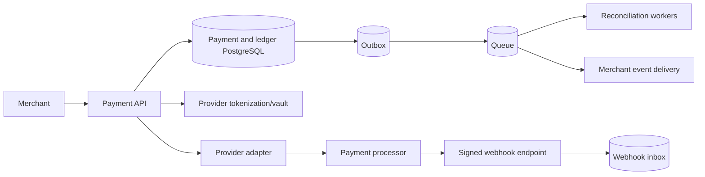

Keep mutable payment state and ledger posting in a strongly consistent primary store. Cache only public provider metadata or read projections that are not used to decide money movement. A stale cache must never authorize an extra refund or capture.

Partition by merchant or account only after carefully addressing cross-account ledger transactions, uniqueness, reporting, and reconciliation. Separate interactive authorization traffic from settlement/reporting jobs.

### Queues and workflow

Commit payment state, ledger effects, and outbox events together where they belong to one local transaction. Webhooks enter a durable inbox after raw signature verification and are processed idempotently. Reconciliation workers poll provider operations and settlement reports for pending or mismatched state.

Merchant webhooks are at-least-once with stable event IDs, signed payloads, retries, and replay tools. They report state changes after durable local commit.

### Failure handling

- Provider times out after authorization: mark operation `pending_provider`, query by provider/idempotency reference, and block incompatible follow-up actions.
- API response is lost after local success: replay returns the recorded operation response.
- Provider webhook precedes API response: inbox/state machine applies it by provider operation ID without regressing state.
- Duplicate webhook: unique provider event ID makes it a successful no-op.
- Ledger post fails: payment state transition does not commit; reconcile external provider outcome before repair.
- Reconciliation finds mismatch: create a durable case, stop unsafe automation where needed, and require audited resolution.
- Provider outage: circuit and reject/pending by product policy; never silently route a second provider without cross-provider duplicate controls.

### Security

Keep card data out of scope through hosted collection/tokenization where possible. Use TLS, scoped provider credentials, managed keys, strict merchant and operator permissions, separation of duties, tamper-evident audit, secure webhook verification, rate/amount limits, fraud controls, and protected replay/refund tools. Mask payment references in logs and prohibit secrets/card data in telemetry.

Authorization is resource- and action-specific. A support viewer, refund operator, and key administrator should not share one broad admin role.

### Observability

Track intent/operation outcome and latency, pending age, provider timeout/decline separately, idempotency replay/conflict, ledger imbalance invariant, webhook signature/duplicate/processing delay, outbox lag, refund and capture anomalies, provider settlement lag, reconciliation mismatch count/age, and amount totals through a controlled financial reporting path. Trace by internal operation ID and record provider request ID in restricted logs.

### Tradeoffs

- Synchronous authorization gives immediate checkout UX but couples to provider latency.
- Pending workflows handle ambiguity safely but require client state and reconciliation.
- One payment provider is simpler; multiple providers improve routing/resilience but multiply compliance, reconciliation, and duplicate risks.
- A ledger adds modeling and operational rigor; deriving balances from mutable payment rows is simpler but weak for audit and corrections.

---

## Case 10: URL Shortener

### Requirements

Create random or custom short codes, redirect with very low latency, support expiry/disablement, custom domains, abuse scanning, and asynchronous analytics. Read traffic can greatly exceed writes, and a few links can become extremely hot.

Clarify whether redirect destination can change, whether codes are case-sensitive, expected lifetime, consistency after create/disable, custom-domain ownership, and whether redirect status is 301/308 or 302/307. Permanent redirects can be cached beyond later disablement, so mutable or safety-sensitive links usually use a temporary redirect and controlled cache TTL.

### API

```http
POST /v1/links              Idempotency-Key optional/recommended
GET  /v1/links/{code}
PATCH /v1/links/{code}
DELETE /v1/links/{code}
GET  /{code}                redirect path on short domain
GET  /v1/links/{code}/stats
POST /v1/domains
```

Creation validates and normalizes destination, policy, expiry, and custom alias. Redirect response includes a bounded cache policy. Management APIs require ownership; redirect is public unless link policy says otherwise.

### Data model

```text
links(domain_id, code, owner_id, destination_url, state, created_at,
      expires_at, destination_version, safety_state)
domains(id, owner_id, hostname, verification_token_hash, state)
idempotency_records(owner_id, key, request_fingerprint, link_code)
click_events(event_id, domain_id, code, occurred_at, coarse_context)
daily_link_stats(domain_id, code, day, clicks, bounded_dimensions)
```

The primary key can be `(domain_id, code)`. Generate a random code with enough entropy, attempt insert, and retry on a rare collision. Sequential IDs encoded in a larger alphabet are compact but reveal volume and enable enumeration unless obfuscated and access-controlled.

### Architecture, cache, and scaling

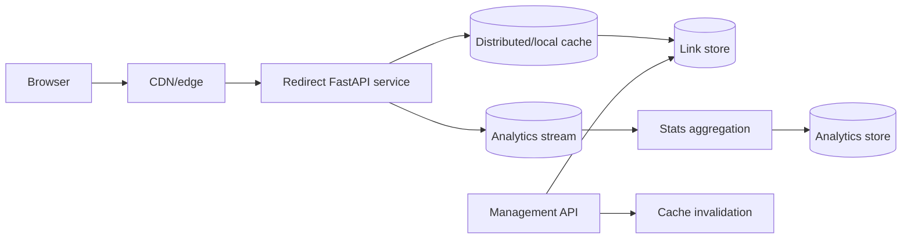

Redirect is a narrow read path. Cache positive mappings with destination version and expiry. Negative-cache missing codes briefly to reduce enumeration load. For very hot links, edge caching absorbs requests, but safety disablement must invalidate or have a sufficiently short maximum age.

The source of truth can begin as indexed PostgreSQL. At very large scale, a partitioned key-value store suits `(domain, code) -> destination` lookups, while PostgreSQL retains ownership/configuration. Avoid changing stores without measured need.

Analytics is never on the critical redirect transaction. Emit a bounded event asynchronously or through edge logs; accept defined loss or use a durable stream according to reporting requirements. Bot filtering and late aggregation mean counts are not immediate.

### Queues and background work

Use events for click aggregation, abuse scanning, expiry cleanup, cache invalidation, and custom-domain certificate workflows. Link creation may start in `pending_scan`; decide whether redirects are blocked, warned, or allowed during scanning. Consumers deduplicate event IDs if exact operational counts matter, while approximate analytics can trade some precision for cost.

### Failure handling

- Cache unavailable: read store with load shedding; do not stampede it for a hot code.
- Store unavailable: serve a bounded stale safe mapping only if disablement policy permits, otherwise fail closed.
- Analytics unavailable: buffer within limit or drop according to product contract; redirect remains fast.
- Code create response lost: idempotency key returns the same code.
- Custom alias collision: unique constraint returns conflict.
- Destination becomes malicious: set disabled state, purge caches/edge, retain audit, and monitor propagation delay.
- Hot link overload: edge cache, replicated cache, request coalescing, and abuse controls.

### Security

Treat destinations as untrusted. Allow only supported schemes, normalize carefully, block dangerous/internal schemes, scan reputation, rate-limit creation, detect phishing/malware, verify custom domain ownership, and provide rapid takedown. The redirect service does not fetch the destination, avoiding SSRF. Do not log full query strings because they often contain secrets. Limit analytics privacy and retention.

### Observability

Measure redirects by outcome/status, p50/p99 latency, cache hit/miss/stale, origin-store load, hot-key skew, negative lookups, create collisions, abuse decisions, disable-to-cache-purge delay, analytics queue age/drop, and certificate/domain failures. Avoid a metric label per code; use logs/analytics for individual-link investigation.

### Tradeoffs

- Random codes resist enumeration but need collision handling; sequential codes are compact and ordered.
- Permanent redirects maximize client/cache performance but reduce control after destination changes.
- Strong disablement consistency costs availability; bounded stale redirects improve resilience with safety risk.
- Exact click counts cost more and can still differ from human views due to bots and retries.

---

## Case 11: General Job Processing Platform

### Requirements

Allow tenants to submit typed long-running jobs, query state/progress, cancel, prioritize, schedule, retry, retrieve results, and receive completion events. Workers have heterogeneous capabilities and jobs may run from milliseconds to hours.

Define accepted job types, maximum payload/result, deadline, retry ownership, priority/fairness, per-tenant concurrency, cancellation semantics, retention, and whether execution side effects can be made idempotent.

### API

```http
POST /v1/jobs                     Idempotency-Key required
GET  /v1/jobs/{job_id}
GET  /v1/jobs?state=&cursor=
POST /v1/jobs/{job_id}/cancel
POST /v1/jobs/{job_id}/retry
GET  /v1/jobs/{job_id}/result-url
POST /v1/job-types/{type}/pause   administrative
```

Creation returns 202 with `Location`. A job request contains a versioned type and small parameters or input object reference. Manual retry creates a new attempt under the same job or a new linked job according to audit semantics; it does not erase history.

### Data model

```text
jobs(id, tenant_id, type, schema_version, state, priority, input_ref,
     result_ref, idempotency_key, request_fingerprint, scheduled_at,
     deadline_at, cancel_requested_at, created_at, completed_at, version)
job_attempts(id, job_id, attempt_no, worker_id, lease_token, state,
             leased_until, heartbeat_at, started_at, completed_at, error_code)
job_progress(job_id, sequence, stage, current, total, message_code, recorded_at)
job_dependencies(job_id, depends_on_job_id, required_state)
job_events(id, job_id, sequence, type, data, occurred_at)
worker_capabilities(worker_id, queue, capability, version, last_seen_at)
```

The database owns user-visible state; the broker transports work. A monotonically increasing version or transition procedure prevents stale workers from overwriting newer cancellation/retry state.

### Architecture, cache, and scaling

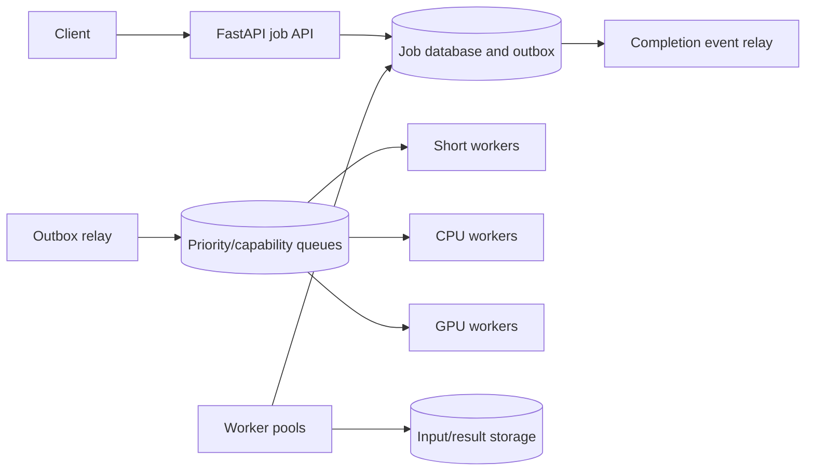

Route by capability and workload duration. Separate high-priority interactive jobs from bulk, while applying weighted fairness and tenant concurrency quotas. Cache status only briefly; cancellation and terminal state need authoritative reads.

Autoscale on oldest eligible job age, expected service time, active concurrency, and resource utilization. Queue depth alone ignores job duration. Maximum worker concurrency must respect database and provider capacity.

### Queue, lease, and execution protocol

1. API inserts job and outbox atomically.
2. Relay publishes a message containing job ID and expected version.
3. Worker atomically claims a pending/retryable job and receives a lease/fencing token.
4. Worker heartbeats and writes bounded progress at safe intervals.
5. Worker stores result, then transitions to terminal state with the current token/version.
6. Outbox emits completion.

A broker visibility timeout or acknowledgement is not the job lease by itself. Long jobs need renewal and a stale worker must be unable to finalize after a new attempt owns the job.

### Failure handling

- API commits but broker publish fails: outbox retries; job remains pending and visible.
- Worker dies before effect: lease expires and job is redelivered.
- Worker dies after external effect: next attempt uses stable operation ID/reconciliation.
- Heartbeat pauses past lease: fencing/version rejects stale completion.
- Poison input: classify permanent, store safe diagnostics, terminal failure/dead letter.
- Cancellation during non-cancellable library call: mark requested, stop at next safe point, and expose honest state.
- Result upload succeeds but state update fails: deterministic object key and reconciliation recover it.
- Queue overload: reject new optional jobs or estimate delay; do not accept beyond retention/deadline.

### Security

Allowlist job types and schemas; never deserialize arbitrary Python objects or let a type name import code. Authorize submit/read/cancel/result by tenant and job type. Use opaque object references, short-lived result URLs, sandbox untrusted transforms, limit CPU/memory/network/time, scope worker credentials, encrypt inputs/results, and audit manual retry/pause. Keep secrets out of payloads and progress text.

### Observability

Measure accepted/rejected jobs, scheduling delay, oldest age, runtime, completion by type/outcome, attempt count, lease expiry, heartbeat delay, stale completion rejection, cancellation latency, progress age, result size, dead-letter/replay, worker utilization, tenant fairness, and deadline misses. Trace submit/outbox/publish and link each attempt using stable job ID, while keeping IDs out of metrics.

### Tradeoffs

- Broker-only status is simple but poor for user queries, retention, and reconciliation.
- Database polling can be adequate at modest scale and gives atomic claiming, while brokers improve distribution and routing.
- Leases enable recovery but allow duplicate concurrent execution near expiry; fencing/idempotency remain necessary.
- Fine-grained progress improves UX but creates write load.
- Priority improves urgent latency but needs aging/fairness to prevent starvation.

---

## Case 12: Webhook Processing and Delivery Platform

### Requirements

Receive signed webhooks from upstream providers, durably deduplicate and process them for internal tenants, and deliver your own domain events to subscriber endpoints. Support secret rotation, schema versions, retries, ordering policy, endpoint verification, pause/replay, and an operator-visible delivery history.

Define maximum body, receipt acknowledgement deadline, retention/replay window, delivery attempt schedule, event ordering boundary, endpoint rate limits, response-size limit, and whether customers require regional delivery or static egress addresses.

### API

Inbound provider endpoints are provider-specific because signature and acknowledgement contracts differ:

```http
POST /v1/inbound/{provider}/{account_ref}
```

Subscriber management and operations:

```http
POST /v1/webhook-subscriptions
POST /v1/webhook-subscriptions/{id}/verify
PATCH /v1/webhook-subscriptions/{id}
DELETE /v1/webhook-subscriptions/{id}
GET  /v1/webhook-deliveries?subscription_id=&cursor=
POST /v1/webhook-deliveries/{id}/replay
GET  /v1/webhook-events/{event_id}
```

The subscription stores an allowlist of event types, endpoint, status, API/schema version, and secret version. Creation may send a verification challenge before activation.

### Data model

```text
inbound_receipts(provider, provider_account, provider_event_id,
                 payload_ref, signature_key_version, received_at,
                 processing_state, processed_at)
events(id, tenant_id, type, schema_version, aggregate_id,
       aggregate_version, payload_ref, occurred_at, created_at)
subscriptions(id, tenant_id, endpoint, event_filter, state,
              secret_ciphertext, secret_version, api_version, created_at)
deliveries(id, event_id, subscription_id, state, attempt_count,
           next_attempt_at, lease_token, last_http_status,
           last_error_code, completed_at)
delivery_attempts(id, delivery_id, attempt_no, started_at, duration_ms,
                  http_status, error_code, response_excerpt)
outbox_events, replay_audit
```

Unique inbound provider event IDs deduplicate receipt. Unique `(event_id, subscription_id)` creates one logical outbound delivery, while attempt rows preserve history. Large/sensitive payloads can use encrypted object references with retention controls.

### Architecture, cache, and scaling

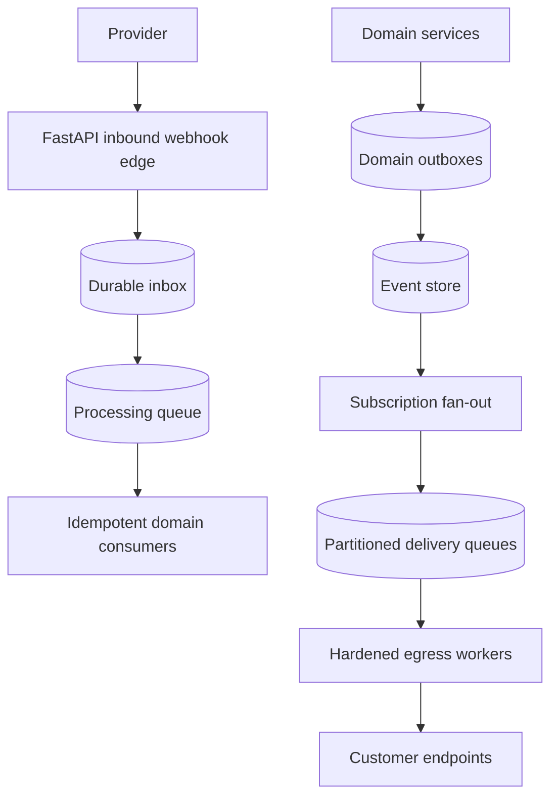

Inbound endpoints read a bounded raw body, verify signature/timestamp, parse a minimal envelope, insert receipt, and return the provider-documented 2xx. Processing happens later.

Outbound workers run in an egress-restricted environment because customer URLs create SSRF risk. Cache subscription configuration briefly by version, but check active state before each attempt when disablement must be fast. Partition delivery by subscription or aggregate when ordered delivery is promised; otherwise maximize parallelism.

### Queues and retry policy

Fan-out creates a delivery record and enqueues it through an outbox. A sender claims with a lease, resolves and validates DNS, signs exact bytes plus timestamp/event ID, sends with strict connect/read/write/pool timeouts, records a bounded response, and acknowledges after state commit.

Retry network errors, 408, 429, and selected 5xx with exponential backoff, jitter, `Retry-After` bounds, maximum attempts, and maximum event age. Most other 4xx are permanent configuration/payload problems. Apply per-subscription concurrency and rate limits plus global egress limits.

Manual replay preserves original event identity and adds a replay header/attempt metadata. It is audited and rate-controlled.

### Failure handling

- Inbound handler commits but 2xx is lost: provider retries; unique event ID returns success without duplicate effect.
- Provider sends older event after newer: aggregate version rules ignore/regenerate current state rather than regress it.
- Outbound receiver processes but response is lost: same event ID is delivered again; receiver must deduplicate.
- Sender dies with a lease: lease expires; another attempt proceeds; stale result is fenced.
- Subscription DNS changes to private IP: re-resolve and reject on every attempt/redirect, not just creation.
- Queue grows during customer outage: per-subscription isolation prevents one endpoint from consuming the platform; events expire or exhaust visibly.
- Signing secret rotates: send/verify according to explicit overlap/version policy; never log secrets.
- Event schema bug: pause affected type/version, repair, then replay from durable records.

### Security

For inbound traffic, use provider-specific raw-body signature verification, constant-time comparison, timestamp/replay window, event-ID deduplication, body limits, TLS, optional mTLS/IP layer, and secret rotation.

For outbound traffic, allow only HTTPS except controlled development, block loopback/private/link-local/metadata destinations, revalidate DNS and redirects, restrict ports, cap response bytes, and isolate network identity. Encrypt subscription secrets, reveal them only at creation/rotation, sign a versioned canonical payload, and authenticate management/replay operations. Minimize personal data in events and honor deletion/retention policy.

### Observability

Inbound signals: receipt rate, signature/timestamp failure, duplicate rate, acknowledgement latency, provider event age, queue delay, processing outcome, schema/version, and reconciliation gaps.

Outbound signals: fan-out count, pending/oldest age, attempt latency/outcome, retries, exhaustion, 429/5xx, DNS/TLS/SSRF rejection, per-subscription backlog, secret version, delivery age, manual replay, and response truncation. Avoid endpoint URL and subscription ID as metric labels; use restricted logs and drill-down queries.

### Tradeoffs

- Fast acknowledgement reduces provider retries but requires durable receipt before 2xx.
- Per-subscription ordering simplifies consumers but a poison/slow delivery can block later events; parallel unordered delivery scales better.
- Storing full payloads improves replay/debugging but increases privacy, breach, and retention cost.
- Static egress IPs help subscriber allowlists but concentrate capacity and operational dependency.
- Exactly-once delivery over HTTP is not achievable without receiver cooperation; promise at-least-once with stable event IDs.

---

## Cross-case comparison

| System | Authoritative state | Main cache | Main asynchronous boundary | Strictest invariant |
|---|---|---|---|---|
| Authentication | Accounts and sessions in PostgreSQL | keys, rate state | security email/audit | one valid session/token-family transition |
| E-commerce | Orders, inventory, payment operation | catalog/read models | fulfillment and projections | no invalid inventory/payment transition |
| Social | posts, graph, privacy state | feeds/posts/profiles | fan-out and moderation | visibility and deletion policy |
| Upload | metadata plus object version | safe metadata/CDN | scan and transform | quarantined bytes never become available early |
| Notification | intent and delivery attempts | templates/preferences | channel delivery | one logical intent and suppression compliance |
| Chat | message history and membership | recent history/presence | live fan-out/push | per-conversation durable sequence |
| AI inference | operation and usage ledger | deterministic artifacts | accelerator jobs | quota, model/policy version, billable usage |
| RAG | document/ACL/version metadata | embeddings/retrieval | ingestion pipeline | no unauthorized or stale-deleted context |
| Payments | payment operations and ledger | non-critical metadata only | webhook/reconciliation | balanced ledger and one logical money operation |
| URL shortener | code-to-destination mapping | redirect mapping/CDN | analytics and scanning | correct active/disabled redirect policy |
| Jobs | job/attempt state | short status cache | execution itself | fenced state transition and idempotent effect |
| Webhooks | inbox/events/deliveries | subscription config | process and delivery | durable deduplication and signed at-least-once delivery |

## System design review checklist

Before considering a design complete, ask:

### Requirements and API

- Are availability, latency, durability, consistency, scale, retention, and cost targets explicit?
- Which APIs are idempotent, and how are payload mismatches handled?
- Are state transitions and pending/terminal outcomes documented?
- Does a 202 response point to durable status?

### Data and consistency

- What is the source of truth for each fact?
- Which constraints protect invariants under concurrency?
- Which views are eventual, how stale may they be, and how are they rebuilt?
- What is the partition and ordering boundary?

### Cache and queue

- Does each cache key contain tenant, policy, and version dimensions?
- Who invalidates it, and what happens during total cache loss?
- Is queue admission bounded by drain capacity and deadlines?
- Are workers idempotent after every possible crash point?

### Failure and recovery

- Can a timeout leave an ambiguous mutation?
- Which layer retries, with what budget and operation identity?
- How are duplicates, reordering, poison data, and stale leases handled?
- Is there reconciliation, restore, and controlled replay tooling?

### Security and operations

- Are authentication, resource authorization, tenant isolation, abuse, SSRF, uploads, secrets, and privacy covered?
- Do telemetry fields avoid secrets, personal data, and high cardinality?
- Do objectives and alerts measure the user promise, including async delay?
- Can the system deploy, migrate, scale, degrade, and recover without violating its invariants?

## Further reading

- [RFC 9700: OAuth 2.0 Security Best Current Practice](https://www.rfc-editor.org/rfc/rfc9700)
- [OpenID Connect Core](https://openid.net/specs/openid-connect-core-1_0.html)
- [OWASP Authentication Cheat Sheet](https://cheatsheetseries.owasp.org/cheatsheets/Authentication_Cheat_Sheet.html)
- [OWASP File Upload Cheat Sheet](https://cheatsheetseries.owasp.org/cheatsheets/File_Upload_Cheat_Sheet.html)
- [Amazon S3: Presigned URLs](https://docs.aws.amazon.com/AmazonS3/latest/userguide/using-presigned-url.html)
- [RFC 6455: The WebSocket Protocol](https://www.rfc-editor.org/rfc/rfc6455)
- [WHATWG: Server-Sent Events](https://html.spec.whatwg.org/multipage/server-sent-events.html)
- [OWASP SSRF Prevention Cheat Sheet](https://cheatsheetseries.owasp.org/cheatsheets/Server_Side_Request_Forgery_Prevention_Cheat_Sheet.html)
- [RabbitMQ Reliability Guide](https://www.rabbitmq.com/docs/reliability)
- [Apache Kafka Design](https://kafka.apache.org/documentation/#design)

## Related topics

- [Architecture Patterns](./architecture-patterns.md)
- [Production Architecture](./production-architecture.md)
- [Distributed Systems](./distributed-systems.md)
- [Queues, Workers, and Scheduling](../docs/04-production/queues-workers-and-scheduling.md)
