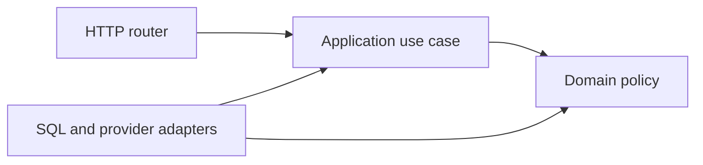
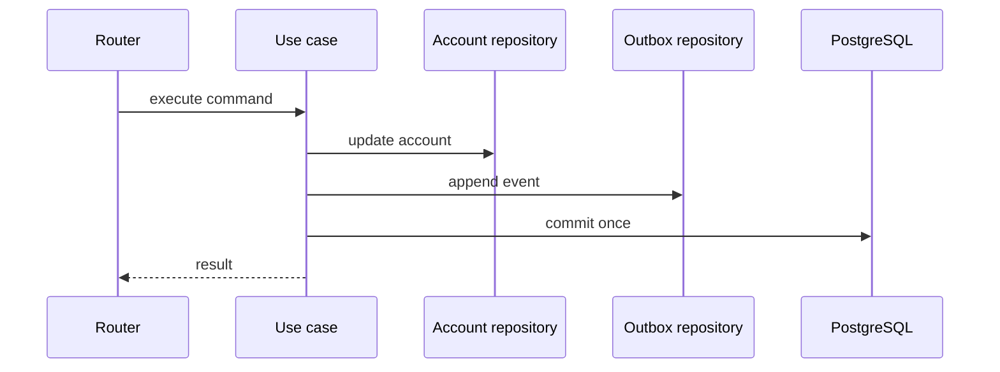

# Backend Project Structure

Project structure is a dependency-management decision expressed as folders. A good structure makes ownership visible, keeps business rules independent of delivery details, and gives tests a stable seam. A bad structure can look tidy while every change still crosses the whole application.

There is no production badge awarded for having `services/` and `repositories/`. Add a boundary when it controls a real source of change, not because the directory name appears in a template.

## The rule that survives every size

Dependencies should point from delivery and infrastructure code toward application and domain policy.



The domain does not import FastAPI, SQLAlchemy sessions, Redis clients, or an email SDK. Small systems may not need a separate domain package, but they still benefit from keeping decisions out of route functions.

## Small project

A small service has a narrow domain, few contributors, and little need to replace infrastructure. Keep it explicit and flat.

```text
app/
|-- main.py
|-- config.py
|-- db.py
|-- models.py
|-- schemas.py
|-- routes/
|   |-- health.py
|   `-- tasks.py
`-- services.py
tests/
|-- conftest.py
`-- test_tasks.py
```

`main.py` constructs the application and includes routers. `routes/` translates HTTP input and output. `schemas.py` owns Pydantic transport models. `models.py` owns persistence mappings. `services.py` contains business operations that would otherwise make routers difficult to test. `db.py` constructs the engine and exposes the session dependency.

This layout is appropriate when the entire application can be understood without jumping between many packages. Splitting every model into its own file would add navigation without establishing a useful boundary.

### A thin route in a small service

```python
from typing import Annotated

from fastapi import APIRouter, Depends, status
from sqlalchemy.orm import Session

from app import schemas, services
from app.db import get_session

router = APIRouter(prefix="/tasks", tags=["tasks"])
SessionDep = Annotated[Session, Depends(get_session)]


@router.post("", response_model=schemas.TaskRead, status_code=status.HTTP_201_CREATED)
def create_task(payload: schemas.TaskCreate, session: SessionDep) -> schemas.TaskRead:
    return services.create_task(session=session, payload=payload)
```

The router owns HTTP status and serialization. The service owns the operation. The session dependency owns cleanup. If the operation is still one obvious insert with no policy, calling a small query function directly is acceptable. A pass-through service is not automatically better.

## Medium project

A medium service usually needs feature ownership, migrations, integrations, and independent testing. Organize by business capability first, then by technical role inside each capability.

```text
app/
|-- main.py
|-- bootstrap.py
|-- core/
|   |-- config.py
|   |-- errors.py
|   |-- logging.py
|   `-- security.py
|-- db/
|   |-- engine.py
|   |-- base.py
|   `-- migrations/
|-- accounts/
|   |-- router.py
|   |-- schemas.py
|   |-- models.py
|   |-- service.py
|   |-- repository.py
|   `-- dependencies.py
|-- orders/
|   |-- router.py
|   |-- schemas.py
|   |-- models.py
|   |-- service.py
|   `-- repository.py
|-- integrations/
|   `-- payment_gateway.py
`-- workers/
    `-- order_jobs.py
tests/
|-- unit/
|   |-- accounts/
|   `-- orders/
|-- integration/
|   `-- db/
`-- api/
    `-- v1/
```

Feature packages prevent the common `routers/`, `services/`, and `repositories/` directories from becoming large unrelated catalogs. An accounts change should mostly remain in `accounts/`. Shared code belongs in `core/` only after at least two features need the same stable behavior.

### What each part owns

| Part | Owns | Must not own |
| --- | --- | --- |
| Router | HTTP parsing, status codes, auth dependency, response mapping | Multi-step business decisions, direct provider SDK calls |
| Schema | Transport validation and serialization | Database transactions, permission queries |
| Service or use case | Application workflow and transaction intent | HTTP exceptions, global client construction |
| Repository | Persistence operations expressed in domain language | Authorization policy, response models |
| Model | Persistence mapping or domain state, depending on the architecture | Request-specific validation |
| Dependency | Per-request resource acquisition and composition | Hidden business side effects |
| Integration adapter | Provider protocol, timeouts, retries, response translation | Cross-feature workflow |
| Configuration | Typed settings loaded at startup | Mutable request state |

FastAPI's [bigger applications guide](https://fastapi.tiangolo.com/tutorial/bigger-applications/) explains router composition. Use that mechanism to support feature boundaries, not to create a router file for every endpoint.

## Large production system

A large system benefits from explicit application ports and infrastructure adapters. The following layout works for a modular monolith and can later expose clear service boundaries.

```text
src/app/
|-- main.py
|-- bootstrap/
|   |-- application.py
|   |-- dependencies.py
|   `-- lifespan.py
|-- platform/
|   |-- config/
|   |-- database/
|   |-- observability/
|   |-- messaging/
|   `-- web/
|-- modules/
|   |-- identity/
|   |   |-- domain/
|   |   |   |-- entities.py
|   |   |   |-- policies.py
|   |   |   `-- events.py
|   |   |-- application/
|   |   |   |-- commands.py
|   |   |   |-- queries.py
|   |   |   |-- handlers.py
|   |   |   `-- ports.py
|   |   |-- infrastructure/
|   |   |   |-- sqlalchemy_models.py
|   |   |   |-- repositories.py
|   |   |   `-- token_signer.py
|   |   `-- api/
|   |       |-- router.py
|   |       |-- schemas.py
|   |       `-- dependencies.py
|   `-- billing/
|       |-- domain/
|       |-- application/
|       |-- infrastructure/
|       `-- api/
|-- integrations/
|   |-- payments/
|   `-- email/
`-- workers/
    |-- consumer.py
    `-- scheduler.py
tests/
|-- unit/
|-- contract/
|-- integration/
|-- api/
`-- system/
```

### API layer

The API layer is an adapter. It turns HTTP details into application input and turns application results into HTTP responses. Authentication establishes an identity here or in a dependency. Authorization that depends on the target resource belongs in an application policy, where workers and other transports can reuse it.

Avoid raising `HTTPException` from domain code. A domain exception such as `OrderCannotBeCancelled` can be mapped to HTTP 409 by a central exception handler and mapped differently by a message consumer.

### Domain and business logic

The domain holds rules whose meaning survives a framework or database change: reservation limits, order state transitions, pricing policy, or permission conditions. It should be possible to test these rules with plain objects.

Not every CRUD service has a rich domain. If the system mostly validates input and persists records, an application service plus SQLAlchemy mappings may be enough. Inventing aggregates and value objects around data with no behavior obscures rather than clarifies.

### Application or service layer

The application layer coordinates one business operation. It loads state through ports, applies policy, writes state, emits an outbox event, and defines the transaction boundary.

```python
from dataclasses import dataclass
from typing import Protocol
from uuid import UUID


class UnitOfWork(Protocol):
    orders: "OrderRepository"

    def commit(self) -> None: ...
    def rollback(self) -> None: ...


class OrderRepository(Protocol):
    def get_for_update(self, order_id: UUID) -> "Order | None": ...


@dataclass(frozen=True)
class CancelOrder:
    order_id: UUID
    actor_id: UUID


def cancel_order(command: CancelOrder, uow: UnitOfWork) -> None:
    order = uow.orders.get_for_update(command.order_id)
    if order is None:
        raise OrderNotFound(command.order_id)
    order.cancel(actor_id=command.actor_id)
    uow.commit()
```

The use case says that cancellation is one transaction. It does not decide how a SQLAlchemy session is constructed or which HTTP status represents a missing order.

### Repository layer

A repository is useful when persistence behavior is complex, when tests need a meaningful port, or when domain language differs from query mechanics. Methods such as `find_expired_reservations()` or `get_for_update()` communicate intent.

A repository is usually unnecessary when it only renames the ORM:

```python
# Extra indirection with no policy or reusable query.
def get_user(session: Session, user_id: UUID) -> User | None:
    return session.get(User, user_id)
```

Do not return a generic `BaseRepository[T]` merely to hide `select()`. Generic CRUD abstractions tend to leak as soon as loading strategy, row locks, tenant filters, or domain-specific errors matter.

### Database layer

The database package owns engine construction, pool settings, mappings, migration metadata, session lifecycle, and shared database instrumentation. Query code lives in feature repositories or query handlers because it changes with that feature.

A SQLAlchemy `Session` represents a mutable unit of work and must not be shared across concurrent requests. The [SQLAlchemy session documentation](https://docs.sqlalchemy.org/en/20/orm/session_basics.html#is-the-session-thread-safe-is-asyncsession-safe-to-share-in-concurrent-tasks) documents the session-per-thread and `AsyncSession`-per-task model.

### Infrastructure and integrations

Infrastructure implements ports for SQL, Redis, queues, object storage, and provider APIs. Each adapter defines:

- explicit connect and read timeouts;
- bounded retries for safe operations;
- provider error translation;
- metrics with bounded labels;
- a contract-test seam;
- idempotency behavior for retried writes.

Construct long-lived clients during application lifespan, not at import time and not once per request. The bootstrap layer wires concrete adapters to application handlers.

### Background workers

Workers are another delivery adapter. They call the same application use cases where possible, but their acknowledgement and retry semantics differ from HTTP. A job handler must expect duplicate delivery. Record an idempotency key or make the state transition itself reject duplicates.

### Configuration and observability

Configuration is validated once at process startup. Secrets enter through an external secret store or environment injection and must not appear in logs. Observability libraries belong in `platform/`, while meaningful events and metric names remain close to the feature that understands them.

### Tests mirror decisions, not every directory

Tests should make scope visible:

```text
tests/
|-- unit/         # Plain policy and use-case tests, no network or database
|-- contract/     # Port behavior shared by fake and real adapters
|-- integration/  # PostgreSQL, Redis, broker, provider sandbox
|-- api/          # ASGI requests, dependency wiring, auth and serialization
`-- system/       # Deployed boundaries and critical user journeys
```

Do not mechanically reproduce every application folder. Mirror feature names where it helps discovery, then group by test scope so fixture cost and failure meaning are obvious.

## Where validation belongs

Validation is not one thing.

| Validation | Example | Owner |
| --- | --- | --- |
| Shape and type | `quantity` is an integer | Pydantic request schema |
| Local value rule | `quantity > 0` | Schema or domain value object |
| Business invariant | A paid order cannot be edited | Domain policy |
| Authorization | Actor may edit this tenant's order | Application policy |
| Referential integrity | `order.user_id` references a user | Database constraint |
| Race-sensitive uniqueness | Only one active reservation | Database constraint or lock plus policy |

Never rely only on a pre-insert query for uniqueness. Concurrent requests can both pass the query. Let the database enforce the constraint and translate the integrity error.

## Transaction ownership

One application use case should normally own one transaction. Repositories participate in it; they should not silently commit. Silent commits prevent a service from atomically combining multiple repository operations.



If an external call cannot participate in the database transaction, model the gap. The transactional outbox pattern records an event with the state change and publishes it after commit. Holding a database transaction open during a slow provider call increases lock time and does not make the provider action atomic.

## Dependency organization

FastAPI dependencies are valuable at transport boundaries:

- acquire and release a request-scoped session;
- authenticate a bearer credential;
- load a resource required by several endpoints;
- construct an application handler from request-scoped and process-scoped objects.

Avoid a dependency graph that performs hidden writes. A function named `get_current_user` should not update last-login state, issue a refresh token, and enqueue analytics. Hidden side effects make order, caching, and testing hard to reason about.

Define reusable annotated aliases near the owning feature:

```python
from typing import Annotated

from fastapi import Depends

CurrentPrincipal = Annotated[Principal, Depends(authenticate_principal)]
OrderServiceDep = Annotated[OrderService, Depends(build_order_service)]
```

Keep bootstrap wiring at the edge. Domain modules should never import these aliases.

## Preventing circular imports

Circular imports usually reveal a missing dependency direction.

1. Keep `main.py` as a composition root. Routers must not import the application object.
2. Put shared interfaces in a lower-level module, not in one of their implementations.
3. Make model registration explicit in migration setup instead of relying on router imports.
4. Import feature routers in one `api.py` aggregator.
5. Use `TYPE_CHECKING` only for annotation cycles, not to hide runtime design cycles.
6. Prefer dependency injection to importing a global service singleton.

If `orders.service` imports `payments.service` and the payments service imports orders, the features are not independent. Extract an application workflow that coordinates both, or communicate through an explicit event when asynchronous consistency is acceptable.

## Avoiding a god service

A service becomes a god service when unrelated operations share a class because they use the same entity. Warning signs include dozens of injected clients, methods that never share state, and tests that require large fixture graphs.

Split by use case or policy:

```text
orders/application/
|-- place_order.py
|-- cancel_order.py
|-- quote_order.py
`-- list_orders.py
```

Functions are often enough. Use a class when its constructor captures a coherent set of collaborators or when a protocol needs an implementation. Do not use a class only as a namespace.

## Preventing router logic creep

A route should be readable as an HTTP contract:

1. accept validated transport input;
2. call one application operation;
3. map the result to an explicit response;
4. let centralized handlers translate known failures.

Move logic when a route starts opening nested transactions, branching on business state, calling multiple provider SDKs, or constructing queue payloads. Leave HTTP concerns such as conditional headers, content negotiation, and status codes in the router.

## Comparing architecture styles

### Simple layered architecture

`router -> service -> repository -> database` is easy to teach and works for conventional services. Its main risk is a shared horizontal layer becoming a dumping ground. Prefer feature-local layers as the codebase grows.

Use it when the domain is mostly transactional CRUD, the team is small, and changes follow the same path through the stack.

### Modular architecture

Modules own a business capability from API to persistence. Cross-module access goes through public functions or events. This improves ownership without creating network failure modes.

Use it for most growing product backends. Enforce boundaries with import rules and database ownership conventions.

### Clean Architecture

Clean Architecture keeps policy inside and frameworks outside through dependency inversion. It improves test isolation and protects long-lived business rules. It costs mapping code and more explicit composition.

Use it selectively where policy is complex or adapters change. Applying ports to every one-line query creates ceremony.

### Hexagonal Architecture

Hexagonal Architecture describes the same dependency goal in terms of ports and adapters. Inbound adapters include HTTP and workers. Outbound adapters include PostgreSQL and provider clients. The application defines the ports it needs.

It is useful when several transports execute the same use cases or when external systems are a major source of change.

### Domain-driven design concepts

Domain-driven design adds strategic tools such as bounded contexts and tactical tools such as aggregates, entities, value objects, and domain events. The important question is where a consistency boundary exists, not whether every class has a DDD name.

Use these concepts in domains with dense rules and shared language. Do not turn simple reference data into elaborate aggregates.

### Modular monolith

A modular monolith deploys as one application while enforcing internal business boundaries. It preserves in-process calls and simple transactions, yet provides a path to extract a module when scale, ownership, or release independence justifies it.

This is a strong default for a product team that has outgrown a layered monolith but has not demonstrated the need for distributed deployment.

### Microservices

Microservices make deployment and data ownership independent at the cost of network failures, eventual consistency, duplicated operational work, and harder testing. A shared database with separately deployed routers rarely provides the intended independence.

Use them when a boundary needs independent scaling, security isolation, release cadence, or team ownership and the organization can operate queues, tracing, service authentication, and failure recovery. Do not use them to repair unclear module boundaries.

## Choosing a structure

| Signal | Likely choice |
| --- | --- |
| One team, simple CRUD, low change rate | Small layered service |
| Several product capabilities, shared deployment | Feature-oriented modular monolith |
| Complex domain rules, multiple adapters | Selective ports and adapters inside modules |
| Independent teams and release cycles, proven boundaries | Services around bounded contexts |
| Need independent compute scaling only | Separate worker or compute service before broad microservice split |

Revisit the decision when team ownership, transaction boundaries, or change coupling changes. Do not reorganize only because the row count grew.

## Senior review questions

1. Which layer owns the transaction, and can any repository commit independently?
2. Can a worker execute the same use case without importing HTTP types?
3. Which constraints are enforced by the database under concurrency?
4. What prevents one tenant from querying another tenant's rows?
5. Which module owns each table and event schema?
6. Can an external retry duplicate a payment, email, or job?
7. Which imports would have to change if the HTTP framework changed?
8. What measured pressure would justify splitting a process boundary?

## Related material

- [Dependency injection](docs/01-fastapi-core/dependency-injection.md)
- [SQLAlchemy 2.x](docs/02-data/sqlalchemy-2.md)
- [Alembic and transactions](docs/02-data/alembic-and-transactions.md)
- [Architecture patterns](architecture/architecture-patterns.md)
- [Production architecture](architecture/production-architecture.md)
- [Persistence and architecture decision guide](decision-guides/persistence-and-architecture.md)

## Sources

- [FastAPI: Bigger Applications](https://fastapi.tiangolo.com/tutorial/bigger-applications/)
- [FastAPI: Dependencies](https://fastapi.tiangolo.com/tutorial/dependencies/)
- [SQLAlchemy: Session Basics](https://docs.sqlalchemy.org/en/20/orm/session_basics.html)
- [Python: Modules](https://docs.python.org/3/tutorial/modules.html)

[Back to documentation map](README.md)
