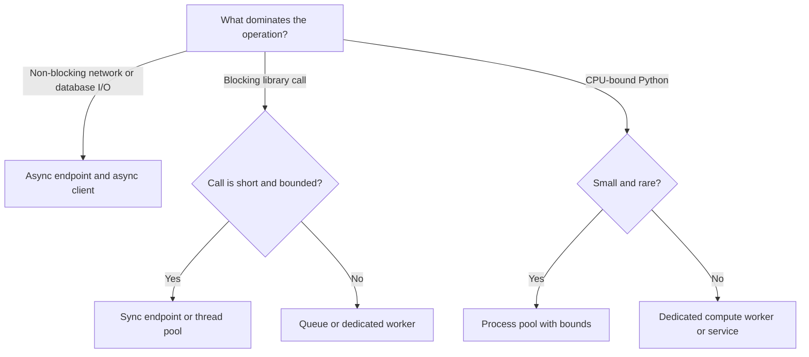

# Decision Guide: Async and Execution Models

Choose an execution model from what the code waits for. FastAPI does not make blocking work non-blocking, and adding `async` does not create CPU parallelism.

## First decision



## When `async def` helps

Use an async endpoint when most of its waiting is performed through awaitable clients:

- an async PostgreSQL driver through `AsyncSession`;
- an async HTTP client;
- Redis operations with an async client;
- asynchronous object storage or queue calls;
- WebSocket or SSE connection management.

While one coroutine waits for I/O, the event loop can run another. This improves concurrency per process; it does not guarantee lower latency for one request.

```python
@router.get("/{account_id}")
async def read_account(
    account_id: UUID,
    session: AsyncSessionDep,
) -> AccountRead:
    account = await session.get(Account, account_id)
    if account is None:
        raise AccountNotFound(account_id)
    return AccountRead.model_validate(account)
```

## When a normal `def` is honest

Use a synchronous endpoint when the stack is synchronous and calls are bounded. FastAPI runs normal route functions in a thread pool so they do not execute directly on the event-loop thread.

```python
@router.get("/{report_id}")
def read_report(report_id: UUID, session: SessionDep) -> ReportRead:
    return report_service.read(session, report_id)
```

Do not combine a sync SQLAlchemy session and blocking driver with `async def` merely for style. That blocks the event-loop thread unless every blocking operation is explicitly offloaded.

## Thread pool decision

A thread pool is appropriate for a blocking library that releases control while waiting and has no async interface. Bound concurrency because threads consume memory and downstream connections.

```python
from anyio import to_thread


async def render_legacy_template(data: dict[str, object]) -> bytes:
    return await to_thread.run_sync(legacy_renderer.render, data)
```

Do not offload an unbounded number of calls. A thread pool can move the bottleneck and exhaust database or provider pools.

## Process pool decision

Use processes for Python CPU work that cannot be moved to a compiled library or separate worker. A process pool adds serialization cost, memory, startup behavior, and deployment complexity. It is poor for long jobs that need retries and status; a durable queue is better there.

Examples include small image transformations or bounded document parsing. Large OCR pipelines, video processing, and model inference deserve dedicated worker capacity.

## Queue decision

Move work out of the request when one or more are true:

- it must survive a web process restart;
- it can exceed the client or proxy deadline;
- it needs independent retry and dead-letter handling;
- its concurrency must be isolated from web traffic;
- the user can work with a job resource rather than an immediate result.

The correct response is usually HTTP 202 plus a status URL. `BackgroundTasks` runs after the response in the same process, so it is not durable and is not a substitute for a queue.

## Concurrency budget

For each workload, write down:

```text
maximum concurrent requests
maximum downstream connections
per-attempt timeout
end-to-end deadline
memory per in-flight operation
retry count and backoff
queue capacity
```

If 100 coroutines can each start five database queries, an application semaphore of 100 does not protect a pool of 20 connections. Budget the entire fan-out.

## Common wrong turns

| Choice | Failure | Better direction |
| --- | --- | --- |
| `async def` around `requests.get()` | Blocks every coroutine in the process | Async HTTP client or sync route |
| `asyncio.create_task()` for a durable job | Work disappears on restart | Queue and job record |
| Huge thread pool | Downstream pool exhaustion | Bound work at admission |
| More Uvicorn workers for CPU work | Competes for memory and still lacks job control | Dedicated compute workers |
| Sequential awaits for independent I/O | Unnecessary latency | Bounded task group if the downstream can handle it |
| Unbounded `gather()` | Memory and rate-limit spike | Semaphore or chunked concurrency |

## Interview answer

**When should a FastAPI endpoint be async?**

Use `async def` when the request path uses non-blocking clients and spends meaningful time waiting for I/O. Keep a synchronous stack synchronous if its libraries block. For CPU-heavy or durable work, use processes or queued workers. Then discuss the real limit: connection pools, rate limits, memory, and deadlines, not the number of coroutines alone.

## Related material

- [Async and concurrency chapter](../docs/01-fastapi-core/async-concurrency.md)
- [Queues, workers, and scheduling](../docs/04-production/queues-workers-and-scheduling.md)
- [Performance and scalability](../docs/04-production/performance-and-scalability.md)
- [Python asyncio documentation](https://docs.python.org/3/library/asyncio.html)

[Back to documentation map](../README.md)
