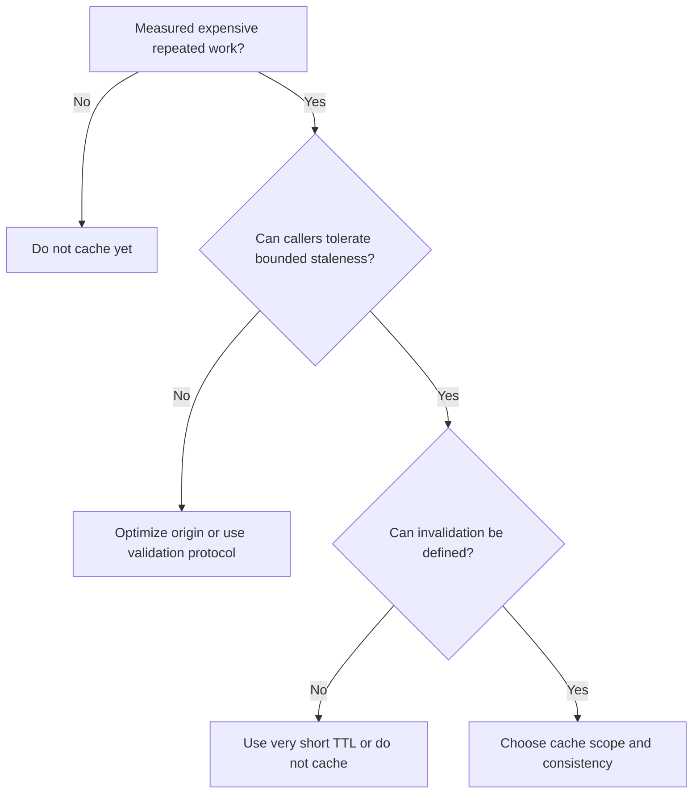

# Decision Guide: Caching, Redis, and Rate Limits

Caching trades freshness and invalidation work for lower latency or lower origin load. Redis is one implementation option, not the definition of a cache.

## Should this be cached?

Cache only after identifying a repeated computation or read whose reuse rate is high enough to matter.



Good candidates include stable reference data, expensive public queries, rendered responses, authorization-independent metadata, and content-addressed artifacts. User-specific data with frequent writes and subtle permissions is a weak candidate.

## Which cache scope?

| Scope | Strength | Risk |
| --- | --- | --- |
| Browser or CDN | Removes origin traffic | Public/private cache mistakes |
| Reverse proxy | Efficient HTTP response caching | Needs correct `Vary`, auth, and invalidation |
| Per-process memory | Very low latency | Diverges across replicas, lost on restart |
| Redis | Shared across replicas, TTLs, atomic primitives | Network hop, serialization, another dependency |
| Database materialization | Transactional and queryable | Refresh and storage cost |

Use HTTP validators such as ETag before building an application cache when the main goal is avoiding response transfer. The origin can answer 304 without duplicating authorization logic in Redis.

## When Redis is justified

Use Redis when the application needs shared, low-latency, expiring state across replicas:

- a measured read cache;
- central rate-limit counters;
- short-lived idempotency results;
- distributed coordination with carefully defined leases;
- ephemeral session state;
- queue or stream functionality when its durability semantics fit.

Do not add Redis only to store configuration, permanent source-of-truth records, or data that has no repeated reads. PostgreSQL may already answer an indexed query within the latency budget.

## Cache-aside baseline

```python
async def get_product(product_id: UUID) -> ProductRead:
    key = f"product:v2:{product_id}"
    if raw := await redis.get(key):
        return ProductRead.model_validate_json(raw)

    product = await repository.get(product_id)
    if product is None:
        raise ProductNotFound(product_id)

    result = ProductRead.model_validate(product)
    await redis.set(key, result.model_dump_json(), ex=60)
    return result
```

Production code must also address cache stampede, invalidation, serialization version, negative caching, Redis timeout behavior, and authorization scope.

## Invalidation choices

- **TTL only:** simple, stale until expiry, good when the staleness window is acceptable.
- **Write-through invalidation:** delete or update after database commit, but a crash can leave stale data.
- **Outbox-driven invalidation:** commit a change event with the data and invalidate asynchronously, giving eventual convergence.
- **Versioned keys:** include a collection or record version, avoiding delete races at the cost of old-key cleanup.

Never invalidate before the database transaction commits. Another request can repopulate the cache with old data before commit.

## Stampede control

TTL jitter prevents many keys from expiring together. Request coalescing or a short lease allows one caller to rebuild while others serve stale data or wait briefly. A distributed lock is not automatically safe: the lock needs a unique token, lease expiry, bounded waiting, and ownership-checked release.

For critical correctness, do not use a cache lock as the only concurrency guarantee. Use database constraints, row locks, or a compare-and-set operation at the source of truth.

## Rate limiting decision

Rate limiting protects a resource or fairness policy. Define the identity and resource first:

| Policy | Key | Purpose |
| --- | --- | --- |
| Anonymous abuse limit | trusted client IP or edge identity | Protect public endpoints |
| Principal limit | authenticated subject | Fairness per user |
| Tenant budget | tenant ID | Contract and cost control |
| Endpoint cost limit | principal plus workload | Protect expensive operations |
| Global admission limit | workload and region | Protect downstream capacity |

A fixed window is simple but permits bursts at a boundary. Sliding windows and token buckets model sustained rate and burst capacity better. Return 429 with a useful retry hint when safe, and distinguish it from a provider or server-capacity 503.

Enforce coarse limits at the edge and application-specific cost limits inside the service. Trust client IP headers only from a configured proxy chain.

## Failure policy

Decide whether each Redis use is fail-open or fail-closed.

- A performance cache usually fails open to PostgreSQL, with origin load protection.
- A security revocation store may need fail-closed behavior.
- A rate limiter may fail open for a low-risk read and fail closed for an expensive or sensitive operation.
- An idempotency store cannot fail open if duplicate payment execution is possible.

One global Redis outage policy is a design smell.

## Interview answer

**When should I use Redis?**

Use Redis when measured shared low-latency state, expiration, or atomic counters justify another networked dependency. State the data owner, consistency window, invalidation strategy, outage behavior, and memory limit. If an indexed PostgreSQL query meets the SLO and traffic is modest, Redis may add more failure modes than value.

## Related material

- [Caching, Redis, and rate limiting chapter](../docs/04-production/caching-redis-and-rate-limiting.md)
- [Query performance](../docs/02-data/querying-pagination-and-performance.md)
- [Redis documentation](https://redis.io/docs/latest/)

[Back to documentation map](../README.md)
