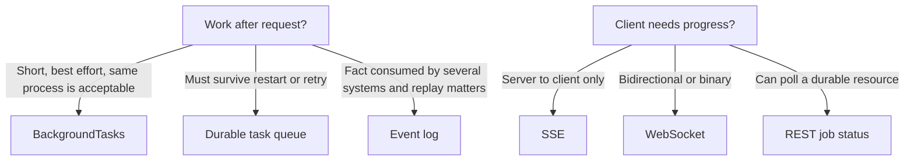

# Decision Guide: Jobs, Messaging, and Realtime

Background work, task queues, event logs, SSE, and WebSockets solve different problems. Choose from delivery direction, durability, ordering, replay, and client contract.

## FastAPI `BackgroundTasks`

Use an in-process background task for short, non-critical work that may be lost during a restart and does not need independent retries. Examples are best-effort cleanup or a low-value local notification in a simple deployment.

Do not use it for payments, durable email delivery, video processing, ingestion, or work that can outlive the process. The task uses web-process capacity after the response.

## Durable task queue

Use a task queue when a command must execute outside the request and needs retry, scheduling, concurrency isolation, or job state.

```text
HTTP request -> commit job -> enqueue job ID -> worker claims -> execute -> record result
```

Celery is appropriate when the team accepts its operational model and needs Python task routing, retry policies, schedules, and worker controls. A simpler broker-specific worker may be enough for a small set of jobs. The decision is about delivery semantics and operability, not popularity.

Required design points:

- messages are at-least-once unless proven otherwise;
- handlers are idempotent;
- retries are bounded and delayed;
- poison jobs go to a dead-letter path;
- job state has an authoritative owner;
- acknowledgements happen after the durable effect;
- workers have visibility and graceful shutdown behavior.

## RabbitMQ or Kafka

| Requirement | RabbitMQ-style broker | Kafka-style log |
| --- | --- | --- |
| Work distribution | Strong fit | Possible with consumer groups |
| Per-message routing and acknowledgement | Strong fit | Different log-offset model |
| Ordered replay of retained history | Limited by queue design | Core capability |
| Many independent consumers | Exchanges and queues | Natural topic consumers |
| Event stream analytics | Possible, not primary | Strong fit |
| Simple background commands | Strong fit | Often excessive |

Use Kafka when retained, ordered event streams, replay, and several independent consumers justify operating a distributed log. Do not choose it as a sophisticated task queue for a handful of emails.

Use RabbitMQ or a managed queue when commands need routing, acknowledgement, redelivery, and worker load distribution. Understand the broker's durability settings and consumer acknowledgement mode.

## Event versus command

A command asks one owner to do something: `GenerateInvoice`. An event reports a fact that already happened: `InvoiceGenerated`. Naming a command as a past-tense event hides ownership and can produce multiple accidental executors.

Events should be immutable and versioned. Consumers own their checkpoint and failure policy. Never assume publishing an event and committing database state are atomic without an outbox or equivalent transaction boundary.

## Scheduled work

Use a scheduler to enqueue work, not to perform large work in the scheduler process. Make schedule triggers idempotent because leader changes or clock behavior can duplicate a run. Record logical run identity such as `daily-settlement:2026-08-11` under a unique constraint.

## SSE or WebSocket

| Need | SSE | WebSocket |
| --- | --- | --- |
| Server-to-client updates | Strong fit | Strong fit |
| Incremental client messages | No | Yes |
| Standard HTTP behavior | Simpler | Upgrade and connection state |
| Browser automatic reconnection | Built-in `EventSource` for GET | Application-owned |
| Binary frames | No | Yes |
| Typical AI text stream | Strong fit | Use if controls are bidirectional |
| Interactive chat or audio protocol | Limited | Strong fit |

REST creates and queries durable resources. SSE or WebSockets deliver transient changes. A WebSocket should not be the only place a client can learn whether a durable job completed.

## Realtime across replicas

Web connections terminate on one process while workers may produce events elsewhere. Use a shared pub/sub or stream layer to route updates, and maintain durable job state separately. Pub/sub messages can be lost during disconnects; reconnect from a durable sequence if missed events matter.

Slow clients require bounded outbound queues. Choose whether to drop replaceable updates, disconnect, or apply upstream backpressure. An unbounded queue per socket is a memory leak under load.

## Decision summary



These choices compose. A request may create a job through REST, a worker may consume it from a task queue, and the client may receive progress through SSE while retaining a pollable status resource.

## Interview answer

**When should I use Celery instead of FastAPI background tasks?**

Use a durable queue such as Celery when work must survive process failure, be retried, scheduled, rate-limited, or scaled independently. `BackgroundTasks` is in-process best-effort execution. Then explain idempotency, acknowledgement timing, dead-letter handling, job state, and how the HTTP API returns 202 with a status URL.

## Related material

- [Queues, workers, and scheduling](../docs/04-production/queues-workers-and-scheduling.md)
- [Webhooks and resilience](../docs/04-production/integrations-webhooks-and-resilience.md)
- [Production AI APIs](../docs/05-ai-backends/production-ai-apis.md)

[Back to documentation map](../README.md)
