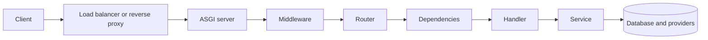

# HTTP and REST API Design

An API contract is more than a list of paths. It defines method semantics, representations, failure behavior, authorization boundaries, caching rules, concurrency controls, and what a client may safely retry. FastAPI can document that contract, but it cannot choose the contract for you.

HTTP semantics in this chapter follow [RFC 9110](https://www.rfc-editor.org/rfc/rfc9110.html). Caching is specified separately by [RFC 9111](https://www.rfc-editor.org/rfc/rfc9111.html).

## 1. The HTTP message model

A request contains:

```http
POST /v1/orders HTTP/1.1
Host: api.example.com
Authorization: Bearer <token>
Content-Type: application/json
Accept: application/json
Idempotency-Key: 79a3e2f4-2fd8-4fb3-a340-5f0b27bce8a4

{"product_id":"p_123","quantity":2}
```

A response contains:

```http
HTTP/1.1 201 Created
Content-Type: application/json
Location: /v1/orders/o_789
ETag: "order-o_789-v1"

{"id":"o_789","status":"pending","quantity":2}
```

The start line and headers carry protocol metadata. The body carries a representation of a resource or problem. Intermediaries such as reverse proxies, gateways, caches, and browsers act on the method, status, and headers, so correct behavior cannot live only in the JSON body.

## 2. Methods are part of the contract

HTTP defines method semantics. Choosing a method based only on whether a body exists produces surprising retries, caches, clients, and monitoring.

| Method | Typical API use | Safe | Idempotent | Important detail |
| --- | --- | --- | --- | --- |
| `GET` | Retrieve a representation | Yes | Yes | Must not request a state change |
| `HEAD` | Retrieve headers as if `GET`, without response content | Yes | Yes | Useful for metadata and conditional checks |
| `POST` | Create subordinate resources or invoke non-idempotent processing | No | No by default | Can be made retry-safe with an application protocol |
| `PUT` | Create or replace the state at a known URI | No | Yes | Repeating the same representation has the same intended effect |
| `PATCH` | Apply a partial modification | No | Not guaranteed | Idempotency depends on patch semantics |
| `DELETE` | Remove the association/resource | No | Yes | Repeated calls have the same intended effect, not necessarily the same response |
| `OPTIONS` | Discover communication options, including CORS preflight | Yes | Yes | Often handled by middleware or a proxy |

Safe means the client did not request a state change. Logging, metrics, and billing for the request may still occur. Idempotent means multiple identical requests have the same intended effect as one request. It does not mean every response has the same status or body.

### GET and HEAD

Use `GET /orders/o_789`, not `POST /getOrder`. Query parameters select, filter, sort, or paginate a collection:

```text
GET /v1/orders?status=pending&limit=50&after=o_700
```

Do not put important request semantics in a GET body. HTTP does not assign general semantics to GET content, and clients and intermediaries may reject or ignore it.

`HEAD` should expose the headers a corresponding `GET` would produce, without response content. Framework behavior should be tested when custom streaming or proxy layers are involved.

### POST

Use `POST /orders` when the server assigns the new order URI. Return `201 Created` with a `Location` header after synchronous creation. Use `202 Accepted` when work is accepted but not complete, and expose a job or operation resource that the client can inspect.

An action that does not map cleanly to CRUD can still be resource-oriented:

```text
POST /v1/orders/o_789/cancellations
POST /v1/reports/r_123/runs
```

This creates an auditable cancellation or run instead of hiding an operation behind `/cancelOrder`.

### PUT and PATCH

`PUT /users/u_1/profile` normally supplies the complete new representation of that resource. Decide and document whether omitted fields are cleared, defaulted, or rejected.

`PATCH` needs a patch document contract. Two common media types are JSON Merge Patch ([RFC 7396](https://www.rfc-editor.org/rfc/rfc7396.html)) and JSON Patch ([RFC 6902](https://www.rfc-editor.org/rfc/rfc6902.html)). A custom partial Pydantic model is convenient, but it must distinguish absent fields from fields explicitly set to `null`.

```json
{"display_name":null}
```

That request may mean "clear the display name," while `{}` means "leave it unchanged." Pydantic v2's `model_fields_set` can preserve this distinction.

Some patches are naturally idempotent, such as replacing `display_name`. Others are not, such as `{"increment": 1}`. Do not promise safe automatic retries without defining the operation.

### DELETE

A successful first deletion may return `204 No Content`; a repeated deletion may return `204` again or `404 Not Found`. Both can be compatible with idempotent semantics because the intended final state is the same. Choose one contract and keep it consistent.

Soft deletion changes domain state rather than actually erasing a row. Name and document restoration, uniqueness, retention, and privacy behavior explicitly.

## 3. Status codes carry machine-readable meaning

Use the narrowest status that accurately represents the outcome.

### Success

| Status | Use |
| --- | --- |
| `200 OK` | Successful retrieval or operation with a response representation |
| `201 Created` | A resource was created; include `Location` when practical |
| `202 Accepted` | Work was accepted but has not completed |
| `204 No Content` | Successful response with no content |
| `206 Partial Content` | A valid byte-range response, not ordinary application pagination |

Do not return a JSON body with `204`. Do not use `202` as a generic faster response unless some durable component actually owns and tracks the accepted work.

### Client errors

| Status | Use |
| --- | --- |
| `400 Bad Request` | Malformed request or a general request error not covered more precisely |
| `401 Unauthorized` | Authentication is missing or invalid; often paired with `WWW-Authenticate` |
| `403 Forbidden` | Identity is known but the action is not allowed |
| `404 Not Found` | Resource is absent, or deliberately concealed from this caller |
| `405 Method Not Allowed` | Method is unsupported for this target; include `Allow` |
| `409 Conflict` | Request conflicts with current resource state, such as a uniqueness or transition conflict |
| `412 Precondition Failed` | An `If-Match` or other precondition was false |
| `413 Content Too Large` | Request content exceeds an enforced limit |
| `415 Unsupported Media Type` | Request representation format is unsupported |
| `422 Unprocessable Content` | Syntax is understood but content cannot be processed semantically |
| `429 Too Many Requests` | A rate policy rejected the request; `Retry-After` may guide clients |

Authentication and authorization responses require a threat-model decision. A `404` can reduce resource enumeration, but it does not replace access controls or rate limiting.

### Server errors

| Status | Use |
| --- | --- |
| `500 Internal Server Error` | Unexpected application failure |
| `502 Bad Gateway` | A gateway received an invalid upstream response |
| `503 Service Unavailable` | Service is temporarily unable to handle traffic |
| `504 Gateway Timeout` | A gateway timed out waiting for an upstream |

Do not turn every dependency failure into `500`. A provider timeout may be `503` at your public boundary, while an upstream gateway might produce `502` or `504`. The mapping should be stable enough for client retry policies and operational dashboards.

## 4. Headers are behavior, not decoration

### Representation and content negotiation

- `Content-Type` describes the representation being sent, such as `application/json`.
- `Accept` lists response media types the client can process.
- `Content-Encoding` describes transformations such as gzip.
- `Accept-Encoding` advertises encodings the client accepts.

Reject unsupported request formats with `415`. If the API implements response negotiation and cannot produce an acceptable representation, `406 Not Acceptable` is available. Many JSON-only APIs intentionally support one response media type and document that constraint.

Include a charset where the media type or client ecosystem requires it. JSON exchanged over HTTP is defined with UTF-8 encoding by [RFC 8259](https://www.rfc-editor.org/rfc/rfc8259.html).

### Authentication and tracing

- `Authorization` carries credentials for the target resource. Never log the raw value.
- `WWW-Authenticate` describes an authentication challenge on relevant `401` responses.
- `traceparent` is the W3C Trace Context propagation field.
- An application request ID can help users and operators refer to a request, but it is not a substitute for a distributed trace.

Decide whether a trusted gateway creates correlation identifiers or whether the application validates client-supplied values. Never copy arbitrary unbounded header values into every log line.

### Caching and conditional requests

- `Cache-Control` expresses cache directives.
- `ETag` is an opaque validator for a selected representation.
- `Last-Modified` provides a time-based validator with lower precision and different tradeoffs.
- `If-None-Match` can turn a successful retrieval into `304 Not Modified`.
- `If-Match` can prevent a lost update.
- `Vary` tells caches which request fields affected response selection.

Caching authenticated or tenant-specific data without a correct cache key and policy can leak data. `no-store` and `private` have different meanings; use the directive that matches the security and storage requirement.

## 5. Cookies are state carried by a client

A server sets a cookie with `Set-Cookie`; a user agent returns applicable cookies in `Cookie`. Important attributes include:

- `Secure`: send only over secure transport.
- `HttpOnly`: prevent JavaScript access, reducing token theft through some XSS paths.
- `SameSite`: constrain cross-site sending and help mitigate CSRF.
- `Path` and `Domain`: define scope, not authorization.
- `Max-Age` or `Expires`: control persistence.

Cookie syntax and processing are defined by [RFC 6265](https://www.rfc-editor.org/rfc/rfc6265.html), with continuing updates in the HTTP state management specification. A cookie-based login is automatically attached by browsers, so state-changing endpoints need a CSRF strategy. `HttpOnly` does not stop CSRF, and `SameSite` is a defense layer rather than a reason to omit origin checks or CSRF tokens where the threat model requires them.

Prefer host-only cookies with narrow paths. Cookie prefixes such as `__Host-` impose additional browser constraints when their requirements are met. Do not store large profiles or authorization policy in cookies merely to avoid a server lookup.

## 6. REST is a set of constraints

REST describes an architectural style, not a JSON naming convention. Its constraints include client-server separation, stateless requests, cacheability, a uniform interface, layered systems, and optional code-on-demand. Most production HTTP APIs borrow resource-oriented parts of REST without implementing every aspect of the style.

Statelessness means each request contains the information needed to understand it; it does not prohibit databases, caches, login sessions, or workflows. It prohibits relying on hidden conversational state in one application instance to interpret the next request.

### Model resources around domain identity

Good resources are stable nouns with meaningful identity:

```text
/users/u_123
/users/u_123/addresses/a_8
/orders/o_789/items
/report-runs/rr_42
```

Avoid exposing the database schema directly. A many-to-many join table might be an implementation detail, while a membership with role, invitation state, and audit history is a first-class resource.

### Keep paths predictable

Practical conventions:

- Use plural collection nouns consistently.
- Keep identifiers opaque to clients.
- Use path segments for identity and query parameters for selection.
- Avoid verbs when a domain resource represents the operation.
- Avoid deep nesting after the parent is no longer needed to identify or authorize the child.
- Choose one trailing-slash policy and enforce it at the edge to avoid redirects on mutating requests.
- Do not put secrets, tokens, or personal data in URLs. URLs appear in browser history, proxy logs, and analytics.

### Bad and improved designs

| Weak design | Problem | Improved contract |
| --- | --- | --- |
| `POST /getUsers` | Ignores safe retrieval semantics | `GET /users` |
| `GET /deleteUser?id=3` | A safe method changes state | `DELETE /users/3` |
| `POST /orders/7?action=cancel` | Action semantics are hidden | `POST /orders/7/cancellations` |
| `GET /users?password=...` | Secrets enter URLs and logs | Authenticate via a protected credential flow |
| `200 {"success": false}` | Protocol outcome contradicts the body | Use an appropriate 4xx or 5xx with a problem document |
| `PATCH /users/7 {"admin": true}` | Mass assignment crosses an authorization boundary | Use an allow-listed input schema and permission check |
| `/v1/user/get_by_id/7` | Mixes version, singular noun, and RPC verb | `/v1/users/7` |

RPC-style APIs can be valid when operations are the core abstraction. The problem is not the existence of verbs; it is an accidental, inconsistent interface that discards HTTP semantics without defining replacements.

## 7. Idempotency and retries

Networks fail ambiguously. A client can time out after the server committed a payment but before the response arrived. Retrying a plain `POST` may repeat the side effect.

An idempotency-key protocol usually works like this:

1. The client generates a high-entropy key for one logical operation.
2. The server scopes it to an authenticated principal and operation.
3. The server atomically records the key, a fingerprint of relevant request data, processing state, and final outcome.
4. A retry with the same key and same fingerprint returns the stored outcome.
5. Reuse with different input is rejected.
6. Retention and in-progress behavior are documented.

```python
from typing import Annotated

from fastapi import Header, HTTPException

IdempotencyKey = Annotated[
    str,
    Header(alias="Idempotency-Key", min_length=16, max_length=200),
]


async def require_idempotency_key(key: IdempotencyKey) -> str:
    if any(character.isspace() for character in key):
        raise HTTPException(status_code=400, detail="invalid idempotency key")
    return key
```

This validates syntax only. Correctness requires durable, atomic storage. A process-local dictionary fails across workers, deploys, and restarts. A database unique constraint or a suitable atomic operation in a shared store must resolve concurrent first attempts.

Do not automatically retry all `PUT` or `DELETE` requests simply because their semantics are idempotent. Authentication failures, validation errors, overload, and long-running operations need classified retry behavior. Use bounded attempts, exponential backoff, jitter, deadlines, and server guidance such as `Retry-After` where applicable.

## 8. Concurrency control and lost updates

Two clients can read version 5, independently edit it, and overwrite each other. Conditional requests support optimistic concurrency:

```http
GET /v1/documents/d_1

HTTP/1.1 200 OK
ETag: "doc-d_1-v5"
```

```http
PATCH /v1/documents/d_1
If-Match: "doc-d_1-v5"
Content-Type: application/merge-patch+json

{"title":"Reviewed"}
```

The server performs the update only if the validator still matches. Otherwise it returns `412 Precondition Failed`, and the client reloads or resolves the conflict. The database update must include the version predicate atomically; checking in application code and updating later recreates the race.

Use `409 Conflict` for domain conflicts, such as an invalid state transition. Use `412` when an HTTP precondition specifically failed.

## 9. Error representations

Errors are part of the public schema. [RFC 9457](https://www.rfc-editor.org/rfc/rfc9457.html) defines Problem Details for HTTP APIs:

```http
HTTP/1.1 409 Conflict
Content-Type: application/problem+json

{
  "type": "https://api.example.com/problems/order-state",
  "title": "Order cannot be cancelled",
  "status": 409,
  "detail": "The order has already shipped.",
  "instance": "/v1/orders/o_789",
  "code": "order_already_shipped",
  "request_id": "req_01J..."
}
```

Keep stable machine-readable fields separate from human text. Do not expose stack traces, SQL fragments, secrets, internal hostnames, or raw provider responses. Validation errors should identify locations and constraints without reflecting sensitive input.

The same error code should mean the same class of failure across endpoints. Clients should branch on status and documented codes, not English strings.

## 10. Pagination, filtering, sorting, and search

Collection APIs need explicit limits before the dataset becomes large.

Offset pagination is easy to use:

```text
GET /v1/orders?limit=50&offset=100
```

It can become expensive at high offsets and can skip or duplicate results while rows change. Cursor pagination uses a stable ordered key:

```text
GET /v1/orders?limit=50&after=eyJjcmVhdGVkX2F0IjoiLi4uIiwiaWQiOiIuLi4ifQ
```

The cursor should encode or reference all tie-breaker fields, be treated as opaque, and be protected against tampering when it contains trusted state. Define:

- Default and maximum page sizes.
- A deterministic sort with a unique tie-breaker.
- Whether results are a snapshot or a moving view.
- Allowed filters and sorts.
- Indexes supporting common access patterns.
- Whether an exact total count is returned, estimated, or omitted.

Search is not just another unbounded query parameter. Define syntax, relevance ordering, tenancy constraints, input limits, and how expensive searches are controlled.

## 11. API versioning and evolution

Version only when compatibility policy requires it. Common strategies include:

- Path versioning: `/v1/orders`, visible and operationally simple.
- Media type versioning: `Accept: application/vnd.example.order-v2+json`, cleanly tied to representations but harder to explore and route.
- Header versioning: compact paths but less visible to tools and humans.
- Query versioning: easy to add, but easy to omit and awkward for cache keys.

Path versioning is a pragmatic default for public APIs. Whichever strategy is chosen, version behavior rather than deployments. Adding an optional response field is often backward compatible; renaming a field, changing its type, narrowing accepted input, or changing side effects often is not.

A migration plan needs:

1. A compatibility policy and deprecation window.
2. Consumer inventory and usage telemetry.
3. Documentation and machine-readable deprecation signals where supported.
4. Parallel operation or an adapter during migration.
5. A retirement date and a tested removal plan.

Do not silently change pagination order, timestamp meaning, enum openness, or error codes. These less visible semantics break clients as surely as deleting a field.

## 12. Request lifecycle and trust boundaries

A typical production path is:



At each boundary, decide who is authoritative:

- The edge may terminate TLS and enforce coarse content limits.
- The application validates forwarded headers only from trusted proxies.
- Authentication establishes identity; authorization still applies to the resource.
- Input validation establishes shape, not business permission.
- The database enforces durable invariants.
- Response validation prevents accidental field disclosure, but does not replace deliberate output design.

Detailed FastAPI mechanics are covered in [Request and Response Lifecycle](../01-fastapi-core/request-response-lifecycle.md).

## 13. Practical design review

For each operation, answer:

- What resource or business capability does it expose?
- Is the method safe or idempotent, and may a client retry it?
- What is the success status and response representation?
- What are the documented error statuses and stable error codes?
- How are authentication, object-level authorization, and tenancy enforced?
- What happens when two callers modify the same state?
- What input, body, upload, and query-complexity limits apply?
- Can a cache store the response, and what is the cache key?
- What timeout owns the operation? What happens after a client disconnects?
- How does a consumer migrate when the contract changes?
- Which fields contain sensitive data, and where might headers and URLs be logged?

## Interview prompts

1. **Are all idempotent methods safe?** No. `PUT` and `DELETE` are idempotent but request state changes. Safe methods are intended to be read-only.
2. **Can an idempotent request return different responses?** Yes. Idempotency concerns intended server effect. A second `DELETE` may return a different status, and representation metadata can change.
3. **How do you make payment creation retry-safe?** Use a durable idempotency key scoped to the caller and operation, atomically claim it, bind it to the request fingerprint, persist the outcome, and coordinate with the provider's own idempotency mechanism.
4. **When would you return 409 versus 412?** Use `412` for a failed HTTP precondition such as `If-Match`. Use `409` for a conflict with domain state when no HTTP precondition expresses it.
5. **Why is `200 OK` with `success: false` harmful?** It disables standard behavior in clients, proxies, retries, alerts, and metrics, forcing every consumer to understand a private status protocol.
6. **What makes cursor pagination stable?** A deterministic indexed order, a unique tie-breaker, cursor state for every ordering key, and clearly defined behavior under concurrent inserts or updates.
7. **Does stateless REST prohibit login sessions?** No. It requires each request to contain the context needed for processing. Session state may live in a shared store and be addressed by a cookie.
8. **How would you prevent lost updates?** Expose a version or ETag, require a matching precondition, and perform an atomic conditional update in the authoritative store.

## Sources

- [RFC 9110: HTTP Semantics](https://www.rfc-editor.org/rfc/rfc9110.html)
- [RFC 9111: HTTP Caching](https://www.rfc-editor.org/rfc/rfc9111.html)
- [RFC 9457: Problem Details for HTTP APIs](https://www.rfc-editor.org/rfc/rfc9457.html)
- [RFC 6265: HTTP State Management Mechanism](https://www.rfc-editor.org/rfc/rfc6265.html)
- [RFC 7396: JSON Merge Patch](https://www.rfc-editor.org/rfc/rfc7396.html)
- [RFC 6902: JSON Patch](https://www.rfc-editor.org/rfc/rfc6902.html)
- [RFC 8259: The JavaScript Object Notation Data Interchange Format](https://www.rfc-editor.org/rfc/rfc8259.html)
- [W3C Trace Context](https://www.w3.org/TR/trace-context/)
- [OWASP REST Security Cheat Sheet](https://cheatsheetseries.owasp.org/cheatsheets/REST_Security_Cheat_Sheet.html)

