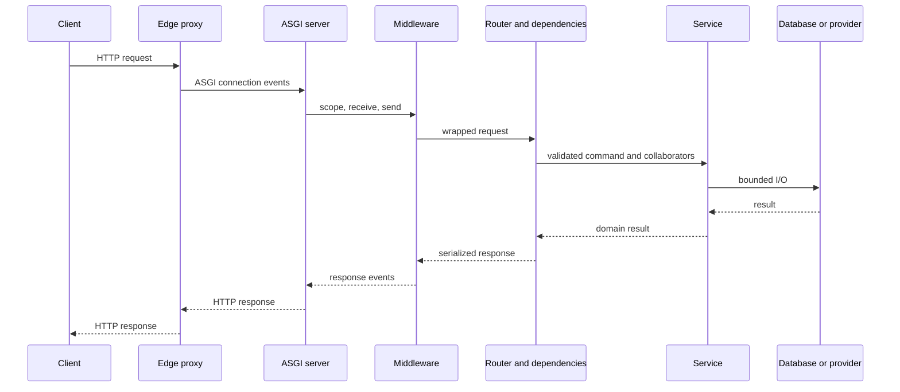

# Request and Response Lifecycle

An endpoint function is the middle of a request, not the beginning. Before it runs, infrastructure has accepted bytes, selected an application, applied middleware, matched a route, resolved dependencies, and validated inputs. After it returns, FastAPI serializes a representation, middleware observes the result, the ASGI server writes it, and scoped resources are released.

Understanding that sequence explains why a log field disappears, why a database session is closed, why a response model raises a server error, or why work continues after a client times out.

## 1. The path through a production API



The exact implementation is streaming and event-driven rather than a single function call, but this model is useful for ownership.

## 2. Edge proxy and load balancer

The first component may terminate TLS, select a host, enforce coarse request limits, reject malformed traffic, attach forwarding metadata, and choose an application instance.

The application must know which proxies are trusted before using forwarded values such as client IP, scheme, or host. If an internet client can supply a header that the app treats as authoritative, it can spoof audit data, construct incorrect redirect URLs, or influence security decisions.

Coordinate timeouts across layers:

- The public edge timeout should match the API contract.
- The application deadline should leave time to return a controlled error.
- Database and provider timeouts should be shorter than the remaining request budget.
- Retries must fit inside the overall deadline.

If every layer waits 60 seconds and retries independently, one slow provider can hold resources far longer than the caller expects.

## 3. ASGI server

The ASGI server translates a connection into an ASGI scope plus `receive` and `send` events. For HTTP, the scope carries method, path, query string, headers, server and client information. For WebSockets, the event flow includes connection, acceptance, messages, and disconnect.

The server owns sockets and worker processes. FastAPI owns application behavior. A reverse proxy, Uvicorn, Starlette, and FastAPI therefore report different but related latency and error measurements.

One worker process has its own event loop, pools, and application state. Multiple workers improve isolation and CPU utilization but multiply connection pools and memory. Four workers configured with a 20-connection database pool can open roughly 80 application-side connections before overflow or administrative connections are counted.

## 4. Middleware wraps the application

ASGI middleware receives the same `scope`, `receive`, and `send` interface as the wrapped app. It can inspect or modify request and response events.

Appropriate middleware concerns include:

- Trusted-host and HTTPS policy.
- CORS response handling.
- Request or correlation identifiers.
- Coarse authentication context.
- Request timing and structured access logs.
- Compression, subject to response and security policy.
- Consistent handling of otherwise unhandled exceptions.

Middleware ordering is observable. On the inbound path, outer middleware runs before inner middleware; response handling unwinds in reverse. Errors, redirects, and CORS headers depend on where a middleware sits. Test the configured stack rather than relying on an informal list.

Do not read and buffer every body in logging middleware. That raises memory usage, can interfere with streaming, and may capture passwords, tokens, or personal data. Log bounded metadata and explicitly approved fields.

## 5. Routing selects an operation

Starlette matches method and path against the route table. Fixed and parameterized paths can overlap, and registration order matters. A route match identifies the handler and its dependency graph, but typed parameter conversion and validation can still fail afterward.

These outcomes are distinct:

- No matching path: typically `404 Not Found`.
- Matching path with unsupported method: typically `405 Method Not Allowed`.
- Matching route with an invalid path value: validation error, commonly FastAPI's `422` response.
- Authentication deliberately conceals a resource: application-chosen `404`.

Avoid catch-all routes that shadow operational or static paths. Contract tests should cover fixed paths next to variable routes.

## 6. Request parsing, dependency resolution, and validation

FastAPI builds a dependency graph when routes are registered. For each request it resolves that graph, extracts declared values, runs Pydantic validation, caches dependency results by default, and calls the endpoint only if required inputs and dependencies succeed.

There is no useful universal split where all validation happens before all dependencies. A dependency can itself declare headers, path parameters, query parameters, request bodies, and sub-dependencies. Input extraction and validation occur as the dependency graph is solved.

Important consequences:

- A dependency can stop processing by raising `HTTPException` or another mapped error.
- A dependency may run even if an unrelated parameter later fails validation.
- Side effects in dependencies can therefore happen for requests whose endpoint is never called.
- Reusing one dependency in the graph normally reuses its per-request result unless caching is disabled.
- Generator dependencies have setup and teardown phases.

Dependencies should acquire resources, establish request context, authenticate, authorize, or assemble collaborators. Avoid irreversible business side effects during dependency resolution.

### Body consumption

The request body is a stream. FastAPI reads and parses it when declared body parameters require that. Multipart uploads may spool content. Raw streaming code consumes ASGI receive events directly.

A body cannot be consumed independently by several layers unless one layer replays or stores it correctly. Middleware that drains the stream can leave the endpoint with no body. Buffering it for convenience can defeat upload streaming and size defenses.

Enforce limits at more than one layer:

1. Edge limit to reject oversized traffic early.
2. Parser and endpoint limits appropriate to the media type.
3. Incremental byte counting for streams and uploads.
4. Domain quotas, such as storage per tenant.

`Content-Length` is useful but not authoritative for all transfer modes and should not be the only control.

## 7. A request-scoped resource example

This sketch gives each request a session, then lets a service own the transaction decision:

```python
from collections.abc import AsyncIterator
from typing import Annotated

from fastapi import Depends, FastAPI, HTTPException, Request, status
from pydantic import BaseModel, ConfigDict
from sqlalchemy.ext.asyncio import AsyncSession, async_sessionmaker

app = FastAPI()


class OrderCreate(BaseModel):
    model_config = ConfigDict(extra="forbid")

    product_id: str
    quantity: int


class OrderView(BaseModel):
    id: str
    status: str


async def get_session(request: Request) -> AsyncIterator[AsyncSession]:
    factory: async_sessionmaker[AsyncSession] = request.app.state.session_factory
    async with factory() as session:
        yield session


SessionDep = Annotated[AsyncSession, Depends(get_session)]


class DuplicateOrderReference(Exception):
    """Raised when an order reference conflicts with persisted state."""


class OrderService:
    def __init__(self, session: AsyncSession) -> None:
        self._session = session

    async def create(self, payload: OrderCreate) -> OrderView:
        async with self._session.begin():
            # Persist through a repository using the same session.
            await persist_order(self._session, payload)
        return OrderView(id="o_123", status="pending")


@app.post("/orders", response_model=OrderView, status_code=201)
async def create_order(payload: OrderCreate, session: SessionDep) -> OrderView:
    try:
        return await OrderService(session).create(payload)
    except DuplicateOrderReference as exc:
        raise HTTPException(
            status_code=status.HTTP_409_CONFLICT,
            detail="order reference already exists",
        ) from exc
```

The engine and session factory are application-wide resources initialized in lifespan. The session is request-scoped. The transaction covers one business operation. These three lifetimes are related but not interchangeable.

Whether commit occurs in a service or unit-of-work dependency is a team decision. What matters is that the boundary is explicit, multiple repository changes can be atomic, and an exception cannot accidentally commit partial work.

## 8. Endpoint execution

FastAPI treats endpoint declaration style as a work-placement decision:

- An `async def` endpoint runs on the event-loop thread and must not perform blocking work there.
- A normal `def` endpoint is run through a thread pool so blocking synchronous libraries do not directly stop the event loop.

This does not make all sync work cheap. Thread capacity, downstream connections, memory, and deadlines remain finite. CPU-heavy Python work can saturate a worker regardless of route syntax.

The endpoint should usually:

1. Receive validated transport data and resolved collaborators.
2. Call one application use case.
3. Translate expected domain outcomes into the HTTP contract.
4. Return a typed result or deliberate `Response`.

Authentication, database access, business rules, provider retries, and serialization should not become one long route function.

## 9. Calls to databases and providers

Every downstream call needs an ownership policy:

- Timeout and total deadline.
- Connection pool and queueing limit.
- Retry classification and maximum attempts.
- Idempotency behavior for side effects.
- Transaction or compensation behavior.
- Circuit breaking or load shedding where useful.
- Metrics and trace attributes with bounded cardinality.

Cancellation is not a rollback protocol for a remote system. A client can disconnect after a database commit or provider side effect. Design important operations with idempotency, durable state, and reconciliation rather than assuming a broken socket undoes work.

Avoid holding a database transaction open while calling a slow third party. It increases lock time and connection pressure. Common alternatives include a state transition plus transactional outbox, a short reservation transaction, or a saga with explicit compensation.

## 10. Response serialization and validation

When an endpoint returns ordinary Python or Pydantic data, FastAPI uses the declared response model or return type to serialize and filter the result. JSON-compatible content is encoded and sent using the selected response class.

Input validation failure is normally a client-facing 4xx response. Output validation failure means server code violated its advertised contract and should remain a server failure. Do not catch it and report a client validation error.

Serialization has a cost. Returning 100,000 ORM objects can exhaust memory, trigger lazy database access, and block on encoding. Page collections, select only required fields, prevent lazy-loading surprises, and measure large responses.

Headers and status must be finalized before the response start event is sent. Once streaming begins, the status cannot be changed to a normal JSON error if the producer later fails.

## 11. Response middleware and ASGI send

On the way out, middleware can add headers, measure duration, apply CORS, compress eligible content, and record status. It then sends ASGI response-start and response-body events to the server.

Access logs should distinguish at least:

- Route template from raw path, to keep metric cardinality bounded.
- Application processing duration from edge-observed duration.
- Status code and exception class.
- Bytes sent when available.
- Request or trace identifier.
- Authenticated principal or tenant only when policy permits it.

Do not label metrics with user IDs, raw URLs containing identifiers, full exception messages, or arbitrary query strings. That creates unbounded cardinality and can leak sensitive data.

## 12. Generator dependency teardown

A dependency containing `yield` has acquisition code before the yield and cleanup code after it:

```python
from collections.abc import AsyncIterator
from time import monotonic


async def measured_resource() -> AsyncIterator[Resource]:
    started = monotonic()
    resource = await acquire_resource()
    try:
        yield resource
    finally:
        await resource.close()
        observe_resource_duration(monotonic() - started)
```

Cleanup belongs in `finally`. Catch `BaseException` only when cleanup or rollback must also cover cancellation, then re-raise. Do not suppress cancellation.

Current FastAPI versions provide two explicit scopes for yielded dependencies:

- `Depends(provider, scope="request")`, the default, exits after the response is sent. A stream may use the resource, but a slow client can hold it for a long time.
- `Depends(provider, scope="function")` exits after the endpoint returns and before sending the response. Use it when response production no longer needs the resource.

For a long response, avoid holding a database transaction or session merely because request scope makes it possible. Load and map data before returning, acquire an independently owned streaming resource inside the iterator, or accept and monitor the explicit request-scoped lifetime. Test this behavior against the project's pinned FastAPI version because older releases used different teardown timing.

## 13. Background tasks and post-response work

Starlette background tasks are attached to a response and run after its content is sent. They still execute in the application process. A successful response therefore does not prove that a task completed.

Use them only when all of these are acceptable:

- Loss on process crash or deployment.
- No independent retry or scheduling guarantee.
- Shared web-worker capacity.
- Short duration and bounded resource use.
- No dependence on closed request-scoped resources.

For business-critical work, commit the operation and a durable outbox record in one transaction, then let an external worker publish or execute it. Return a job resource when callers need status.

## 14. Streaming and disconnects

A streaming response changes the lifecycle:

```python
from collections.abc import AsyncIterator

from fastapi import FastAPI
from fastapi.responses import StreamingResponse

app = FastAPI()


async def lines() -> AsyncIterator[bytes]:
    for index in range(10):
        if await source_is_cancelled():
            return
        yield f"{index}\n".encode()


@app.get("/export")
async def export() -> StreamingResponse:
    return StreamingResponse(lines(), media_type="text/plain; charset=utf-8")
```

The iterator runs while the body is sent, potentially long after the endpoint returns. Production streaming needs:

- Bounded producer and per-client buffers.
- Backpressure rather than unbounded queue growth.
- Cancellation and disconnect handling.
- Heartbeats where intermediaries enforce idle timeouts.
- A maximum duration and record count where applicable.
- Cleanup owned by the iterator.
- A documented error strategy after headers have been sent.

If an export holds a database transaction for the duration of a slow download, redesign it. Generate an object asynchronously, stream from object storage, or paginate reads with an explicit consistency model.

## 15. Lifespan around all requests

Application lifespan wraps the period during which a worker accepts requests:

```text
import application
    -> enter lifespan
        -> initialize shared pools and clients
            -> serve many request lifecycles
        -> stop accepting or drain requests
    -> exit lifespan and close shared resources
```

Readiness should turn true only when required startup work is complete. During shutdown, readiness should turn false before the process is killed so the load balancer can stop sending new traffic. The available grace period must exceed the expected drain and cleanup time or long requests will still be terminated.

Startup runs per worker, not once for an entire cluster. Database migrations and singleton scheduled work should not be casually placed in lifespan if every replica would race to perform them.

## 16. Failure map

| Stage | Example failure | Expected owner |
| --- | --- | --- |
| Edge | TLS, host, or body-size rejection | Proxy or gateway configuration |
| ASGI server | Worker timeout or protocol error | Server/process metrics and logs |
| Middleware | Invalid host, CORS, request context failure | Middleware-specific response and telemetry |
| Router | No matching path or method | Framework 404 or 405 contract |
| Dependency | Missing credential or forbidden action | Typed authentication/authorization error |
| Validation | Invalid path, query, header, or body | Stable validation problem response |
| Service | Invalid domain transition | Domain error mapped to 409 or other contract |
| Repository | Constraint violation or timeout | Translate expected persistence failures; report unexpected ones |
| Provider | Timeout, overload, malformed response | Bounded retry or stable dependency error |
| Serialization | Output violates schema | 500-class failure and alert |
| Streaming | Producer fails after response start | Close stream, record failure, support resumability if required |
| Cleanup | Pool/session close fails | Log once with request context; protect shutdown budget |

## 17. Diagnose lifecycle problems

Ask these questions in order:

1. Did the request reach the edge, the ASGI server, and the application?
2. Which route template matched?
3. Did request validation fail before the handler?
4. Which dependencies started, completed, or raised?
5. Was time spent waiting for a thread, connection pool, lock, database, or provider?
6. Did the service commit before the client disconnected?
7. Did response validation or serialization fail?
8. Were headers already sent when the failure occurred?
9. Did generator cleanup and background work run?
10. Do edge, app, database, and trace timelines use compatible clocks and identifiers?

One request ID in logs is useful. A trace showing queue time, pool acquisition, SQL, provider calls, and serialization is more useful. Neither compensates for missing domain outcome metrics.

## Interview prompts

1. **Does validation always happen before dependencies?** No. Dependencies have their own validated parameters and are resolved as a graph. Avoid irreversible side effects during resolution because another part of the graph can still fail.
2. **Why can a client timeout even though the database committed?** Network delivery and database commit are separate events. A lost response makes the result ambiguous, which is why idempotency and status lookup matter.
3. **Where should a request-scoped session be closed?** In deterministic dependency cleanup, typically an `async with` or `finally`. Transaction commit boundaries should remain explicit.
4. **Why can four workers exhaust the database after a scaling change?** Each process owns its own pool. Total possible connections are approximately replicas times workers times per-worker pool capacity, plus other consumers.
5. **Why is streaming error handling different?** After response start, the status and headers are committed. A later producer failure can terminate only the stream or emit an application-level event if the protocol defines one.
6. **Should an authorization check be middleware?** Coarse identity establishment can be. Object and action authorization usually needs route and resource context, so it belongs closer to dependency or service logic.

## Sources

- [ASGI HTTP and WebSocket specification](https://asgi.readthedocs.io/en/latest/specs/www.html)
- [FastAPI request object](https://fastapi.tiangolo.com/advanced/using-request-directly/)
- [FastAPI dependency injection](https://fastapi.tiangolo.com/tutorial/dependencies/)
- [FastAPI dependencies with `yield`](https://fastapi.tiangolo.com/tutorial/dependencies/dependencies-with-yield/)
- [FastAPI advanced dependency scopes and version behavior](https://fastapi.tiangolo.com/advanced/advanced-dependencies/)
- [FastAPI response models](https://fastapi.tiangolo.com/tutorial/response-model/)
- [FastAPI lifespan events](https://fastapi.tiangolo.com/advanced/events/)
- [Starlette middleware](https://www.starlette.io/middleware/)
- [Starlette responses](https://www.starlette.io/responses/)
- [Uvicorn deployment concepts](https://uvicorn.dev/deployment/)
