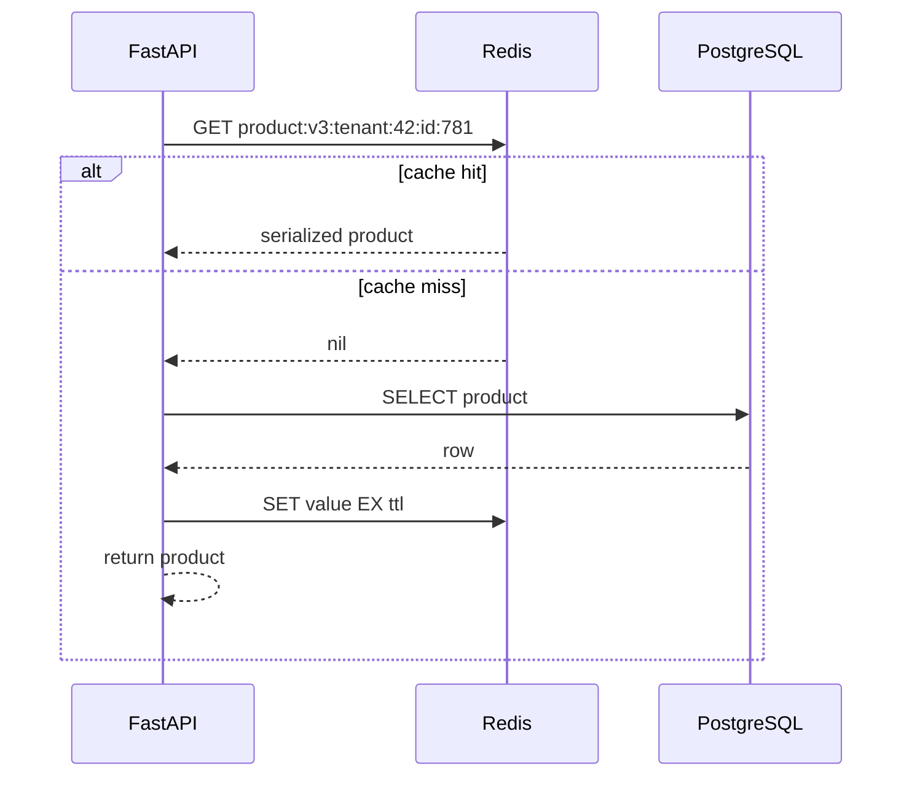

# Caching, Redis, and Rate Limiting

Caching trades freshness and operational simplicity for lower latency and reduced load. Redis is often used because it offers fast data structures, atomic commands, expiration, and mature clients, but adding Redis does not make an endpoint fast by itself. The design must identify what is cached, who owns invalidation, what happens on a miss, and what happens when Redis is unavailable.

## Start with the bottleneck

Cache only after establishing that repeated work is significant and reuse is likely. Common candidates include:

- database reads with a high read-to-write ratio;
- expensive deterministic calculations;
- authorization metadata that changes infrequently;
- third-party responses whose freshness policy permits reuse;
- generated documents or AI results keyed by all relevant inputs;
- static HTTP responses suitable for a browser, reverse proxy, or CDN.

Poor candidates include rapidly changing balances, one-off queries, sensitive values without a clear isolation model, and data where serving stale results would violate a safety invariant.

Before introducing Redis, consider cheaper layers:

| Layer | Scope | Best fit | Main limitation |
|---|---|---|---|
| Request memoization | One request | Avoid duplicate repository calls in a dependency graph | No reuse across requests |
| In-process cache | One worker process | Small immutable reference data | Inconsistent across workers and lost on restart |
| HTTP/client cache | Browser or API client | Public or private cacheable representations | Requires correct HTTP semantics |
| CDN/reverse proxy | Edge or proxy | Public GET responses and assets | Limited personalization |
| Redis | Shared application cache | Dynamic data reused across instances | Network hop and operational dependency |
| Database materialization | Database | Complex aggregates and indexed views | Refresh and write cost |

## Cache semantics before implementation

For each cached value, write down:

1. **Identity**: which inputs uniquely determine the value?
2. **Freshness**: how stale may it be, and under which conditions?
3. **Invalidation owner**: which write path knows the value changed?
4. **Isolation**: does the key include tenant, user, permission scope, locale, and API version where needed?
5. **Fallback**: can the source of truth absorb misses or a complete cache outage?
6. **Size**: what is the maximum item size and total key cardinality?
7. **Security**: may this data be stored outside the primary database, and for how long?

The key must include every input that changes the result. A response that differs by tenant but is cached only by resource ID is a cross-tenant data leak.

## Redis lifecycle in FastAPI

Create one async client per process, let it own its pool, and close it during shutdown. Do not create a new client for each request.

```python
from collections.abc import AsyncIterator
from contextlib import asynccontextmanager

import redis.asyncio as redis
from fastapi import FastAPI, Request


@asynccontextmanager
async def lifespan(app: FastAPI) -> AsyncIterator[None]:
    client = redis.Redis.from_url(
        "redis://redis:6379/0",
        encoding="utf-8",
        decode_responses=True,
        max_connections=50,
        socket_connect_timeout=0.2,
        socket_timeout=0.2,
        health_check_interval=30,
    )
    app.state.redis = client
    try:
        yield
    finally:
        await client.aclose()


def get_redis(request: Request) -> redis.Redis:
    return request.app.state.redis
```

Pool size is a capacity decision, not a value to maximize. Across `replicas * workers * max_connections`, ensure the Redis deployment and network can support the potential connections. A finite pool timeout and command timeout prevent cache latency from consuming the request budget.

Use TLS and authentication outside a trusted local network. Apply Redis ACLs so the application can access only required commands and key patterns. Never expose Redis directly to the public internet.

## Cache-aside

Cache-aside, also called lazy loading, keeps the database as the source of truth:



A typed implementation should distinguish a missing key from a cached falsey value and should tolerate a cache-only failure when policy allows it.

```python
import json
import logging
import random
from collections.abc import Awaitable, Callable
from typing import TypeVar

from pydantic import BaseModel
from redis.asyncio import Redis
from redis.exceptions import RedisError

logger = logging.getLogger(__name__)
ModelT = TypeVar("ModelT", bound=BaseModel)


async def cached_model(
    redis_client: Redis,
    *,
    key: str,
    model: type[ModelT],
    loader: Callable[[], Awaitable[ModelT]],
    ttl_seconds: int,
) -> ModelT:
    try:
        raw = await redis_client.get(key)
        if raw is not None:
            return model.model_validate_json(raw)
    except (RedisError, ValueError):
        logger.warning("cache_read_failed", extra={"cache_namespace": key.split(":", 1)[0]})

    value = await loader()
    jittered_ttl = ttl_seconds + random.randint(0, max(1, ttl_seconds // 10))

    try:
        await redis_client.set(key, value.model_dump_json(), ex=jittered_ttl)
    except RedisError:
        logger.warning("cache_write_failed", extra={"cache_namespace": key.split(":", 1)[0]})
    return value
```

Do not log full keys if they contain personal or secret data. Prefer opaque identifiers or a hash for sensitive components.

### Serialization and schema changes

JSON is portable and inspectable but larger and slower than binary formats. MessagePack or Protocol Buffers may be appropriate at high volume. Python `pickle` is unsafe for untrusted or tamperable cache data because deserialization can execute code.

Version either the namespace (`product:v3:...`) or the payload. A new application release can then read its own schema without interpreting old bytes incorrectly. Namespace versioning gives simple invalidation at the cost of temporarily retaining old keys until expiration.

### TTL selection

A TTL bounds staleness and memory usage, but it is not an invalidation strategy by itself.

- Short TTL: fresher data, more source load and churn.
- Long TTL: higher hit ratio, greater stale-data risk.
- No TTL: only safe with complete explicit invalidation and bounded key cardinality.
- Randomized TTL: spreads expirations and reduces synchronized misses.

Derive TTL from the business freshness budget and recovery requirements, not a universal constant. Measure hit ratio, miss cost, memory, evictions, and stale-result incidents.

## Invalidation patterns

Cache invalidation is coordination between writes and reads. Common approaches:

### Delete on successful write

Within a request:

1. commit the database transaction;
2. delete affected cache keys;
3. let the next read repopulate them.

Deleting before the database commit creates a race in which another reader repopulates old data. Even deleting after commit is not atomic with the transaction: the process can fail between the two operations.

For stricter reliability, write an invalidation event to an outbox in the same database transaction, publish it asynchronously, and make consumers idempotently delete or refresh keys. A short TTL remains a safety net.

### Write-through

The write path updates the source of truth and cache together. Reads are simpler, but the two writes still require failure handling. Treat the database as authoritative and define repair behavior for a failed cache update.

### Versioned keys

Store a version or generation per aggregate and include it in keys. Incrementing the generation makes the old namespace unreachable. This is useful when one mutation invalidates many derived keys, though old data occupies memory until expiration.

### Event-driven invalidation

Publish domain events such as `ProductPriceChanged`. Each projection or cache consumer invalidates its own keys. This reduces coupling but introduces propagation delay, replay, duplicate delivery, and consumer lag as design concerns.

### Avoid wildcard deletion on the request path

`KEYS prefix:*` can block Redis while scanning the entire keyspace. Use explicit key tracking, versioned namespaces, or incremental `SCAN` in an out-of-band maintenance process. In a cluster, remember that keys are partitioned across nodes.

## Stampedes, penetration, and hot keys

### Cache stampede

When a popular key expires, many requests can miss simultaneously and all perform the expensive load.

Mitigations include:

- TTL jitter to avoid many keys expiring together;
- single-flight request coalescing per key;
- a short lease so one caller refreshes while others wait or serve stale data;
- stale-while-revalidate, with separate fresh and hard-expiry windows;
- proactive refresh for a small set of predictably hot keys;
- admission control to protect the source of truth.

A distributed lock should not turn a 20 ms cache lookup into an unbounded wait. Use a short acquisition timeout, a lease expiry, and a fallback.

### Cache penetration

Repeated requests for absent values always miss. Negative caching stores a sentinel for a short period:

```python
NOT_FOUND = "__missing__"

raw = await redis_client.get(key)
if raw == NOT_FOUND:
    return None
if raw is not None:
    return Product.model_validate_json(raw)

product = await repository.find(product_id)
if product is None:
    await redis_client.set(key, NOT_FOUND, ex=15)
    return None
```

Keep negative TTLs short when resources may be created soon. Authorization must run before serving a cached existence result if resource discovery is sensitive.

### Hot keys

One key can overload a Redis shard or network even when total memory is low. Options include local near-cache with a very short TTL, read replicas where consistency permits, replication of immutable values under sharded keys, or serving the representation at a CDN. Diagnose command rate per key pattern and network throughput, not only overall hit ratio.

## HTTP caching

Do not overlook standard HTTP caching:

- `Cache-Control: public, max-age=60` allows shared caches where the representation is public.
- `Cache-Control: private` restricts storage to a private cache.
- `no-store` tells caches not to store a sensitive response.
- `ETag` with `If-None-Match` lets a client revalidate and receive 304.
- `Vary` identifies request headers that change the representation, but excessive variation destroys cache reuse.

Authenticated responses are not automatically uncacheable, but caching them safely requires precise private/shared cache semantics. Never let a shared cache mix users.

## Rate limiting is resource allocation

Rate limits protect capacity, fairness, cost, and upstream quotas. They are not a complete denial-of-service defense; connection floods and large bodies may consume resources before application middleware runs. Enforce complementary controls at a CDN, gateway, load balancer, and server.

Choose the identity deliberately:

- authenticated principal or API key for customer quotas;
- tenant for shared contractual capacity;
- endpoint or operation for expensive work;
- IP address as a coarse unauthenticated signal, considering proxies, NAT, and IPv6;
- a combination, with both burst and sustained limits.

Trust client IP headers only from known proxies. Otherwise an attacker can choose the apparent identity.

### Algorithms

| Algorithm | Behavior | Cost and tradeoff |
|---|---|---|
| Fixed window | Count in a wall-clock interval | Simple, but permits bursts across a boundary |
| Sliding log | Store every request timestamp | Accurate, memory grows with request volume |
| Sliding window counter | Weighted current and previous windows | Good approximation with bounded state |
| Token bucket | Tokens refill over time, requests spend tokens | Supports controlled bursts and sustained rate |
| Leaky bucket | Requests drain at a fixed rate | Smooths output, often implemented as a queue |
| Concurrency limit | Bound simultaneous in-flight work | Protects scarce pools better than request rate alone |

Use Redis atomic operations or a Lua script so the check and update cannot race. A naive `GET`, compare, then `INCR` sequence overspends under concurrency.

### Atomic fixed-window example

This Lua script increments and sets expiration atomically. It uses Redis server time to avoid application clock skew.

```python
from dataclasses import dataclass

from redis.asyncio import Redis

FIXED_WINDOW_SCRIPT = """
local current = redis.call('INCR', KEYS[1])
if current == 1 then
  redis.call('PEXPIRE', KEYS[1], ARGV[1])
end
local ttl = redis.call('PTTL', KEYS[1])
return {current, ttl}
"""


@dataclass(frozen=True)
class LimitDecision:
    allowed: bool
    remaining: int
    retry_after_seconds: int


async def check_fixed_window(
    redis_client: Redis,
    *,
    subject: str,
    operation: str,
    limit: int,
    window_ms: int,
) -> LimitDecision:
    key = f"rl:v1:{operation}:{subject}"
    count, ttl_ms = await redis_client.eval(
        FIXED_WINDOW_SCRIPT, 1, key, window_ms
    )
    remaining = max(0, limit - int(count))
    retry_after = max(1, (int(ttl_ms) + 999) // 1000)
    return LimitDecision(
        allowed=int(count) <= limit,
        remaining=remaining,
        retry_after_seconds=retry_after,
    )
```

Hash or map an API key to an internal subject before using it in a Redis key. Do not store the credential itself.

On rejection, return 429 and a `Retry-After` value when it is meaningful. Rate-limit response header conventions are evolving, so document the exact headers your API supports. Do not cache a 429 response across unrelated callers.

### Failure policy

If Redis is down, choose explicitly:

- **Fail open** for a low-risk public read endpoint, while protecting downstreams with local concurrency limits.
- **Fail closed** for login brute-force protection, costly AI inference, or a contractual quota where bypass is unacceptable.
- **Fallback locally** for a short outage, accepting that per-process counters are approximate.

Emit a metric whenever the fallback is used. An invisible fail-open policy becomes permanent behavior.

### Multiple limits

Real systems often apply several policies at once, for example:

```text
per-IP login attempts:       10 / minute
per-account login attempts:   5 / minute
per-tenant API requests:   1000 / minute
per-tenant AI concurrency:    3 in flight
global AI concurrency:       50 in flight
```

Evaluate cheap, broad controls at the edge, then identity-aware limits inside the application. Reserve capacity per tenant if one customer must not exhaust a shared upstream quota.

## Distributed locks and leases

A Redis lock can reduce duplicate work, but it cannot make arbitrary distributed code exactly once. The holder may pause past the lease expiry, lose connectivity, and continue writing after another holder acquires the lock.

For a single Redis instance, acquisition usually uses `SET resource token NX PX ttl`. Release must compare the random ownership token and delete atomically, normally with Lua. Never release with an unconditional `DEL`, because the lease may have expired and been acquired by someone else.

For correctness-critical writes, prefer a database uniqueness constraint, row lock, compare-and-swap version, or a coordinator whose guarantees match the problem. If stale holders can write to an external resource, use **fencing tokens**: each lease receives a monotonically increasing token and the protected resource rejects tokens older than the latest accepted one.

Locks require:

- bounded acquisition time;
- a lease longer than expected work with a safe renewal strategy;
- unique ownership tokens;
- cancellation-safe release;
- metrics for contention, lease expiry, and work duration;
- a documented outcome if the process dies at every line.

## Redis is not automatically a durable database

Redis can persist and replicate data, but cache use and system-of-record use have different requirements. For a cache, eviction and loss should be survivable. For durable coordination, queues, or idempotency records, examine persistence mode, replication acknowledgement, failover behavior, backup, and recovery point objectives.

Separate workloads when possible. A cache configured with an eviction policy can discard keys that a rate limiter or job coordinator assumes exist. Large background jobs can also starve latency-sensitive request caching.

Operational signals include:

- command latency percentiles and timeouts;
- hit, miss, bypass, and stale-serve counts by bounded namespace;
- memory, fragmentation, key count, and eviction rate;
- connections, rejected connections, and pool waits;
- replication lag and failover events;
- hot commands, slow log, CPU, network, and blocked clients;
- rate-limit decisions and limiter errors;
- lock acquisition latency, contention, and expired leases.

## Decision guide

Use Redis when shared low-latency state, expiration, atomic operations, or supported data structures solve a measured problem. Do not use it merely because the architecture diagram looks incomplete without a cache.

Use an in-process cache when data is small, bounded, safe to be inconsistent for a short time, and inexpensive to reconstruct. Use a CDN when content can be cached near clients. Use a database constraint rather than a distributed lock when the database owns the invariant. Use a gateway limiter when the identity and policy are available before the request reaches the application.

## Common mistakes

- Caching before measuring the database query or serialization cost.
- Using a cache key that omits tenant, permissions, locale, or representation version.
- Caching ORM objects or pickled untrusted data.
- Assigning every key the same TTL and causing synchronized expiry.
- Invalidating before a transaction commits.
- Assuming a Redis outage is harmless while all misses overload the database.
- Implementing a distributed limiter with per-process memory.
- Treating a Redis lock as a proof of exactly-once execution.
- Running unbounded `KEYS` or large values on a latency-sensitive instance.
- Sharing one eviction policy between disposable cache keys and correctness-critical state.

## Interview prompts

1. Explain cache-aside and the race that occurs when invalidation happens before database commit.
2. How would you prevent a cache stampede on a product viewed by millions of users?
3. Why can a fixed-window limiter permit roughly twice the configured rate near a boundary?
4. When should a rate limiter fail open or fail closed?
5. Why is `SET NX` plus an unconditional `DEL` an unsafe lock?
6. How would you discover and mitigate a Redis hot key?
7. What changes when Redis is a cache versus part of a correctness-critical workflow?

## Further reading

- [redis-py asynchronous operations](https://redis.io/docs/latest/develop/clients/redis-py/async/)
- [Redis cache-aside pattern with redis-py](https://redis.io/docs/latest/develop/use-cases/cache-aside/redis-py/)
- [Redis rate limiter patterns](https://redis.io/docs/latest/develop/use-cases/rate-limiter/)
- [Redis pipelines and transactions](https://redis.io/docs/latest/develop/clients/redis-py/transpipe/)
- [Redis distributed locks](https://redis.io/docs/latest/develop/clients/patterns/distributed-locks/)
- [RFC 9111: HTTP Caching](https://www.rfc-editor.org/rfc/rfc9111)

## Related topics

- [Performance and Scalability](./performance-and-scalability.md)
- [Queues, Workers, and Scheduling](./queues-workers-and-scheduling.md)
- [Distributed Systems](../../architecture/distributed-systems.md)
