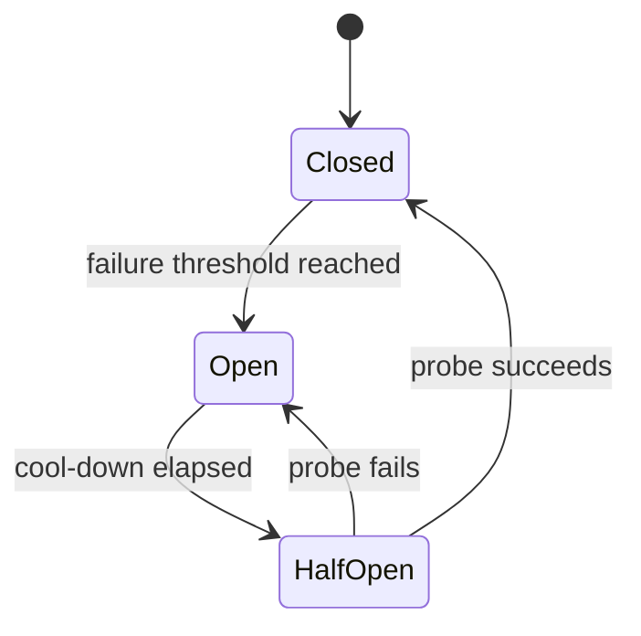
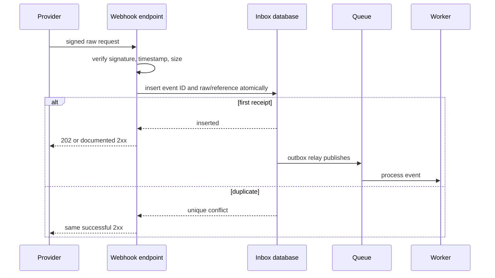

# Integrations, Webhooks, and Resilience

Calling a third-party API crosses a failure and trust boundary. The remote system has its own latency, quotas, deployments, data model, authentication, and incidents. A production integration therefore needs an adapter, explicit time budgets, bounded concurrency, safe retry semantics, stable idempotency, schema validation, and operational ownership.

Webhooks reverse the direction, but not the problems. A webhook endpoint accepts untrusted, duplicated, delayed, and potentially reordered input. A 2xx response means receipt according to a documented contract, not necessarily completion of every downstream side effect.

## Put an anti-corruption layer around providers

Do not scatter vendor SDK calls across routers and services. Define an application-facing port in domain language and implement it in an infrastructure adapter.

```python
from dataclasses import dataclass
from decimal import Decimal
from typing import Protocol


@dataclass(frozen=True)
class AuthorizationResult:
    provider_reference: str
    approved: bool
    decline_code: str | None = None


class PaymentGateway(Protocol):
    async def authorize(
        self,
        *,
        operation_id: str,
        amount: Decimal,
        currency: str,
        payment_method_token: str,
    ) -> AuthorizationResult: ...
```

The adapter owns:

- vendor authentication and request shape;
- connect, read, write, and pool timeouts;
- provider error classification;
- serialization and response validation;
- retry and idempotency behavior;
- provider request IDs for diagnostics;
- metrics with bounded labels;
- redaction of credentials and customer data.

The domain should see `PaymentTemporarilyUnavailable` or `PaymentDeclined`, not an `httpx.ReadTimeout` or vendor JSON dictionary.

This boundary makes provider replacement possible, but that is not the main benefit. It prevents vendor quirks from becoming the application's business model.

## Manage clients for the process lifetime

An `httpx.AsyncClient` owns connection pools and should normally be created once per process during lifespan, then closed at shutdown. Creating one per request forfeits connection reuse and adds DNS, TCP, and TLS overhead.

```python
from collections.abc import AsyncIterator
from contextlib import asynccontextmanager

import httpx
from fastapi import FastAPI


@asynccontextmanager
async def lifespan(app: FastAPI) -> AsyncIterator[None]:
    timeout = httpx.Timeout(connect=1.0, read=4.0, write=2.0, pool=0.5)
    limits = httpx.Limits(
        max_connections=100,
        max_keepalive_connections=20,
        keepalive_expiry=30.0,
    )
    app.state.billing_http = httpx.AsyncClient(
        base_url="https://billing.example.net/v2/",
        timeout=timeout,
        limits=limits,
        headers={"User-Agent": "orders-api/2026.08"},
        follow_redirects=False,
    )
    try:
        yield
    finally:
        await app.state.billing_http.aclose()
```

Pool sizing must match workload concurrency, upstream quotas, file-descriptor limits, and the number of application replicas. A 100-connection pool in each of 30 replicas is potential concurrency of 3,000 against the provider. Add an application semaphore or bulkhead when the upstream contract allows much less.

Keep separate clients or bulkheads for dependencies with different criticality. A slow analytics provider should not consume every connection needed for payment authorization.

## Timeouts are budgets

No outbound call should wait without a bound. Distinguish:

- **connect timeout**: establish the network connection;
- **pool timeout**: wait for an available pooled connection;
- **write timeout**: send request bytes;
- **read timeout**: wait for response bytes;
- **operation deadline**: total time allowed across attempts and application work.

If an inbound request has 5 seconds remaining, three 4-second attempts cannot fit. Derive per-attempt timeouts from the remaining deadline and leave time to serialize and send the response. For asynchronous jobs, use a job deadline or expiry so obsolete tasks do not retry for days.

A timeout is an ambiguous result. The provider may have completed a write while the response was lost. This is why mutation retries require idempotency, not simply an exception handler.

## Validate both sides of the contract

Use Pydantic models or another schema boundary for provider responses. Treat undocumented new fields as compatible when appropriate, but reject missing or invalid fields the application depends on.

```python
from typing import Literal

from pydantic import BaseModel, ConfigDict


class ProviderAuthorization(BaseModel):
    model_config = ConfigDict(extra="ignore")

    id: str
    state: Literal["approved", "declined", "pending"]
    decline_code: str | None = None
```

Keep captured contract fixtures sanitized. Add tests for a missing field, unexpected enum value, malformed JSON, oversized response, 429, every 5xx class you handle, and a successful response whose business state is a decline.

HTTP 200 means transport success, not necessarily business success. Conversely, some providers use 409 to report successful replay of an idempotent operation. The adapter must understand the documented contract.

## Classify failures before retrying

| Failure | Usually retry? | Notes |
|---|---|---|
| DNS/connect failure | Yes, bounded | Could be local or provider outage |
| Connect/read timeout | Yes for reads; writes need idempotency | Result may be ambiguous |
| 408 | Often | Respect total deadline |
| 429 | Often | Respect `Retry-After`, quotas, and job expiry |
| 500, 502, 503, 504 | Often | Back off, cap attempts, use retry budget |
| Other 4xx | Usually no | Fix request, credentials, permissions, or state |
| Schema mismatch | Usually no immediate retry | Often contract drift or provider defect |
| Domain decline | No | A valid business outcome, not an outage |

Never retry every exception. A broad retry loop can turn a bad credential, validation bug, or card decline into an outage and a larger bill.

### Idempotency determines retry safety

GET, HEAD, OPTIONS, PUT, and DELETE are defined as idempotent by HTTP semantics, though a poorly designed provider can still violate expectations. POST is not generally idempotent. For a mutation:

1. create a stable operation ID in the application's durable state;
2. send that same value in the provider's idempotency mechanism on every attempt;
3. persist the provider reference and final outcome;
4. reconcile ambiguous operations by querying status rather than creating a new operation.

The idempotency key identifies the logical operation, not an HTTP attempt. Generating a new key inside each retry defeats it.

### Backoff with full jitter

Immediate synchronized retries amplify overload. Exponential backoff spaces attempts; random jitter prevents all callers from retrying together.

```python
import asyncio
import random
import time
from collections.abc import Awaitable, Callable
from typing import TypeVar

import httpx

T = TypeVar("T")


async def retry_transient(
    operation: Callable[[], Awaitable[T]],
    *,
    deadline: float,
    max_attempts: int = 4,
) -> T:
    last_error: Exception | None = None
    for attempt in range(max_attempts):
        try:
            return await operation()
        except (httpx.TimeoutException, httpx.NetworkError) as exc:
            last_error = exc
            remaining = deadline - time.monotonic()
            if attempt == max_attempts - 1 or remaining <= 0:
                break
            cap = min(8.0, 0.25 * (2**attempt), remaining)
            await asyncio.sleep(random.uniform(0, cap))
    assert last_error is not None
    raise last_error
```

In real adapters, catch the client's explicit transient exception types and interpret HTTP responses separately. Propagate cancellation. Record the attempt count once on the final span and use metrics rather than an error log for every routine retry.

### Retry budgets

Set a maximum ratio or absolute rate of retries per dependency. During an outage, allow only a bounded number beyond original traffic. This prevents retries from consuming all connections after recovery. Combine the budget with admission control, job expiry, and a circuit breaker.

## Circuit breakers and bulkheads

A circuit breaker stops making calls that are likely to fail:



- **Closed**: calls flow and relevant outcomes update rolling health.
- **Open**: calls fail fast or use a fallback.
- **Half-open**: a small number of probes determine recovery.

Count failures that indicate dependency health, such as timeouts and 5xx. Do not trip because customers supplied invalid input or payments were declined. Use a rolling window and minimum sample size so a single failure at low traffic does not open the circuit.

Circuit state may be per process. Shared state coordinates replicas but makes the breaker itself a distributed dependency. Per-process breakers are often adequate when combined with upstream health and jitter.

A **bulkhead** bounds how much of the service a dependency can occupy: a separate connection pool, semaphore, worker queue, or process pool. Circuit breakers reduce futile work after failures are known; bulkheads limit damage while failures are developing. Use both where the dependency is high-risk.

## Fallbacks must preserve correctness

Possible fallbacks include stale cache, queued work, a secondary provider, a partial response, or explicit unavailability. A fallback is safe only if its semantics are acceptable.

- Serving yesterday's product catalog may be acceptable.
- Serving a stale account balance or authorization decision may not be.
- Silently switching payment providers can double-charge unless operation identity and reconciliation span both providers.
- Queueing a password reset email is normal; queueing an interactive fraud decision may violate the checkout deadline.

Expose degraded behavior in the response where clients must know, and always in metrics.

## Security at the outbound boundary

### SSRF prevention

Server-side request forgery occurs when user input controls an outbound destination. Prefer a fixed provider base URL and validated path identifiers. If arbitrary URLs are a product requirement:

- allowlist schemes and destination domains where possible;
- resolve and block loopback, link-local, private, multicast, and metadata-service addresses;
- revalidate after every redirect and DNS resolution;
- disable redirects unless required;
- restrict ports and response size;
- run fetchers in an isolated network identity with no internal service access;
- defend against DNS rebinding and alternate IP representations.

URL prefix string checks are not sufficient.

### Credentials and data

Use TLS verification, scoped credentials, rotation, and a secret manager. Do not place API keys in query strings. Redact `Authorization`, cookies, signed URLs, and request bodies. Verify a provider SDK's telemetry hooks before enabling debug logs.

Minimize data sent to the provider. Record the lawful purpose, retention, regional routing, and deletion behavior for personal data.

## Inbound webhook architecture

A reliable inbound endpoint performs bounded receipt work, then delegates processing:



Do not perform slow business workflows before acknowledgement. Providers retry on timeouts, creating parallel duplicate work. First make receipt durable, then process asynchronously.

### Verify the raw body

Signature schemes usually cover exact request bytes. Reading parsed JSON and re-serializing it changes whitespace and key order. Verify first, then parse.

```python
import hashlib
import hmac
import time

from fastapi import Header, HTTPException, Request, status

MAX_WEBHOOK_BYTES = 1_000_000


def verify_signature(
    *, raw_body: bytes, timestamp: str, signature: str, secret: bytes
) -> None:
    try:
        sent_at = int(timestamp)
    except ValueError as exc:
        raise HTTPException(status_code=400, detail="Invalid timestamp") from exc

    if abs(int(time.time()) - sent_at) > 300:
        raise HTTPException(status_code=401, detail="Stale webhook")

    signed = timestamp.encode("ascii") + b"." + raw_body
    expected = hmac.new(secret, signed, hashlib.sha256).hexdigest()
    if not hmac.compare_digest(expected, signature):
        raise HTTPException(status_code=401, detail="Invalid signature")


async def receive_webhook(
    request: Request,
    x_webhook_timestamp: str = Header(),
    x_webhook_signature: str = Header(),
) -> dict[str, bool]:
    try:
        content_length = int(request.headers.get("content-length", "0") or "0")
    except ValueError as exc:
        raise HTTPException(status_code=400, detail="Invalid content length") from exc
    if content_length < 0 or content_length > MAX_WEBHOOK_BYTES:
        raise HTTPException(status_code=status.HTTP_413_REQUEST_ENTITY_TOO_LARGE)

    raw_body = await request.body()
    if len(raw_body) > MAX_WEBHOOK_BYTES:
        raise HTTPException(status_code=status.HTTP_413_REQUEST_ENTITY_TOO_LARGE)

    verify_signature(
        raw_body=raw_body,
        timestamp=x_webhook_timestamp,
        signature=x_webhook_signature,
        secret=b"loaded-from-secret-manager",
    )
    # Parse, validate the event envelope, and insert its provider event ID
    # into a durable inbox with a unique constraint before returning success.
    return {"accepted": True}
```

This is a generic pattern, not a substitute for a provider's documented canonicalization. Some schemes include request path, multiple signature versions, asymmetric keys, or a header containing several signatures. `request.body()` buffers before the post-read length check, so enforce the limit at a trusted proxy or use bounded streaming middleware when clients can omit `Content-Length`.

Use constant-time comparison. Apply a timestamp tolerance to limit replay, but also persist the event ID because a replay within that window is still possible. During secret rotation, verify against a small set of active secret versions and record which version matched, without logging the secret.

### Authentication is not just an IP allowlist

Provider IP ranges can change, requests may traverse proxies, and source headers can be spoofed unless the proxy trust chain is correct. Signature verification is primary. Mutual TLS, private networking, and IP allowlists can add layers but should match the provider contract.

### Event schemas and evolution

Validate a small envelope containing event ID, type, creation time, and schema/API version. Dispatch only known types. Keep unknown event handling visible: acknowledge and quarantine if the provider expects forward compatibility, or return the documented failure response. Store enough original data or a secure object reference to replay after fixing a consumer.

Never let an event type string select an arbitrary import or function.

### Duplicates and ordering

Return success for an already accepted event. Responding with an error causes more retries but cannot make the duplicate disappear.

Do not assume webhook arrival order. If events contain object versions or sequence numbers:

- ignore a version older than the last applied version;
- serialize updates per aggregate where necessary;
- fetch current provider state when a gap makes the event insufficient;
- run periodic reconciliation because webhooks can be lost beyond the provider retry window.

The provider's API is often the current-state authority; the webhook is a prompt to synchronize.

## Outbound webhooks

When your service sends webhooks, you become the provider. A durable design has:

- a subscription with tenant ownership, verified endpoint, active status, event allowlist, and secret version;
- an immutable event record with stable event ID and schema version;
- one delivery record per subscription and event;
- a worker with DNS/SSRF controls, timeout, concurrency bound, retry schedule, and response-size limit;
- HMAC or asymmetric signatures over exact bytes plus timestamp;
- a delivery log and manual replay that keeps the original event ID;
- automatic disablement or operator review for consistently failing endpoints.

```text
webhook_deliveries
  id
  event_id
  subscription_id
  attempt_count
  next_attempt_at
  status             pending | delivering | succeeded | exhausted
  last_http_status
  last_error_code
  response_excerpt   bounded and redacted
  created_at
  completed_at
```

Do not hold a database transaction open during the HTTP call. Claim a due delivery with a lease, commit, call the endpoint, then record the outcome using optimistic concurrency. If the worker dies after the receiver processes the event but before recording success, delivery repeats. Document at-least-once delivery and require consumers to deduplicate by event ID.

### Receiver response policy

Define which responses are success and which retry:

- 2xx: normally delivered;
- 408, 425, 429, selected 5xx: retry with bounds and `Retry-After` handling;
- most other 4xx: permanent subscription or payload problem;
- redirect: normally reject, or reapply SSRF validation at every hop;
- timeout/TLS/DNS: retry if the delivery has not expired.

Set maximum event age. A webhook delivered weeks late may be more harmful than useful.

## Reconciliation and sagas

Integrations fail in ambiguous states. Build reconciliation as a routine operation, not an emergency script:

- query provider state for pending operations older than a threshold;
- compare local and remote totals or IDs;
- repair missed webhook projections;
- expose mismatches and manual resolution with an audit trail.

Multi-step workflows across services cannot use one ordinary database transaction. A saga records progress and applies compensating operations where possible. Compensation is business action, not time travel: refunding a captured payment is not identical to never charging it, and sending a second email cannot unsend the first.

Model saga state durably, make each command idempotent, time out stalled steps, and provide operator visibility.

## Observability and service objectives

Per integration, measure:

- request count, latency, and outcome class;
- timeouts by phase, pool waits, and connection errors;
- attempts per logical operation and retry-budget consumption;
- circuit state and bulkhead rejections;
- provider quota remaining where exposed, without high-cardinality labels;
- webhook receipt, signature failure, duplicate, queue delay, processing failure, and event age;
- outbound delivery success, attempts, oldest pending age, and exhausted deliveries;
- reconciliation mismatch count and age.

Propagate W3C trace context only to trusted destinations and according to policy. For webhook messages, link asynchronous processing spans to the receipt span rather than pretending one span stays open for hours.

Log provider request IDs and your logical operation ID. Do not label metrics with request ID, endpoint URL, tenant ID, or provider error text.

## Testing integrations

- Unit-test mapping between domain and provider schemas.
- Use HTTPX mock transports or a local fake server for status, timeout, malformed response, and retry cases.
- Contract-test against a provider sandbox, but do not make every unit test call it.
- Verify stable idempotency keys across attempts.
- Test an ambiguous timeout after the provider applied a mutation.
- Send webhook signatures over exact fixture bytes, including invalid and rotated keys.
- Concurrently submit the same event ID and prove one inbox row and one business transition result.
- Deliver newer then older versions and verify ordering policy.
- Test an outbound URL that redirects to a private address.
- Run a reconciliation test with intentionally missing webhooks.

## Production checklist

- Every provider has an owned adapter and documented failure policy.
- Shared clients have finite pools, timeouts, shutdown, and bounded dependency concurrency.
- Mutation retries reuse a durable logical idempotency key.
- Retries are classified, capped, jittered, deadline-aware, and budgeted.
- Circuit breakers and fallbacks count only relevant failures and preserve correctness.
- Webhook signatures cover raw bytes and include replay defense.
- Receipt is durable before a successful inbound response.
- Duplicates, reordering, unknown schemas, and secret rotation are tested.
- Outbound destinations are protected against SSRF and redirects are controlled.
- Reconciliation covers ambiguous and missed operations.
- Integration dashboards show latency, error, saturation, retry, queue-age, and circuit signals.

## Interview prompts

1. Why can retrying a timed-out POST charge a customer twice?
2. How do an operation deadline and a per-attempt read timeout differ?
3. Compare a circuit breaker with a bulkhead.
4. Why must webhook signatures usually be verified against raw bytes?
5. How would you process duplicated and out-of-order payment webhooks?
6. What makes outbound webhooks an SSRF risk?
7. Why is reconciliation necessary even when the provider retries webhooks?
8. How would you test that an integration handles an ambiguous timeout correctly?

## Further reading

- [HTTPX Timeouts](https://www.python-httpx.org/advanced/timeouts/)
- [HTTPX Resource Limits](https://www.python-httpx.org/advanced/resource-limits/)
- [RFC 9110: HTTP Semantics](https://www.rfc-editor.org/rfc/rfc9110)
- [OWASP: Server-Side Request Forgery Prevention](https://cheatsheetseries.owasp.org/cheatsheets/Server_Side_Request_Forgery_Prevention_Cheat_Sheet.html)
- [AWS Architecture Blog: Exponential Backoff and Jitter](https://aws.amazon.com/blogs/architecture/exponential-backoff-and-jitter/)
- [W3C Trace Context](https://www.w3.org/TR/trace-context/)

## Related topics

- [Queues, Workers, and Scheduling](./queues-workers-and-scheduling.md)
- [Configuration, Logging, and Error Handling](./configuration-logging-and-errors.md)
- [Distributed Systems](../../architecture/distributed-systems.md)
