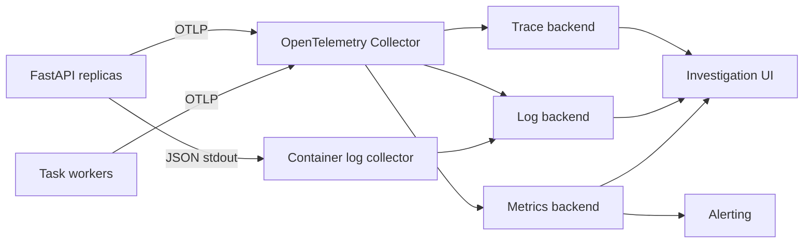
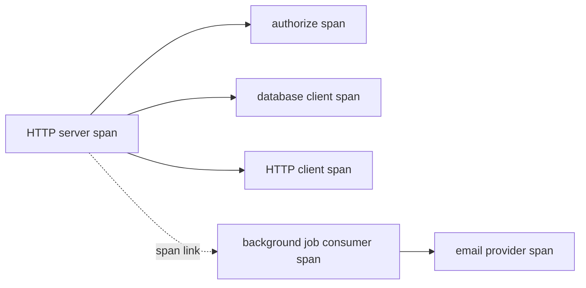

# Observability

Observability is the ability to investigate a system's internal behavior from the signals it emits. Monitoring answers known questions with dashboards and alerts. Observability also supports questions that were not predicted before an incident, such as why one tenant's checkout became slow only after a particular dependency retry.

The main signals are logs, metrics, traces, profiles, and domain audit records. They overlap, but they are not interchangeable:

- **Metrics** summarize many events cheaply and support objectives and alerts.
- **Traces** show how one operation moved through components and where it waited.
- **Logs** carry detailed event context and exceptions.
- **Profiles** show where CPU time or memory allocation occurs.
- **Audit records** provide durable, access-controlled evidence of security or business actions.

An effective system connects them with service identity, deployment version, trace context, request/job/event IDs, and disciplined field names.

## Begin with service objectives

Collecting every available signal creates cost and noise. Start with what users need.

### Service-level indicators

An SLI is a measured aspect of service behavior. Examples:

- proportion of eligible API requests completed successfully;
- proportion of reads below 300 ms;
- webhook events processed within 60 seconds of provider creation;
- jobs completed before their promised deadline;
- proportion of checkout operations with a correct, durable outcome.

Define the event population and exclusions precisely. If 4xx responses are caused by invalid input, they may not count against API availability. A 429 caused by insufficient provisioned capacity may need to count. Report both the user-facing objective and raw status classes.

### SLOs and error budgets

An SLO sets a target over a window, such as 99.9 percent successful requests over 28 days. The remaining 0.1 percent is an error budget. Burn-rate alerts indicate how quickly that budget is being consumed, which is often more actionable than a fixed instantaneous error threshold.

Do not promise an objective stronger than critical dependencies can support without redundancy or acceptable fallback. Internal objectives should leave budget for the composed user journey.

## Telemetry architecture

OpenTelemetry provides vendor-neutral APIs, SDKs, semantic conventions, propagation, and a collector for traces, metrics, and logs. It is not the storage or visualization backend.



The collector can batch, retry, redact, enrich, sample, and route telemetry outside the application process. Keep its buffers bounded. Telemetry backpressure must not block every request indefinitely.

At the time of writing, the OpenTelemetry Python project marks traces and metrics stable, while its logs signal remains under development. Check component status before standardizing production log export through the SDK. Structured stdout remains a sound transport in container environments.

## Resource identity

Every signal should identify the producing resource with low-cardinality attributes such as:

```text
service.name = orders-api
service.namespace = commerce
service.version = 2026.08.11+git.a1b2c3d
deployment.environment.name = production
cloud.region = ap-southeast-1
service.instance.id = pod-or-task-id
```

Do not put instance ID into every application metric label when the platform already attaches a target identity and queries do not need it. Cardinality and backend model matter.

Deployment version is critical. Without it, an error-rate increase cannot be reliably correlated with a rollout.

## Structured logging

Use JSON or another reliably parseable format in production. Standardize fields:

```json
{
  "timestamp": "2026-08-11T12:04:33.418Z",
  "severity": "ERROR",
  "event": "payment_authorization_failed",
  "service": "orders-api",
  "version": "a1b2c3d",
  "trace_id": "4bf92f3577b34da6a3ce929d0e0e4736",
  "span_id": "00f067aa0ba902b7",
  "request_id": "req_01J...",
  "operation_id": "payop_123",
  "provider": "gateway_a",
  "failure_category": "timeout",
  "attempt": 3
}
```

### Logging rules

- Log events with stable names and typed fields rather than interpolated prose alone.
- Log an unexpected exception once at the owning boundary with its traceback.
- Treat expected client and domain errors according to operational value, not automatically as `ERROR`.
- Use bounded values for route template, status class, provider, and error code.
- Redact authorization, cookies, passwords, tokens, signed URLs, card data, and sensitive bodies at source.
- Define retention and access controls because logs are a data store.
- Sample repetitive low-value events, but do not sample rare security or correctness failures blindly.
- Keep audit events in a tamper-resistant store with stricter access and retention than diagnostic logs when required.

### Correlate logs with traces

Add the active trace and span ID through a logging filter or structured logging processor. The exact integration depends on the logging library and OpenTelemetry setup. Keep request ID as a separate application correlation value: external clients can quote it even when a trace was not sampled.

Do not use trace ID or request ID as metric labels. Each is nearly unique and creates an unbounded time series. Exemplars, where supported, attach selected trace references to histogram observations without making them labels.

## Metrics

### Instrument types

| Type | Use | Example |
|---|---|---|
| Counter | Monotonic event count | requests, errors, jobs completed |
| Up-down counter | Value that rises and falls | active requests, checked-out connections |
| Histogram | Distribution of observations | request duration, payload bytes, queue delay |
| Gauge/observable gauge | Current sampled state | queue depth, breaker state, process memory |

Do not average percentiles. Histograms can aggregate across instances when bucket boundaries and backend semantics are compatible. Client-side summaries often calculate non-aggregatable quantiles. OpenTelemetry and Prometheus now also support native/exponential histogram approaches in parts of the ecosystem; verify backend and exporter support.

### RED for request-driven services

- **Rate**: request count or operations per second.
- **Errors**: failures by meaningful bounded category.
- **Duration**: latency distribution.

For FastAPI, useful measurements include:

```text
http.server.request.duration
http.server.active_requests
http.server.request.body.size
http.server.response.body.size
```

Use OpenTelemetry semantic conventions where instrumentations provide them. Attribute the route template, method, status code, server address, and protocol according to the convention. Never use a raw path containing IDs as `http.route`.

### USE for resources

- **Utilization**: how busy is the resource?
- **Saturation**: how much work is waiting?
- **Errors**: what failed at the resource boundary?

Apply this to CPU, memory, disk, network, event loop, thread pool, database pool, HTTP pool, broker channels, and GPU.

### Domain and workflow metrics

Framework metrics do not reveal whether the product works. Add bounded business-flow metrics:

- orders accepted and rejected by safe reason code;
- payments pending beyond reconciliation threshold;
- notification intents and delivery outcomes;
- webhook receipt-to-processing delay;
- jobs completed, failed, cancelled, and expired;
- AI token/cost units by model class and tenant plan, subject to cardinality controls;
- idempotency replays and conflicts.

Metrics used for financial reporting normally require a durable ledger, not a lossy telemetry pipeline. Operational counters and business records serve different purposes.

### Cardinality

Time-series cost grows roughly with every combination of label values. Never label metrics with:

- user, tenant, order, request, job, or trace ID;
- raw URL, query string, email address, or IP address;
- exception message or SQL text;
- unbounded provider response text.

Use bounded route templates, method, status class/code, operation, error category, queue, provider, and deployment environment. If per-tenant operational analysis is necessary, use logs, traces, a bounded premium-tenant allowlist, or a separate analytical system.

## Distributed tracing

A trace represents one logical operation. Spans represent timed steps with parent-child or link relationships.



Automatic instrumentation creates spans for FastAPI/Starlette, HTTPX, SQLAlchemy, Redis, and other libraries. Manual spans should describe business operations not visible at library level, such as `reserve_inventory` or `render_report`.

Do not create a manual span around every function. Excessive spans cost money and obscure the critical path.

### Minimal OpenTelemetry trace setup

```python
from fastapi import FastAPI
from opentelemetry import trace
from opentelemetry.exporter.otlp.proto.grpc.trace_exporter import OTLPSpanExporter
from opentelemetry.instrumentation.fastapi import FastAPIInstrumentor
from opentelemetry.sdk.resources import Resource
from opentelemetry.sdk.trace import TracerProvider
from opentelemetry.sdk.trace.export import BatchSpanProcessor


def configure_tracing(app: FastAPI, settings: Settings) -> None:
    resource = Resource.create(
        {
            "service.name": settings.service_name,
            "service.version": settings.service_version,
            "deployment.environment.name": settings.environment,
        }
    )
    provider = TracerProvider(resource=resource)
    provider.add_span_processor(
        BatchSpanProcessor(
            OTLPSpanExporter(endpoint=settings.otlp_endpoint, insecure=False)
        )
    )
    trace.set_tracer_provider(provider)
    FastAPIInstrumentor.instrument_app(
        app,
        excluded_urls="/health/live,/health/ready,/metrics",
    )
```

Package versions and exporter options change, so keep telemetry dependencies locked and consult their current documentation. Initialize once per process before serving traffic. Flush the provider during graceful shutdown within a bounded time.

### Manual spans and safe attributes

```python
from opentelemetry import trace

tracer = trace.get_tracer(__name__)


async def reserve_inventory(command: ReserveInventory) -> Reservation:
    with tracer.start_as_current_span("inventory.reserve") as span:
        span.set_attribute("inventory.item_count", len(command.items))
        span.set_attribute("inventory.channel", command.channel.value)
        try:
            return await repository.reserve(command)
        except InventoryUnavailable as exc:
            span.set_attribute("inventory.outcome", "unavailable")
            # A handled business result need not be recorded as an exception.
            raise
```

Avoid order IDs, SKUs with unbounded cardinality, personal data, prompts, and full database statements unless an explicit controlled policy permits them.

### Propagation

W3C Trace Context standardizes `traceparent` and `tracestate` headers. Instrumented HTTP clients inject and extract these automatically when configured. Only accept context as correlation, never authorization.

For queues:

- inject context fields into versioned message headers;
- extract them in the consumer;
- create a consumer/processing span;
- use a span link when work is asynchronous or one batch combines several messages;
- do not leave the producer span open until a job finishes.

Preserve a separate stable message/event ID for deduplication and operations. Trace retention is not a business idempotency mechanism.

### Sampling

Head sampling decides near trace start and keeps cost predictable. Tail sampling can retain traces based on complete outcomes, such as errors or high latency, but requires collector buffering and capacity.

Good policies often retain:

- a baseline probability of normal traffic;
- all or more errors, within volume protection;
- slow operations;
- selected critical workflows;
- exemplars linked from important metrics.

Sampling must be consistent enough across services to avoid broken traces. An incident that produces millions of identical errors still requires a cap.

## Instrument dependencies and pools

For PostgreSQL/SQLAlchemy:

- query duration grouped by operation or safely normalized statement;
- pool checked-out, size, overflow, and checkout wait;
- transaction duration, rollback, deadlock, and timeout;
- server CPU, I/O, locks, slow queries, replication lag, and connection count.

For Redis:

- command latency and error;
- cache hit/miss/bypass by bounded namespace;
- pool wait, connections, memory, evictions, replication, and hot keys.

For HTTP integrations:

- latency, outcome, timeout phase, pool wait, retry count, circuit state, quota signals;
- logical operation ID in logs/traces, not metrics.

For queues:

- publish errors and outbox lag;
- ready and in-flight messages;
- oldest-message age, scheduling delay, processing time, retries, redelivery, dead letters;
- active worker concurrency and downstream pool saturation.

Queue depth alone is ambiguous. Age indicates whether user promises are being missed.

## Health checks are telemetry consumers too

Liveness answers whether the process should be restarted. Readiness answers whether it should receive traffic. A diagnostic endpoint can show required and optional dependency state to operators.

Do not make liveness depend on a shared database. During a database outage, that restarts all API processes and destroys evidence. Readiness can fail when the instance cannot serve meaningful traffic, but checks must be fast and bounded.

Probe status should also be a metric and an event when it changes. Exclude or sample high-rate successful probe logs.

## Error tracking

An error tracker groups exceptions, records stack traces, release, environment, and selected request context. Configure it to:

- scrub secrets and personal data before export;
- distinguish expected domain exceptions from defects;
- group by stable stack/error fingerprint rather than dynamic message IDs;
- attach release and trace context;
- rate limit an exception storm;
- assign ownership and resolution state.

Error tracking does not replace error-rate metrics. If the SDK or network drops reports during overload, metrics and service objectives must still reveal the incident.

## Dashboards

A service overview should answer, in one screen:

- Is user-facing availability and latency within objective?
- What traffic and endpoint mix is arriving?
- Is a new release correlated with change?
- Which tier or dependency is saturated?
- Are queues and asynchronous promises falling behind?
- Are business outcomes anomalous?

A useful drill-down order is:

```text
SLO and traffic
  -> route or operation
  -> dependency and saturation
  -> representative trace
  -> correlated logs/profile/query plan
```

Build dashboards from operational questions. A wall of every exported metric is an inventory, not a dashboard.

## Alerting

Alert on user impact or credible imminent impact. Good alerts are:

- actionable by the receiving team;
- tied to an owner and runbook;
- deduplicated and routed by severity;
- resistant to one-off noise;
- tested, including notification delivery;
- annotated with deployment and dashboard links.

Examples:

- multi-window, multi-burn-rate SLO alert;
- sustained readiness loss reducing available capacity;
- queue oldest age approaching job promise;
- database pool wait and saturation before timeouts rise;
- payment operations stuck pending reconciliation;
- telemetry pipeline dropping a material fraction of signals.

Avoid paging on CPU alone. High CPU with healthy objectives may be efficient; low CPU with a deadlocked database can be an outage. Use saturation as context or an early warning with a lower urgency.

## Incident workflow

During an incident:

1. state observed user impact and start time;
2. check recent deploys, configuration, traffic, and dependency status;
3. use SLO and RED metrics to narrow operation and region;
4. inspect traces to locate time or error boundaries;
5. use logs, profiles, and database evidence for cause;
6. mitigate with rollback, load shedding, feature disablement, capacity, or dependency isolation;
7. preserve a timeline and verify recovery against user-facing signals;
8. create follow-up work for detection, prevention, and runbook gaps.

Do not search raw logs without first narrowing time, service, version, and operation. It is slow and prone to confirmation bias.

## Cost, retention, and reliability

Telemetry can become one of the largest service costs. Control it with:

- bounded metric attributes and histogram configuration;
- trace sampling;
- log levels and event sampling;
- separate retention by signal and compliance need;
- payload size limits and redaction;
- collector batching, compression, memory limits, and queued retry;
- usage dashboards and budgets per team/service.

The telemetry path should degrade gracefully. An exporter outage must not block application requests indefinitely. At the same time, dropped telemetry must be counted locally or by the collector so the blind spot is visible.

## Common mistakes

- Logging full request bodies or authorization headers.
- Using raw path, tenant ID, exception text, or request ID as a metric label.
- Reporting only average latency.
- Alerting on every 500 without traffic rate, window, or SLO context.
- Creating spans around every helper function.
- Keeping a producer trace span open for the lifetime of a background job.
- Treating trace propagation as authenticated identity.
- Restarting every replica because a shared dependency failed its liveness check.
- Instrumenting libraries but omitting business workflow outcomes.
- Sending telemetry synchronously on the request path with no timeout or bound.
- Building dashboards without deployment version or queue age.

## Production checklist

- Critical user journeys have explicit SLIs, SLOs, and error-budget alerts.
- Logs, metrics, and traces share service, environment, version, and correlation context.
- Metric and span attributes follow a reviewed cardinality and data policy.
- Route labels use templates, not raw URLs.
- Pools, queues, event loop, workers, and dependencies expose saturation.
- Background messages propagate context with links and stable message IDs.
- Sampling retains useful failure and latency evidence within cost limits.
- Telemetry export is batched, bounded, secured, and monitored for drops.
- Dashboards support a path from objective to dependency to trace to logs.
- Every paging alert has an owner, urgency, and tested runbook.

## Interview prompts

1. How do metrics, logs, and traces differ during a latency incident?
2. What makes a metric label high cardinality, and why is that harmful?
3. Why should a request ID not be a Prometheus label?
4. How would you trace work that moves from HTTP to a queue and runs an hour later?
5. Compare head and tail sampling.
6. What would you monitor for a database connection pool?
7. Why is queue age often more useful than queue depth?
8. Explain an SLI, SLO, and error budget for a webhook service.
9. Why can an exporter outage become an application outage?

## Further reading

- [OpenTelemetry Documentation](https://opentelemetry.io/docs/)
- [OpenTelemetry Python](https://opentelemetry.io/docs/languages/python/)
- [OpenTelemetry Semantic Conventions](https://opentelemetry.io/docs/specs/semconv/)
- [W3C Trace Context](https://www.w3.org/TR/trace-context/)
- [Prometheus: Metric and Label Naming](https://prometheus.io/docs/practices/naming/)
- [Prometheus: Histograms and Summaries](https://prometheus.io/docs/practices/histograms/)
- [Google SRE Workbook: Alerting on SLOs](https://sre.google/workbook/alerting-on-slos/)
- [OWASP Logging Cheat Sheet](https://cheatsheetseries.owasp.org/cheatsheets/Logging_Cheat_Sheet.html)

## Related topics

- [Configuration, Logging, and Error Handling](./configuration-logging-and-errors.md)
- [Performance and Scalability](./performance-and-scalability.md)
- [Production Architecture](../../architecture/production-architecture.md)
