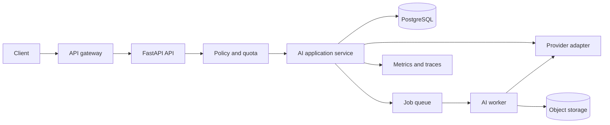

# Production AI APIs

An AI endpoint is still a backend endpoint. It needs authentication, bounded resource use, durable state, cancellation, observability, and an honest failure contract. Model latency and probabilistic output add constraints, but they do not remove ordinary service engineering.

This chapter uses OpenAI to make the provider calls concrete. Keep provider details behind an application interface so model choice, credentials, retry policy, and tests do not leak into routers.

## Start with the workload shape

Choose the interaction contract before choosing a transport.

| Workload | Typical latency | Client contract | Execution model |
| --- | ---: | --- | --- |
| Classification or extraction | Seconds | Request and response | Await provider with a deadline |
| Chat generation | Seconds to a minute | Incremental text | SSE or WebSocket stream |
| Large report or media analysis | Minutes | Job resource | Durable queue or provider background mode |
| Bulk embeddings | Minutes to hours | Batch resource | Worker pipeline |
| Interactive audio | Continuous | Bidirectional session | WebSocket or provider realtime transport |

Do not keep an HTTP connection open for a job that must survive a client disconnect or process restart. Do not introduce a queue for a two-second, user-blocking classification unless traffic control or isolation requires it.

## Production boundary



The API owns identity, authorization, input limits, and the public contract. The service owns prompt selection, budgets, idempotency, and persistence. The provider adapter owns SDK calls, provider error translation, and provider-specific telemetry. Workers own durable long-running execution.

## A provider interface

Application code should depend on the capabilities it needs, not on an SDK response object.

```python
from collections.abc import AsyncIterator
from dataclasses import dataclass
from typing import Protocol


@dataclass(frozen=True)
class GenerationRequest:
    prompt: str
    model: str
    max_output_tokens: int
    user_reference: str


@dataclass(frozen=True)
class GenerationResult:
    text: str
    provider_request_id: str
    input_tokens: int
    output_tokens: int


class TextProvider(Protocol):
    async def generate(self, request: GenerationRequest) -> GenerationResult: ...

    def stream(self, request: GenerationRequest) -> AsyncIterator[str]: ...
```

The `user_reference` should be a stable, privacy-preserving internal identifier, not an email address. Keep the raw provider response available in adapter-level diagnostics when policy permits, but return a stable application result to callers.

## OpenAI Responses API adapter

The [OpenAI developer quickstart](https://developers.openai.com/api/docs/quickstart) uses the Responses API for text generation. Construct the client once during application lifespan so the underlying HTTP connection pool is reused.

```python
from contextlib import asynccontextmanager
from dataclasses import dataclass
from typing import AsyncIterator

from fastapi import FastAPI, Request
from openai import AsyncOpenAI


@dataclass(frozen=True)
class Settings:
    openai_api_key: str
    openai_model: str


@asynccontextmanager
async def lifespan(app: FastAPI):
    settings = load_settings()
    client = AsyncOpenAI(
        api_key=settings.openai_api_key,
        timeout=30.0,
        max_retries=2,
    )
    app.state.openai = client
    app.state.settings = settings
    yield
    await client.close()


app = FastAPI(lifespan=lifespan)


def get_openai(request: Request) -> AsyncOpenAI:
    return request.app.state.openai
```

The SDK may retry selected transient failures. Application retries still need a deadline and a retry budget. Layering proxy retries, SDK retries, worker retries, and caller retries without coordination produces retry amplification.

### Non-streaming request

```python
from typing import Annotated

from fastapi import APIRouter, Depends, HTTPException
from openai import APIConnectionError, APITimeoutError, AsyncOpenAI, RateLimitError
from pydantic import BaseModel, Field

router = APIRouter(prefix="/v1/generations", tags=["generations"])


class GenerateInput(BaseModel):
    prompt: str = Field(min_length=1, max_length=20_000)


class GenerateOutput(BaseModel):
    text: str
    request_id: str


@router.post("", response_model=GenerateOutput)
async def generate(
    payload: GenerateInput,
    client: Annotated[AsyncOpenAI, Depends(get_openai)],
    principal: Annotated[Principal, Depends(require_principal)],
) -> GenerateOutput:
    enforce_ai_quota(principal, estimated_input_chars=len(payload.prompt))
    try:
        response = await client.responses.create(
            model=get_settings().openai_model,
            input=payload.prompt,
            max_output_tokens=800,
            safety_identifier=principal.safety_reference,
        )
    except RateLimitError as exc:
        raise HTTPException(503, "Generation capacity is temporarily unavailable") from exc
    except (APITimeoutError, APIConnectionError) as exc:
        raise HTTPException(504, "The model provider did not respond in time") from exc

    record_usage(principal_id=principal.id, response=response)
    return GenerateOutput(text=response.output_text, request_id=response.id)
```

The route limits input before the provider sees it, enforces a product quota, and does not return provider exception text. In a real service, usage recording and result persistence need a failure policy. If billing must be exact, reconcile provider usage asynchronously instead of relying only on the request path.

Do not hard-code a model into dozens of routes. Select a logical workload such as `support_summary` and resolve it through versioned configuration. Pin a provider model snapshot when output stability matters, then evaluate before changing it.

## Streaming with Server-Sent Events

SSE is a good fit for server-to-client text deltas over HTTP. OpenAI's [streaming guide](https://developers.openai.com/api/docs/guides/streaming-responses) describes Responses API events delivered through SSE. Your FastAPI API can consume those events and expose a smaller product-specific event contract.

```python
import asyncio
import json
from collections.abc import AsyncIterator
from typing import Annotated

from fastapi import APIRouter, Depends
from fastapi.responses import StreamingResponse
from openai import AsyncOpenAI


def sse(event: str, data: dict[str, object]) -> bytes:
    payload = json.dumps(data, separators=(",", ":"))
    return f"event: {event}\ndata: {payload}\n\n".encode()


async def model_events(
    client: AsyncOpenAI,
    *,
    model: str,
    prompt: str,
    safety_reference: str,
) -> AsyncIterator[bytes]:
    try:
        stream = await client.responses.create(
            model=model,
            input=prompt,
            stream=True,
            max_output_tokens=1_200,
            safety_identifier=safety_reference,
        )
        async for event in stream:
            if event.type == "response.output_text.delta":
                yield sse("token", {"text": event.delta})
            elif event.type == "response.completed":
                yield sse("done", {"response_id": event.response.id})
            elif event.type == "response.failed":
                yield sse("error", {"code": "generation_failed"})
    except asyncio.CancelledError:
        # The downstream client disconnected. Release the provider stream promptly.
        raise


@router.post("/stream")
async def stream_generation(
    payload: GenerateInput,
    client: Annotated[AsyncOpenAI, Depends(get_openai)],
    principal: Annotated[Principal, Depends(require_principal)],
) -> StreamingResponse:
    enforce_ai_quota(principal, estimated_input_chars=len(payload.prompt))
    events = model_events(
        client,
        model=get_settings().openai_model,
        prompt=payload.prompt,
        safety_reference=principal.safety_reference,
    )
    return StreamingResponse(
        events,
        media_type="text/event-stream",
        headers={
            "Cache-Control": "no-cache",
            "X-Accel-Buffering": "no",
        },
    )
```

The public event names are yours. Do not forward every provider event and make clients depend on a provider protocol. Add a `message_id` and sequence number if clients need to resume a product stream.

### Streaming failure semantics

Once response headers and some tokens have been sent, the server cannot change the HTTP status. Express later failures as an SSE `error` event, close the stream, and record the terminal state. Clients must treat a stream without a terminal event as incomplete.

A model may have generated billable output after a user disconnects. Propagate cancellation when the provider supports it, but also record abandoned work and reconcile cost. Configure reverse proxies to avoid buffering SSE and set idle timeouts longer than expected pauses. Heartbeats can keep intermediaries from closing a quiet stream, but they must not hide a stuck provider call.

## WebSockets

Use a WebSocket when the client sends incremental input, needs bidirectional control such as cancel or pause, or participates in a realtime audio session. For plain generated text, SSE is simpler: ordinary HTTP authentication and proxy behavior are easier, reconnect semantics are understood, and server-to-client flow is sufficient.

A WebSocket endpoint still needs:

- authentication during the handshake;
- origin validation for browser clients;
- message size and rate limits;
- a per-connection task budget;
- bounded outbound buffers for slow clients;
- cancellation on disconnect;
- an external fan-out layer if connections span processes.

Never use an in-memory connection dictionary as the only routing registry in a multi-process deployment.

## Long-running work

There are two separate background choices.

### Application-owned job

Create a job resource, commit it, enqueue its ID, and return HTTP 202.

```http
POST /v1/reports
Idempotency-Key: 8fd2...

HTTP/1.1 202 Accepted
Location: /v1/jobs/01J...

{"job_id":"01J...","status":"queued"}
```

The worker moves the job through `queued`, `running`, and a terminal state. Store progress, cancellation intent, input version, prompt version, provider request ID, token usage, result location, and a sanitized failure code. The queue message carries the job ID, not a large document or credential.

This design is provider-independent and survives application restarts. The job handler must be idempotent because queues can redeliver.

### Provider background mode

OpenAI [background mode](https://developers.openai.com/api/docs/guides/background) can run a response asynchronously and expose status for polling. Store the provider response ID against your own job ID. Your API should still own authorization, product status, and result retention. Provider status is not a substitute for a product job model.

OpenAI [webhooks](https://developers.openai.com/api/docs/guides/webhooks) can notify your service when a background response completes. Verify the signature over the raw request body with the SDK helper, return quickly, and process the event idempotently.

```python
from typing import Annotated

from fastapi import APIRouter, Header, Request, Response
from openai import OpenAI

webhook_router = APIRouter()


@webhook_router.post("/webhooks/openai", include_in_schema=False)
async def openai_webhook(
    request: Request,
    x_openai_signature: Annotated[str | None, Header()] = None,
) -> Response:
    raw_body = await request.body()
    event = OpenAI().webhooks.unwrap(
        raw_body,
        request.headers,
        secret=get_settings().openai_webhook_secret,
    )
    persist_inbox_event_once(event_id=event.id, event_type=event.type, body=raw_body)
    enqueue_webhook_event(event.id)
    return Response(status_code=204)
```

Treat the field names as SDK-version-sensitive and cover the handler with a signed fixture. A duplicate webhook must not duplicate a result, charge, or notification.

## Timeouts, retries, and capacity

Use at least three budgets:

1. A client-visible request deadline.
2. A provider attempt timeout shorter than the remaining deadline.
3. A workload concurrency limit that protects memory, connections, and spend.

Retry connection failures, selected 5xx responses, and rate-limit responses only when there is time left and the operation is safe. Use exponential backoff with jitter. Respect provider retry hints. Do not retry validation errors or an exhausted product quota.

Concurrency is a cost control. A semaphore in one process can protect that process, but a distributed queue or central admission counter is needed across replicas. Reserve capacity by workload so a bulk ingestion does not starve interactive chat.

## Token and cost accounting

Record usage at the unit that matters to the product:

```text
tenant_id
principal_id
workload
provider
model_snapshot
prompt_version
provider_request_id
input_tokens
cached_input_tokens
output_tokens
estimated_cost_minor_units
started_at
completed_at
status
```

Do not put `tenant_id` or `user_id` directly into metric labels when cardinality is unbounded. Store per-request facts in a database or analytics system and expose aggregate counters by workload, model family, status class, and region.

Estimated cost supports admission control and product displays. Provider billing data remains the reconciliation source. Price tables change, so version the price used for each estimate rather than recalculating historical rows with today's price.

## Prompt and output governance

Treat prompts as deployed behavior:

- give each prompt template an immutable version;
- record the version with every request;
- evaluate a candidate on representative and adversarial cases;
- canary model or prompt changes;
- define structured output schemas where downstream code needs structure;
- reject or repair invalid output at a boundary;
- never splice untrusted text into a privileged instruction without delimiting and policy review.

Model output is untrusted input. Escape it before rendering HTML, validate tool arguments, authorize each tool action, and do not execute generated code outside a constrained sandbox.

## Multimodal and file inputs

For images, audio, and documents, the upload path is part of the threat model. Enforce content length at the proxy and application, inspect actual media type, scan files, store them outside the web process, and pass short-lived object references to workers. Strip sensitive metadata when required.

OCR and model extraction should produce a versioned derived artifact. Keep the original immutable so the pipeline can be replayed after an extractor change.

## Observability

Measure the stages separately:

- admission and queue wait;
- provider connection and first-token latency;
- total generation latency;
- input and output tokens;
- provider status and rate-limit response counts;
- stream disconnects and incomplete streams;
- job age, retries, and dead-letter count;
- cost by bounded workload category;
- structured-output validation failures;
- retrieval latency and context size for RAG.

Propagate a trace context into workers and attach the provider request ID as an attribute, not as a metric label. Log prompt content only under an explicit data policy; hashes, sizes, versions, and redacted diagnostics are safer defaults.

## Failure review

| Failure | Weak response | Engineering response |
| --- | --- | --- |
| Provider rate limit | Retry immediately in every replica | Central admission control, bounded jittered retries, degraded response |
| Client disconnect | Ignore it | Cancel downstream work where possible, record abandoned cost |
| Stream breaks | Return HTTP 500 after tokens | Emit terminal error event, persist incomplete state |
| Long request times out | Increase proxy timeout indefinitely | Durable job with status and cancellation |
| Model output violates schema | Parse optimistically | Validate, bounded repair or reject, record failure |
| Prompt change harms quality | Roll forward blindly | Version, evaluate, canary, and roll back |
| Duplicate completion webhook | Send result twice | Inbox deduplication and idempotent state transition |
| Bulk ingestion saturates chat | Add more replicas only | Workload isolation, queue limits, separate capacity pools |

## Interview discussion

**Question: Why not call the model directly from every route?**

Short answer: it couples the HTTP contract to a provider, scatters deadlines and cost controls, and removes a clean test seam.

Deeper answer: a provider adapter translates one SDK into application capabilities. An application service selects prompts, budgets, persistence, and policy. This also lets streaming and queued delivery share the same workload definitions without sharing transport details.

**Question: When would you choose SSE over WebSockets?**

Use SSE for a primarily server-to-client stream such as generated text. Use WebSockets when incremental client messages or low-latency bidirectional control are part of the protocol. At scale, discuss proxy support, slow consumers, reconnect state, process affinity, and how connections find events produced by workers.

**Question: How would you stop model traffic from creating an unbounded bill?**

Enforce per-request token limits, tenant budgets, workload concurrency limits, and queue capacity before starting provider work. Record actual usage, reconcile estimates, alert on burn rate, and provide a kill switch by workload and provider.

## Further reading

- [OpenAI: Developer quickstart](https://developers.openai.com/api/docs/quickstart)
- [OpenAI: Streaming API responses](https://developers.openai.com/api/docs/guides/streaming-responses)
- [OpenAI: Background mode](https://developers.openai.com/api/docs/guides/background)
- [OpenAI: Webhooks](https://developers.openai.com/api/docs/guides/webhooks)
- [OpenAI: Production best practices](https://developers.openai.com/api/docs/guides/production-best-practices)
- [FastAPI: StreamingResponse](https://fastapi.tiangolo.com/advanced/custom-response/#streamingresponse)

[Previous: Observability](../04-production/observability.md) | [Next: RAG and document ingestion](rag-and-ingestion.md) | [Interview questions](../../interview/advanced.md)
