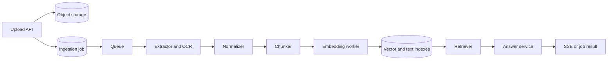
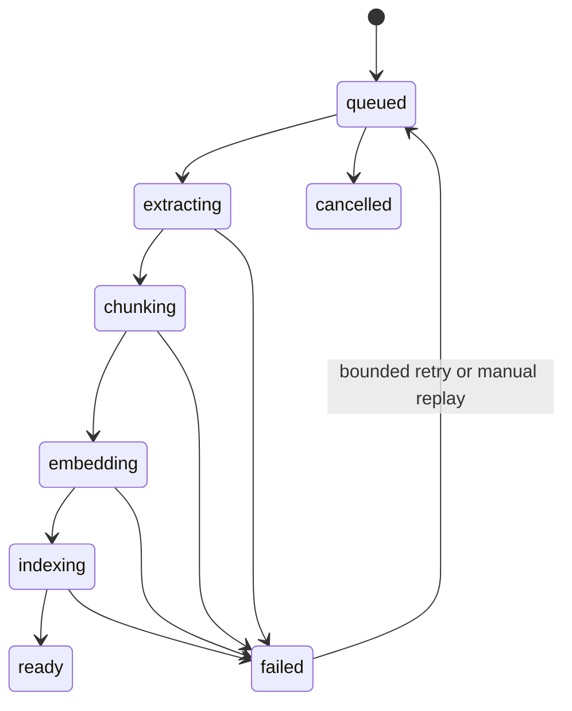

# RAG and Document Ingestion

Retrieval-augmented generation is a data system with a model at the final stage. Most production failures come from ingestion state, permissions, weak retrieval evaluation, or missing provenance rather than from the syntax of an embedding call.

## Define the product contract

A RAG API should answer four questions before implementation:

1. Which documents may this principal search?
2. How fresh must indexed content be?
3. What evidence must accompany an answer?
4. What happens when the evidence is insufficient?

If the system cannot identify the source chunks used for an answer, it cannot provide useful citations, debug retrieval, or delete derived data reliably.

## Separate ingestion from answering



The upload API should not parse, chunk, embed, and index a document inside the request. Persist the document and job atomically enough that an acknowledged upload cannot disappear. Workers make each stage replayable and record its version.

## Data model

A practical relational core looks like this:

```text
document
  id, tenant_id, collection_id, source_uri, content_hash
  media_type, object_key, status, created_by, created_at, deleted_at

document_version
  id, document_id, source_etag, extraction_version
  chunking_version, embedding_model, embedding_dimensions, created_at

chunk
  id, document_version_id, tenant_id, ordinal
  text, token_count, page_number, section_path, source_offsets
  embedding, search_vector, metadata

ingestion_job
  id, document_id, requested_version, status, attempts
  stage, error_code, queued_at, started_at, completed_at

answer
  id, tenant_id, principal_id, query_hash, prompt_version
  retrieval_version, model, status, token_usage, created_at

answer_source
  answer_id, chunk_id, rank, retrieval_score, rerank_score
```

Repeat `tenant_id` on the chunk when it enables a mandatory database filter and index. The redundancy is justified only if every update path preserves it. Row-level security can add defense in depth, but application authorization still needs tests.

## Upload and ingestion contract

Use an asynchronous resource contract:

```http
POST /v1/collections/{collection_id}/documents
Content-Type: multipart/form-data
Idempotency-Key: 468d...

HTTP/1.1 202 Accepted
Location: /v1/ingestion-jobs/01J...

{
  "document_id": "01J...",
  "job_id": "01J...",
  "status": "queued"
}
```

Enforce limits before reading the whole body into memory. Prefer a direct-to-object-storage upload for large objects, followed by a finalize request that verifies object size, checksum, ownership, and content type. Use short-lived upload credentials scoped to one object key.

### Ingestion state machine



State transitions must be conditional. A stale worker should not move a cancelled or newer-version job back to `ready`. Use a version or expected-state condition in the update.

## Extraction and OCR

Treat parsers and OCR engines as untrusted compute:

- verify file signatures, not only the supplied content type;
- scan uploads before parsing;
- isolate parsers with CPU, memory, file, and execution-time limits;
- reject encrypted or malformed formats unless explicitly supported;
- preserve page, slide, table, and section location;
- store an extraction artifact and its tool version;
- redact secrets or sensitive fields according to product policy before indexing.

Multimodal extraction may call a model. That call needs the same timeout, quota, data-retention, and cost controls as answer generation.

## Chunking

Chunking determines the retrieval unit and the citation unit. Fixed token windows are a baseline, not a universal answer.

Use structure where possible:

- keep headings with the paragraphs they describe;
- avoid splitting a table without retaining its headers;
- attach page and section metadata;
- overlap only enough to preserve boundary context;
- cap pathological sections;
- record deterministic source offsets.

Large chunks improve context continuity but dilute similarity and consume more model input. Small chunks retrieve precisely but can lose meaning. Evaluate several strategies on actual questions and measure both retrieval recall and final answer quality.

## Embeddings

An embedding maps content into a vector used for similarity search. The [OpenAI embeddings guide](https://developers.openai.com/api/docs/guides/embeddings) describes the API and common similarity applications. Keep the model name, dimensions, normalization policy, and input transformation with each index version.

```python
from collections.abc import Sequence

from openai import AsyncOpenAI


async def embed_batch(
    client: AsyncOpenAI,
    texts: Sequence[str],
    *,
    model: str,
) -> list[list[float]]:
    if not texts:
        return []
    response = await client.embeddings.create(model=model, input=list(texts))
    ordered = sorted(response.data, key=lambda item: item.index)
    return [item.embedding for item in ordered]
```

Batch within provider limits and a worker memory budget. Record which inputs belong to which indexes. A partial batch failure must not silently associate vectors with the wrong chunks.

Changing embedding dimensions or model semantics requires a new index version. Build it alongside the old index, evaluate it, switch reads, then retire old data. Avoid an in-place rewrite that leaves a mixed index.

## Retrieval pipeline

A production retriever often has several stages:

```text
validated query
  -> authorization and tenant filter
  -> query normalization or expansion
  -> vector candidates plus keyword candidates
  -> metadata filters
  -> merge and deduplicate
  -> rerank
  -> context budget selection
  -> answer generation with source identifiers
```

Hybrid retrieval combines semantic similarity with lexical search. Exact identifiers, names, error codes, and quoted phrases often benefit from keyword search. Reciprocal-rank fusion is one way to combine result lists without pretending unlike scores have the same scale.

Apply authorization inside every retrieval query. Retrieving broadly and filtering after the fact can leak content into logs, rerankers, caches, or provider calls.

### Cursor and cache keys

Search results depend on collection version, permissions, query transformation, filters, and retrieval configuration. A cache key that contains only the raw question is unsafe.

```text
rag:v3:{tenant}:{principal-policy-version}:{collection-version}:
    {retriever-version}:{normalized-query-hash}:{filter-hash}
```

Caching personalized retrieval may have low value and high invalidation cost. Cache stable embedding results by content hash or shared public retrieval only after measuring reuse.

## Context assembly

Context assembly is a budgeted selection problem. Reserve tokens for instructions, the user's question, tool output, and the answer. Do not fill the model window by default.

Each context block should carry a stable citation key:

```text
[source: doc_01J/chunk_17, page: 12, section: Transaction ownership]
Repositories participate in the unit of work and do not commit independently.
```

The application maps citation keys to authorized display metadata after generation. Do not let a generated URL decide which object the caller may access.

## Answer service

```python
from dataclasses import dataclass


@dataclass(frozen=True)
class RetrievedChunk:
    chunk_id: str
    text: str
    source_label: str
    score: float


@dataclass(frozen=True)
class AnswerRequest:
    tenant_id: str
    principal_id: str
    question: str
    collection_ids: tuple[str, ...]


async def answer_question(request: AnswerRequest) -> AnswerRecord:
    policy = await authorization.load_search_policy(request)
    chunks = await retriever.search(
        question=request.question,
        policy=policy,
        limit=40,
    )
    selected = context_selector.fit(chunks, token_budget=8_000)
    if evidence_gate.is_insufficient(selected):
        return AnswerRecord.insufficient_evidence(source_ids=[])

    result = await text_provider.generate(
        build_grounded_request(question=request.question, chunks=selected)
    )
    return await answer_repository.save(result=result, sources=selected)
```

The evidence gate should be evaluated, not chosen from intuition alone. Some applications should answer with an explicit lack-of-evidence result. Others may allow a general answer but must label it as outside the indexed sources.

## Streaming a grounded answer

Retrieval generally completes before answer streaming begins. Send a metadata event with an answer ID, then deltas, then an authoritative terminal event with final sources and usage. Do not treat early generated citation markers as validated citations.

```text
event: start    {"answer_id":"..."}
event: token    {"text":"A transaction boundary..."}
event: sources  {"items":[{"id":"...","page":12}]}
event: done     {"status":"completed"}
```

Persist the final answer and source mapping. If persistence fails after the text reached the client, mark the stream terminal event as failed and keep an incident signal. This is a dual-write boundary that needs an explicit policy.

## Deletion and re-indexing

Deleting a document means deleting or tombstoning all derived objects:

- original and normalized objects;
- chunks and indexes;
- caches;
- queued work;
- answer references according to retention policy;
- provider-hosted files if used.

Maintain lineage so this operation is possible. A periodic reconciler should detect chunks without a live document version, jobs stuck beyond their lease, and object-store artifacts missing from database state.

Re-indexing creates a new document version. Do not let queries see half of the new version. Mark it ready only after all chunks are indexed, then atomically switch the active version.

## Evaluation

Evaluate retrieval and generation separately.

### Retrieval measures

- recall at K for a labeled relevant chunk;
- mean reciprocal rank or normalized discounted cumulative gain;
- permission-filter correctness;
- empty-result rate;
- latency by stage;
- index freshness lag.

### Answer measures

- factual support by retrieved evidence;
- citation correctness and completeness;
- refusal or insufficient-evidence behavior;
- structured-output validity;
- human task success;
- latency, tokens, and cost.

Keep a fixed evaluation set, but add real failure cases over time. Compare prompt, retriever, reranker, chunker, and model changes independently where possible. A better final score does not reveal which stage improved.

## Failure cases

| Symptom | Likely causes | Investigation |
| --- | --- | --- |
| Plausible wrong answers | Weak evidence gate, prompt ignores sources | Inspect selected chunks and citation support |
| Relevant document never appears | Extraction loss, chunking, embedding drift, missing keyword path | Test each retrieval stage with known queries |
| Cross-tenant result | Filter omitted in one query path or cache key | Disable path, audit access, test every adapter |
| Index has mixed vector sizes | In-place model migration | Build immutable versioned index |
| Ingestion backlog grows | Provider limit, parser hotspot, poison document | Break down queue age and stage timing |
| Duplicate chunks | Redelivery without content/version key | Upsert on deterministic chunk identity |
| Deletion leaves data | Missing lineage or cache invalidation | Run reconciler and deletion contract tests |
| High cost without traffic growth | Larger context, retries, re-index loop | Attribute tokens by stage and version |

## Senior interview scenario

**Scenario:** Users report that the correct policy document is in the system, but answers cite an older policy.

**Short answer:** Trace document version, active index version, retrieval filters, cache key, and answer source mapping. Do not start by changing the prompt.

**Deeper explanation:** Confirm that the new document reached `ready`, the collection atomically points to its new version, old chunks were excluded or demoted, and caches include collection version. Reproduce the query against vector and keyword paths separately. Inspect reranking and the final selected context.

**Senior discussion:** Define freshness SLOs, immutable index versions, atomic read cutover, source effective dates, and an operational rollback. Add an evaluation case for superseded documents and a rule that prefers the latest applicable policy without deleting audit history.

**Common follow-ups:** How do you prevent cross-tenant retrieval? How do you re-embed without downtime? Which stage do you cache? How do you prove a citation supports the answer?

## Further reading

- [OpenAI: Vector embeddings](https://developers.openai.com/api/docs/guides/embeddings)
- [OpenAI: File inputs](https://developers.openai.com/api/docs/guides/file-inputs)
- [PostgreSQL: Text Search](https://www.postgresql.org/docs/current/textsearch.html)
- [OWASP: File Upload Cheat Sheet](https://cheatsheetseries.owasp.org/cheatsheets/File_Upload_Cheat_Sheet.html)

[Previous: Production AI APIs](production-ai-apis.md) | [Related: Queues and workers](../04-production/queues-workers-and-scheduling.md) | [Interview scenarios](../../interview/scenario-based.md)
