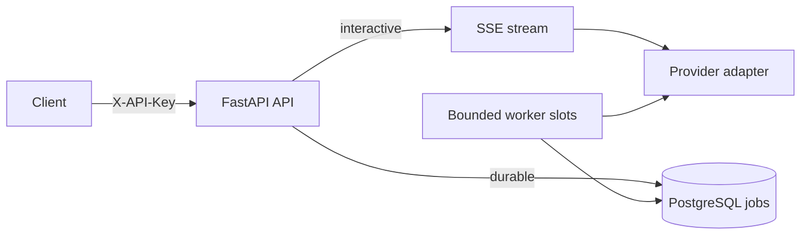

# FastAPI AI API Reference

This example shows two safe shapes for model-backed HTTP work:

- a bounded Server-Sent Events stream for interactive generation;
- a durable PostgreSQL job for work that must survive an HTTP disconnect.

The application starts with a deterministic fake provider. The default path makes no
network request and needs no OpenAI API key. An environment setting can select the
OpenAI Responses API adapter without changing route or worker code.



PostgreSQL is authoritative for queued jobs, attempts, leases, output, errors, and
token usage. The API process never owns an in-memory background job.

## Run the complete stack

Docker Compose uses `.env.example` as safe local defaults and loads `.env` afterward
when that file exists. No copy step is required for the fake-provider path.

```bash
docker compose up --build
```

The stack starts PostgreSQL, runs `alembic upgrade head`, then starts one API service
and one worker service. Check readiness at
`http://127.0.0.1:8000/health/ready` and browse the OpenAPI UI at
`http://127.0.0.1:8000/docs`.

Stop the containers while retaining job data:

```bash
docker compose down
```

`docker compose down --volumes` also deletes the local PostgreSQL volume and all jobs
stored in it.

## Authentication boundary

Generation and job endpoints require this local demonstration credential:

```text
X-API-Key: local-demo-boundary-key-5d8f3dc6f8f64d17
```

`/health/live` and `/health/ready` intentionally remain unauthenticated for container
or orchestrator probes. This example maps the single key to one `demo-client`
principal. It demonstrates where authentication belongs, not a complete API-key
product. A real service should store only key digests, support rotation and scopes,
rate-limit by principal, audit use, and obtain secrets from a managed secret store.

## Interactive SSE generation

Use `curl -N` so the client prints events as they arrive. In Windows PowerShell, use
`curl.exe -N` to bypass the PowerShell alias.

```bash
curl -N -X POST http://127.0.0.1:8000/v1/generations:stream \
  -H "Content-Type: application/json" \
  -H "X-API-Key: local-demo-boundary-key-5d8f3dc6f8f64d17" \
  -d '{"prompt":"Explain why bounded concurrency matters","max_output_tokens":200}'
```

The application exposes a small, provider-neutral SSE contract:

| Event | Meaning | Terminal |
| --- | --- | --- |
| `start` | Supplies the request ID and selected model | No |
| `delta` | Carries generated text in `text` | No |
| `refusal` | Carries provider refusal text in `text` | No |
| `complete` | Supplies the provider response ID and usage | Yes |
| `error` | Supplies a stable code, safe message, and retry hint | Yes |

A connected client receives exactly one `complete` or `error` terminal event. A client
that has disconnected cannot receive a terminal event; the server detects that state,
closes the upstream provider iterator, cancels its in-flight request, and releases the
stream-concurrency lease. The API also bounds admission wait, provider time, and total
emitted characters. Nginx buffering is disabled through `X-Accel-Buffering: no`.

The OpenAI adapter follows the
[Responses API streaming event model](https://developers.openai.com/api/docs/guides/streaming-responses).
It maps `response.output_text.delta`, `response.refusal.delta`,
`response.completed`, `response.failed`, and `response.incomplete` into the contract
above. Unknown provider events are ignored for forward compatibility, and a provider
stream that ends without a terminal response becomes an application `error` event.

## Durable generation jobs

Submit work with an idempotency key:

```bash
curl -i -X POST http://127.0.0.1:8000/v1/jobs \
  -H "Content-Type: application/json" \
  -H "X-API-Key: local-demo-boundary-key-5d8f3dc6f8f64d17" \
  -H "Idempotency-Key: handbook-job-001" \
  -d '{"prompt":"Summarize durable worker leases","max_output_tokens":300}'
```

The API returns `202 Accepted` and a `Location` header. Poll that URL with the same API
key:

```bash
curl http://127.0.0.1:8000/v1/jobs/JOB_ID \
  -H "X-API-Key: local-demo-boundary-key-5d8f3dc6f8f64d17"
```

Replace `JOB_ID` with the UUID returned by the submission. A completed response
includes output and provider usage:

```json
{
  "status": "completed",
  "output_text": "Fake provider response: Summarize durable worker leases",
  "usage": {
    "input_tokens": 4,
    "output_tokens": 7,
    "total_tokens": 11
  }
}
```

The full response also contains the job ID, model, attempt counts, provider response
ID, timestamps, and nullable error fields.

The idempotency key is HMAC-hashed before storage. Repeating the same key and request
returns the original job with `created: false`. Reusing that key for a different
request returns `409 Conflict`.

Each worker slot claims one eligible row with PostgreSQL `FOR UPDATE SKIP LOCKED`.
Claims have expiring leases, so another worker can recover a job after a process crash.
Updates include the worker ID and reject stale completion after a lease has been
reclaimed. Provider calls have a timeout, output has a storage bound, retry delay is
exponential, and `max_attempts` is an enforced terminal bound. Cancellation leaves a
running row leased instead of falsely marking work complete.

## Select the OpenAI adapter

Create `.env` from `.env.example`, replace the local secrets, and set these values:

```dotenv
AI_API_PROVIDER=openai
AI_API_MODEL=gpt-5-mini
AI_API_OPENAI_API_KEY=
```

Supply `AI_API_OPENAI_API_KEY` through your shell, deployment platform, or secret
store. Do not commit it to `.env`. Compose loads `.env` after `.env.example`, so the
override wins.

The adapter creates one asynchronous OpenAI client for each API or worker process and
reuses its connection pool until application shutdown. Requests use the configured
model and instructions, set `store` to false, cap output tokens, and send a SHA-256
digest of the internal client ID as `safety_identifier`. Provider exceptions are
translated into stable application errors; raw provider messages are not returned to
callers.

## Configuration

All application settings use the `AI_API_` prefix.

| Setting | Default in `.env.example` | Purpose |
| --- | --- | --- |
| `AI_API_DATABASE_URL` | PostgreSQL through `postgres:5432` | Durable job database |
| `AI_API_DEMO_API_KEY` | Local demonstration value | Expected `X-API-Key` credential |
| `AI_API_IDEMPOTENCY_SECRET` | Local demonstration value | HMAC key for idempotency data |
| `AI_API_PROVIDER` | `fake` | Selects `fake` or `openai` |
| `AI_API_MODEL` | `fake-text-v1` | Provider model sent with each request |
| `AI_API_OPENAI_API_KEY` | Empty | Required only when provider is `openai` |
| `AI_API_INSTRUCTIONS` | Built-in safe default | Provider system instructions |
| `AI_API_MAX_PROMPT_CHARS` | `8000` | Per-request prompt bound |
| `AI_API_MAX_OUTPUT_TOKENS` | `1024` | Per-request output-token ceiling |
| `AI_API_MAX_STREAM_OUTPUT_CHARS` | `40000` | SSE output-character bound |
| `AI_API_MAX_STORED_OUTPUT_CHARS` | `40000` | Durable output storage bound |
| `AI_API_STREAM_CONCURRENCY` | `8` | Maximum streams per API process |
| `AI_API_STREAM_ADMISSION_TIMEOUT_SECONDS` | `0.25` | Wait for a stream slot |
| `AI_API_PROVIDER_TIMEOUT_SECONDS` | `60` | Provider request deadline |
| `AI_API_WORKER_CONCURRENCY` | `2` | Worker slots per worker process |
| `AI_API_JOB_LEASE_SECONDS` | `90` | Claim recovery window |
| `AI_API_JOB_MAX_ATTEMPTS` | `3` | Terminal attempt bound |

The job lease must exceed the provider timeout by more than five seconds. Settings
validation rejects an unsafe combination at startup.

## Run locally without containerizing Python

Start PostgreSQL first:

```bash
docker compose up -d postgres
```

Create and activate a Python 3.12 or newer virtual environment, install the example,
and copy `.env.example` to `.env`. Change the database host in `.env` from `postgres`
to `127.0.0.1` because the Python processes now run on the host.

```bash
python -m venv .venv
python -m pip install -e ".[test]"
alembic upgrade head
uvicorn app.main:app --reload
```

On Windows PowerShell, activate with `.venv\Scripts\Activate.ps1`. On Linux or macOS,
activate with `. .venv/bin/activate`. Run `python -m app.worker` in a second activated
terminal to process durable jobs.

`AI_API_AUTO_CREATE_SCHEMA=true` is available for isolated tests and short local
experiments. Normal deployments should leave it false and run the reviewed Alembic
migration before starting the API or worker.

## Verify

```bash
python -m pytest
python -m ruff check .
python -m compileall -q app tests migrations
docker compose config --quiet
```

The tests use SQLite only as an isolated test database. They exercise authentication,
successful and failed SSE terminals, stream timeout and disconnect cleanup,
idempotency conflicts, persisted usage, bounded retries, and Responses API event
mapping. Compose and the actual deployment path use PostgreSQL because job claiming
depends on PostgreSQL row locking and `SKIP LOCKED` semantics.

## Production boundaries

- Run migrations as a one-shot deployment step before rolling out compatible API and
  worker versions.
- Scale workers by adding processes; keep each process's configured concurrency within
  provider and database limits.
- Add per-principal quotas, distributed rate limits, tracing, metrics, structured logs,
  and alerts around queue age, failure code, token usage, and lease recovery.
- Put the API behind TLS and an authenticated gateway. Replace the demonstration key
  boundary before exposing the service publicly.
- Decide retention for prompts and outputs, encrypt sensitive data, and apply provider
  moderation and safety controls appropriate to the product.
- Streaming is not automatically moderatable before text reaches the caller. Assess
  partial-output risk for the application before enabling provider-backed streaming.

[Back to examples](../README.md)
