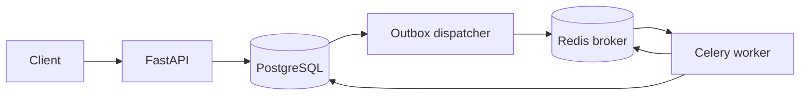

# Distributed API Reference

This example connects FastAPI, PostgreSQL, Redis, Celery, and Docker Compose around one durable export workflow. Its purpose is to show boundaries that short task-queue examples usually omit: idempotent HTTP creation, transactional outbox, duplicate task delivery, job state, progress, and retry policy.



PostgreSQL owns job state. Redis transports tasks and holds replaceable progress snapshots. If Redis loses progress, `GET /v1/exports/{id}` still returns authoritative state.

## Run

```bash
docker compose up --build
```

Create a job:

```bash
curl -i -X POST http://localhost:8000/v1/exports \
  -H "Content-Type: application/json" \
  -H "X-API-Key: local-development-key" \
  -H "Idempotency-Key: export-2026-08-11" \
  -d '{"report_type":"monthly-usage"}'
```

Repeat the same request and key to receive the same job. Reuse the key with another payload to receive 409.

## Why both an outbox and an idempotent worker?

The API commits the job and outbox row in one database transaction. A periodic dispatcher publishes unpublished rows. A crash after broker publish but before marking the row can publish twice, so the worker locks the job and treats an already-completed state as success.

Celery task IDs are useful for diagnostics but are not the business deduplication boundary.

## Deliberate boundaries

- API-key authentication is small enough for the example. Real keys need per-key hashing, scope, rotation, audit, and a secret store.
- The worker simulates artifact generation. A real implementation writes through an object-storage adapter with a stable object key.
- `init_db` creates the demonstration schema. A production service uses reviewed Alembic migrations and the expand-contract process shown in the production API and handbook.
- Redis progress has a TTL and is never used to decide whether the job completed.

[Back to examples](../../README.md#practical-examples)
